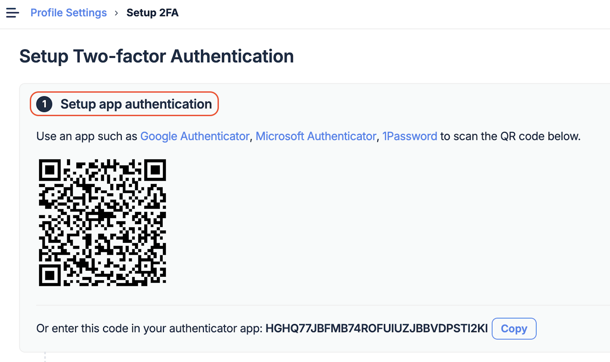
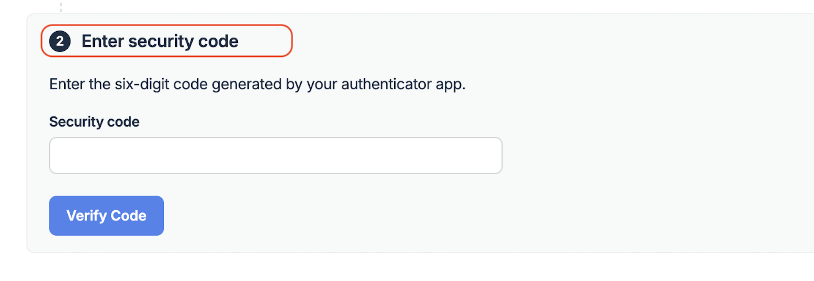
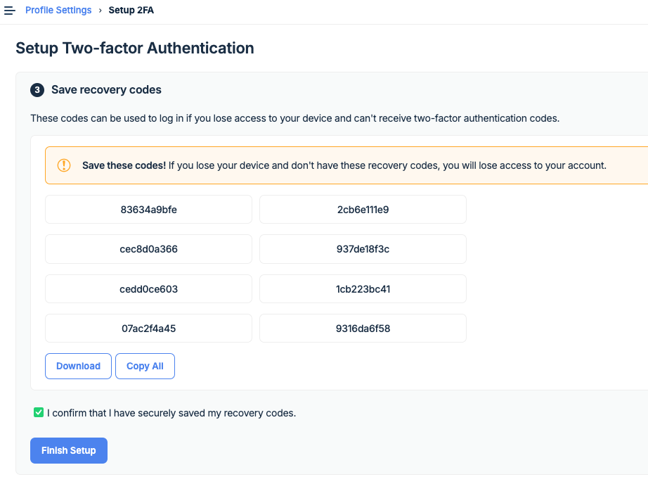
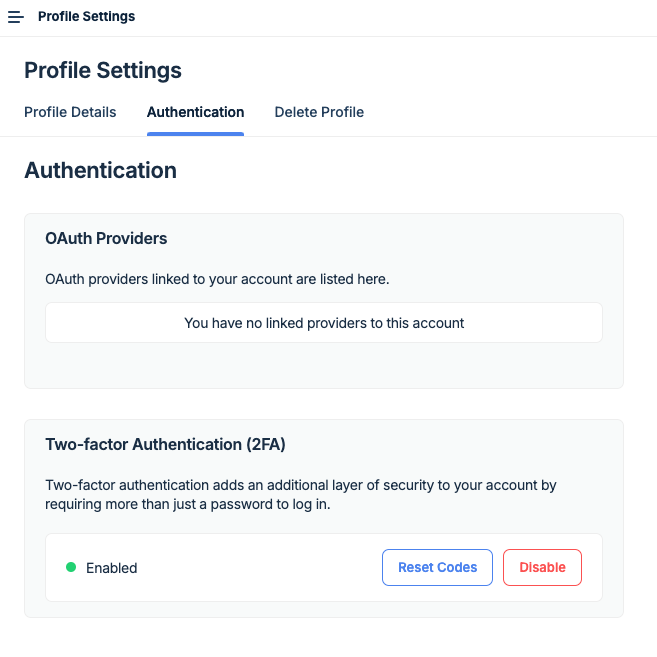
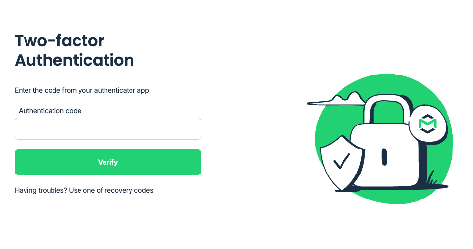
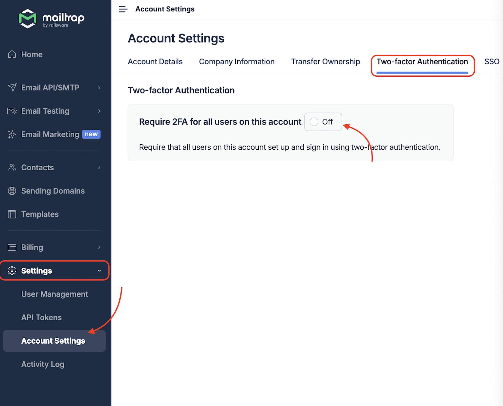
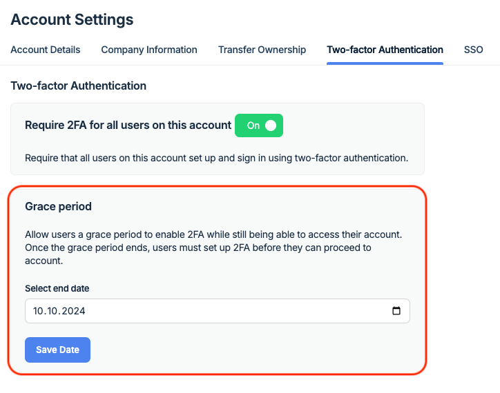
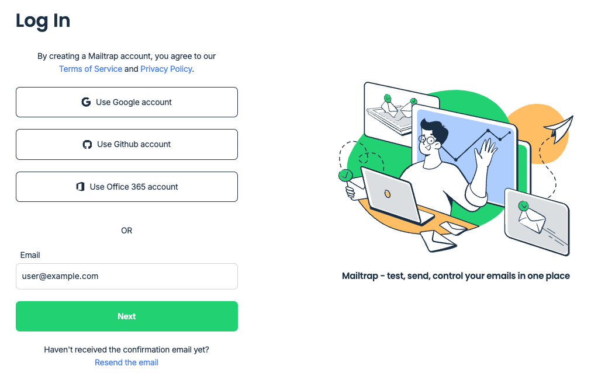
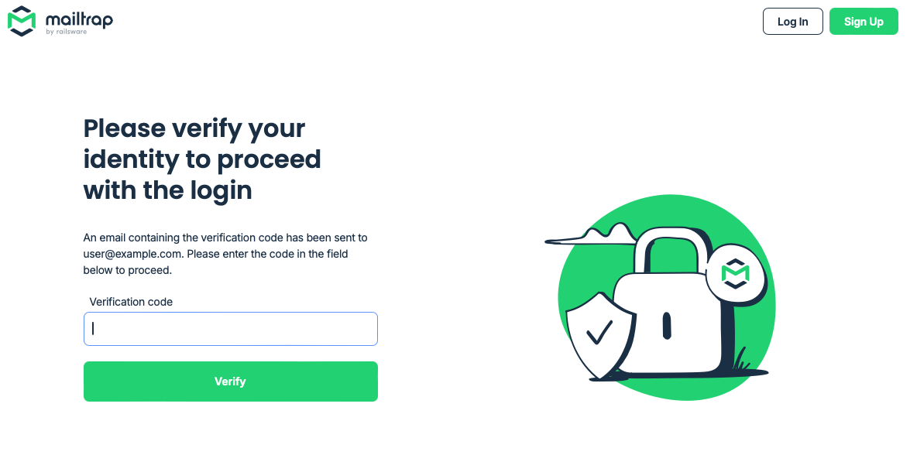

# Two-Factor Authentication

### Setting up 2FA



Go to **Account** (top-right) → **My profile** → **Authentication** and click on **Enable 2FA** under the **Two-Factor Authentication (2FA)** section.




In the 2FA setup page, either:

* Use the authenticator app of your choice to scan the QR code
* Input the corresponding key if your authenticator app does not support QR scanning




Whichever of the two options you choose, your authenticator app will provide a code. Enter this code in the verification window, then click on **Verify Code**.




You will be provided with recovery codes you can use in case you lose access to your authenticator app. Make sure to save these codes in a secure location.

Click on **Finish Setup** to complete the process. You will have successfully enabled 2FA for your Mailtrap account.



### Disabling 2FA



Navigate to **Account** (top-right) → **My profile** → **Authentication**.



Click on **Disable** under the **Two-Factor Authentication** section.


Disabling 2FA also resets the recovery codes. After setting it up again, the old codes will no longer work, regardless of whether they had been used or not.




### Logging in via 2FA

During login, if you have enabled the 2FA, you will be redirected to the following screen upon entering the correct username/password combination:

To successfully login, enter the code provided by your authenticator app.

### Recovering account

#### No access to the authenticator app

If you can't access your authenticator app, simply use one of the recovery codes at the two-factor authentication step. Then, disable the 2FA and set it up with a different device or app. Please remember to save your new recovery codes, as the old ones will no longer work.


**Important:** Each recovery code only works once.


#### Lost recovery codes

In case you cannot access or use your recovery codes for any reason, you can contact Support for help. Our Support Agent will:

* Confirm your identity
* Disable 2FA for your user

Lastly, the Support Agent will inform you that you can login and set up 2FA again.


**Note:** If 2FA is enforced by your account owner, you will be prompted to set it up the first time you log in.


### Enforcing 2FA for all account users

As a Mailtrap account owner, you can enforce 2FA for all users linked to the account, except those who login via SSO. Moreover, you can add a grace period, during which setting up 2FA can be skipped.



Navigate to **Settings** → **Account Settings** → **Two-Factor Authentication** tab.



Tick the **Require 2FA for all users on this account** box.




After enforcing 2FA as an account owner, you can **set a grace period** during which users can skip setting up 2FA. Simply choose the date on the calendar until which you want the grace period to last and click on **Save Date**.




### Email-based 2FA on unrecognized devices

To protect accounts with no 2FA enabled, Mailtrap will require email-based 2FA for new unrecognized devices.



On a new device, enter the correct username/password combination.




A verification code is then requested in order to proceed with the login.




**Check the inbox** for the email address associated with your Mailtrap user. You should see an email from Mailtrap <[notifications@mailtrap.io](mailto:notifications@mailtrap.io)>, with the subject line "Verify your identity to proceed with the login."


**Important:**

* If you are unable to find it in your inbox, please check your spam folder.
* To ensure the email reaches your inbox every time, please add [notifications@mailtrap.io](mailto:notifications@mailtrap.io) to your address book.




**Copy the code and paste it into the "verification code" field**, then click **Verify**. Login should proceed as normal, and the device should be recognized on future logins.




**Cases when a new device might be detected:**

* The same physical device but another browser
* The same browser on a different physical device
* An updated version of the same browser on the same device
* The same version of the same browser on the same device, after some time has passed

### 2FA Support FAQ

#### 1. What's happening? Why has our signing-in behavior changed?

Mailtrap implemented 2FA, or two-factor authentication, to additionally protect customer's accounts against attackers.

#### 2. When did we release the changes?

We released those features on Monday Oct 7, 2024 1:08 PM (UTC+3:00)

#### 3. Can we disable the OTP sent via email?

There's no way to disable the OTP sent via email. The only way to skip it is to enable 2FA.
