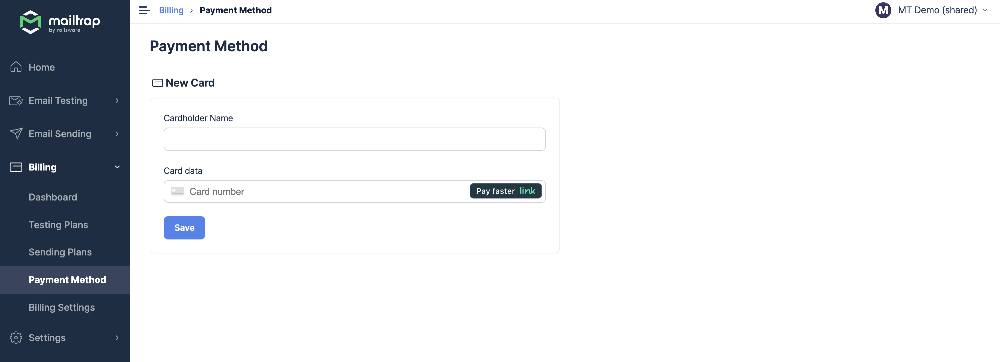
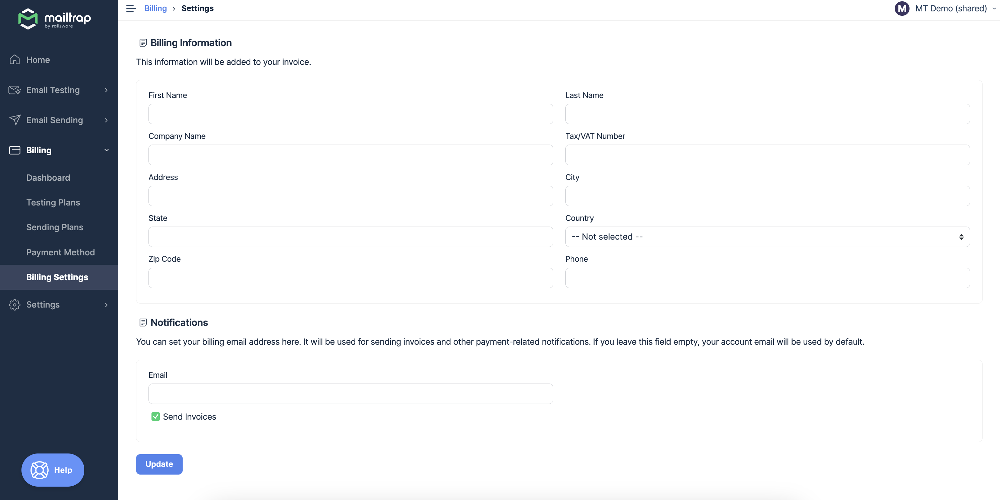

# Billing Setup

### Managing your payment card details

We accept major bank cards, and we send invoices for each transaction. To set or change your billing details, log in to your account, and go to the [Billing](https://mailtrap.io/billing/) section from the main menu. You can manage payment details on the Dashboard or directly from the [Payment method](https://mailtrap.io/billing/payment/) section. There you can add or change your card details.

To see the list of transactions, go to the [Payment history](https://mailtrap.io/billing/transactions/) section in the Billing menu.

### Billing information and invoices

Please enter complete billing information for us to be able to send you proper invoices. Go to the [Settings](https://mailtrap.io/billing/settings/) in the Billing section of the menu.

By default, we send invoices and billing notifications to your account email address. If you would like to receive them to another email address, please specify the address in the [Billing Settings](https://mailtrap.io/billing/settings/).

_Please note that payment can be managed in the Mailtrap account only with the proper account owner credentials._

### Can I move my billing subscription to another account?

For security reasons, we can't migrate payment credentials and subscription billing plans between accounts. Alternatively, you can change your account email address in the [User Settings](https://mailtrap.io/settings/) of your Profile page, or send us a request at [support@mailtrap.io](mailto:support@mailtrap.io).
