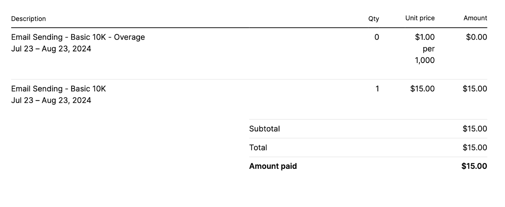
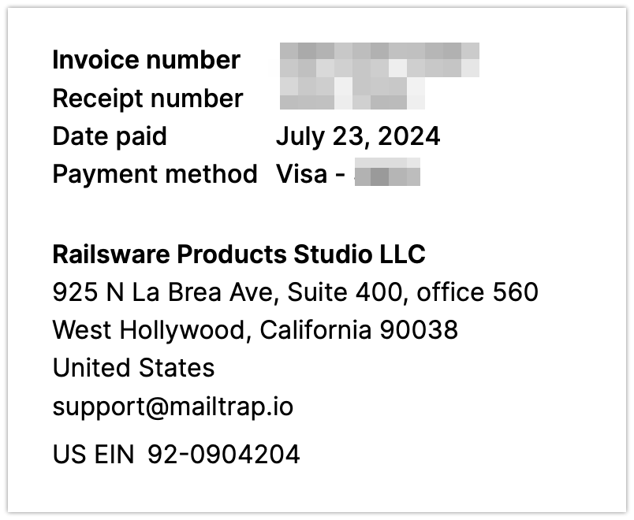
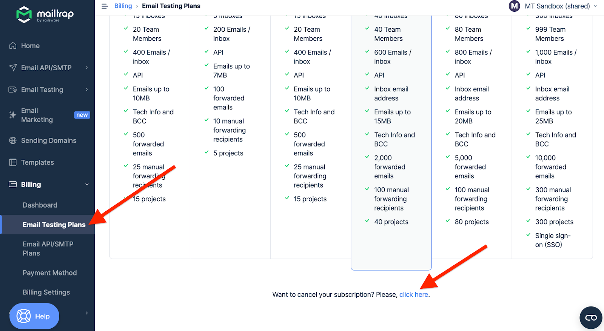

# Payment and Billing FAQs

### How does Mailtrap pricing work?

We have separate subscription plans for our products: [Email Sandbox](https://mailtrap.io/email-sandbox/) and [Email API/SMTP](https://mailtrap.io/email-sending/).

Both plans are based on the plans' limits. For example, Email Sandbox plans give you a certain amount of credits you can use for testing, whereas Email API/SMTP plans give you monthly email sending limits along with a pre-set number of allowed contacts.

### What happens if I hit the email limit in my plan?

When you exhaust your Email API/SMTP plan's monthly sending volume, any additional emails you send are counted as overage and billed separately.&#x20;

Overage lets you send a limited number of extra emails beyond your plan’s monthly sending limit, giving you extra flexibility. Each plan sets a maximum on these additional emails since it's not intended to be used as an extended allowance.

The overage bill is calculated and added to your invoice separately. For example, if you have a Basic 10K plan and you sent 12K emails during the month, your invoice will include:

* Basic 10K plan price;
* Overage price for 2K additional emails.&#x20;

The price for every additional 1,000 emails varies depending on the plan. You can check detailed information on [our pricing page](https://mailtrap.io/pricing/).&#x20;

You’ll get notified via email as you use 80%, 90%, and 100% of your overage limit. Once your overage limit is used up, further emails will be rejected.&#x20;


If you anticipate higher or recurring spikes in sending volume, consider upgrading to a higher plan or contact customer support for more information.


### How is the overage calculated if I upgrade?

When you upgrade, you're billed the prorated amount, including the used overage (if any). If you have any overage on the newly upgraded plan before the next billing date, it is counted afresh according to your new plan's limits. The billing date remains the same.

Let's take a look at an example:

* Say, your regular billing date is the 10th of the month. Your current billing cycle is July 10th — August 10th.
* You switched from the Basic 10K plan to the Business 100K plan on August 1st. By August 1st, you had sent 12K emails (10K as part of your plan and 2K as overage). Then, you sent 110K emails from August 1st to August 10th.

The following would have happened:

* When you upgraded to the Business 100K plan on August 1, you didn't buy a new package of emails. Instead, you purchased the difference (and paid the difference).
* So, in our example, you purchased Business 100K - Basic 10K - 2K overage = 88K emails for the period of August 1st to August 10th.

As a result, during the upgrade, you would have been billed the pro-rated amount that includes

* Unused time on the Basic 10K plan (between July 10th and August 1st), which will be deducted from the bill;
* The remaining time on the Business 100K plan (between August 1st and August 10th), which will be added to the bill.

On your next regular billing date (August 10), you will be billed for:

* The full price of the Business 100K plan;
* The overage amount for 22K emails.
  * You were paying a prorated amount for 88K emails during the upgrade, so the overage will be 110K (actual sent emails) - 88K (paid during the upgrade) = 22K)

### How can I pay?

We process the payments automatically on a monthly (for monthly plans) and annual basis (for annual plans). For monthly plans, we support only credit card payments. For annual subscriptions, you can pay with a credit card or bank transfer (upon request).

Each month (or year), we charge the price of your plan and the overage (if any) from your payment method.

### Can I pay for Mailtrap by invoice using a bank transfer?

Unfortunately, this option isn't available for monthly subscriptions. You can only pay with a credit card.

However, you can use a bank transfer for annual subscriptions. Please, [contact our support](mailto:support@mailtrap.io) so we can set everything up for you.

### Does Mailtrap have a free plan?

Yes, Mailtrap has a free plan. You can send up to 4,000 emails or test 50 emails per month for free.

### Do you have any ongoing promotions?

We don't have any ongoing promotions currently, but we do have discounts for non-profits and educational institutions.

Additionally, you can get 20% off if you opt for an annual subscription.

### Do you offer discounts for nonprofit open-source organizations?

Yes, we provide the Email API/SMTP Basic 10K plan and Email Sandbox Team plan for free for nonprofit open-source organizations. Additionally, nonprofits can get any other plan at a 50% discount.

For us to activate a non-profit plan for you, please send us a document (a W-9 form or any other legal document) verifying you are a representative of a nonprofit open-source organization to support@mailtrap.io, and let us know what Mailtrap product you need to use.

### Do you offer a yearly subscription?

Yes, we do. You can get a 20% discount if you opt for an annual subscription. The price is available on our [pricing page](https://mailtrap.io/pricing/).

### How do I change my plan?

The account owner, account admin, or billing owner can make changes to the plan.

In your [account under Billing](https://mailtrap.io/billing/dashboard), you can view your current plans and upgrade to the needed plan by clicking the Upgrade button.

### When will I be charged for the change to the subscription plan?

If you upgrade to a higher plan, we create a prorated transaction based on the price change for the rest of the billing cycle. If you downgrade, the new price will be applied to the next billing period. If the transaction for the prorated amount fails, the subscription update is canceled.

### How do I view my invoices?

To view your invoices, go to **Organization** → **Billing** and scroll down to **Payment History**. Next to each payment, you'll see the **Get invoice** button that will open your invoice.

Invoice notifications are sent by email after each payment.

### How can I get an invoice?

We send invoices by email once your credit card is successfully charged. Fill in the requested details in the [Billing Settings tab](https://mailtrap.io/billing/settings/) under Billing in your Mailtrap account, and indicate your financial email address for invoices and billing notifications.

If the financial email address is not set up, you will receive invoices and billing notifications to your main account email address.

### What will I find in my invoice?

Your invoice will include all your subscriptions and the overage. The overage amount will be $0.00 if you didn't send any emails outside your plan limits.

You will also see your invoice number, receipt number, payment date, and payment method, as well as Railsware business address (Mailtrap is a product owned by Railsware Products Studio LLC) and EIN number.

### Can you change the details in my invoice?

We can't. You should add your billing details to the [Billing Settings](https://mailtrap.io/billing/settings/) before making a payment to ensure your invoice contains correct information.

### Can I receive a purchase order?

We don't provide purchase orders for Mailtrap subscriptions.

However, if your billing flow requires it, feel free to send your purchase order to our customer support at [support@mailtrap.io](mailto:support@mailtrap.io).

### Can I move my billing subscription to another account?

For security reasons, we can't migrate payment credentials and billing plans between accounts. However, you can do the following to transfer your account (with its billing details) to a different owner:

* Change your account email address in the [User Settings](https://mailtrap.io/profile-settings) of your Profile page;
* Transfer your account ownership in the [Transfer Ownership](https://mailtrap.io/account-management?current_tab=transfer_ownership) tab of your account settings.

### Can I cancel my subscription at any time?

Yes. When you cancel the subscription, it will be terminated at the end of the current billing cycle. If you encounter any issues while downgrading, please contact support.

### How can I cancel my subscription?

#### Email API/SMTP

Open Email API/SMTP plans under Billing. Locate the Free plan and click Select.

Your subscription will be switched to the free plan at the end of the billing cycle. Until then, you can keep the benefits of the current plan.

#### Email Sandbox

Open Email Sandbox plans under Billing. At the bottom of the page, find _Want to cancel your subscription? Please, click here_. Press click here.

Select the reason for downgrading and click Change Plan. The date of downgrade will be indicated on the same screen. Until then, you can keep the benefits of the current plan.

### Can I request a refund?

Yes, you can request a refund within 30 (thirty) days starting from the first day you purchased a Paid Plan.


**Important:**

* If your usage volume exceeds 30% of your Paid Plan scope, Mailtrap reserves the right to provide you with a partial refund only.
* If Mailtrap suspends the Services for any reason [listed in the Terms of Service](https://mailtrap.io/terms/#Suspension-of-Service-by-Mailtrap), you shall not be provided with a refund.

