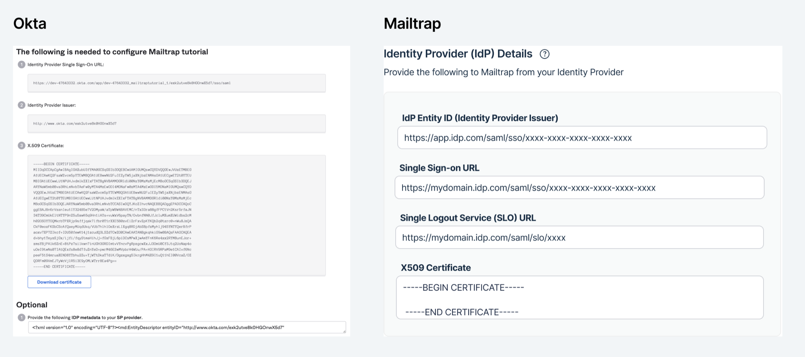
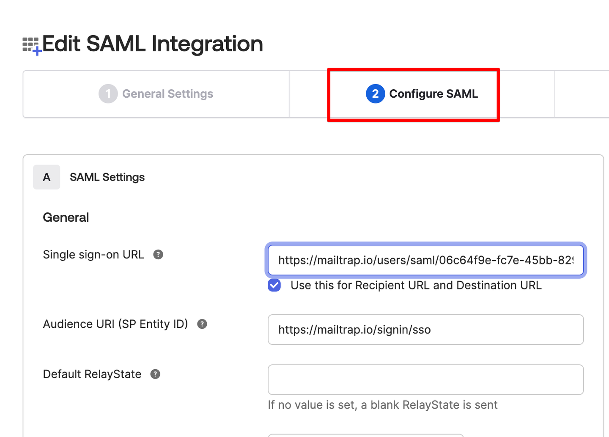
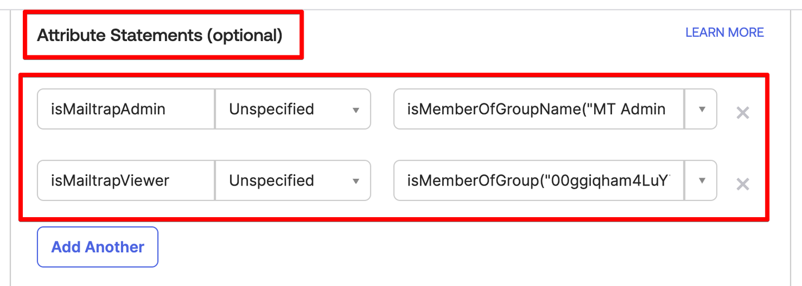
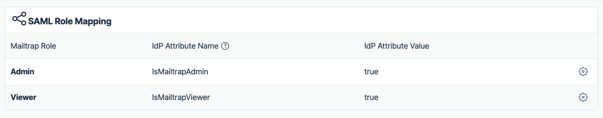

# Okta

This guide walks you through setting up SSO integration between Okta and Mailtrap using SAML 2.0, including optional role mapping configuration.

## On Okta side



Navigate to **Applications** and click **Create App Integration**.




Select the **Web Platform** and **SAML 2.0** as the Sign on method.



Enter app name and click on **Next**.



Provide the following **SAML Provider details** to Okta:

* **Entity ID** = Audience URI (SP Entity ID)
* **Assertion Consumer Service URL** = Single sign on URL
* **Name ID format** should be set to `EmailAddress`
* **Application username** should be set to `email`




To apply role mapping please add used for mapping attribute in **Attribute Statements (optional)**



Click **Next** and **Finish**.



## Mailtrap configuration

After configuration is ready on Okta side, next step would be to setup Mailtrap.

In Okta, you will see info that "**SAML 2.0** is not configured until you complete the setup instructions"



Click **"View Setup Instructions"**




Provide the following to Mailtrap from Okta:

* **IdP Entity ID (Identity Provider Issuer)** = Identity Provider Issuer
* **Single Sign-on URL** = Identity Provider Single Sign-On URL
* **X509 Certificate** = X509 Certificate



Click **Save** in Mailtrap SSO configuration.



For **Role mapping** there is additional configuration, please find more details in the SSO Guide Step 4: Role mapping section



## SAML role mapping

There are different ways how you can configure your Okta to provide needed `attribute` to Mailtrap.

Mailtrap allows you to configure role attributes mapping (it's name and value). So you can configure will Mailtrap receive a role name from Okta or `true|false` as a value.

* **Example of receiving boolean values in Attribute value**

* **Example with Role name in Attribute value**


There are several ways to do it in Okta. The best way is to consult with your team with help with configuration.


### Map Okta group names to Mailtrap permissions



Create groups in Okta:

* "MT Admin Group"
* "MT Viewer Group"




Add users to groups



Update Okta application SAML attributes mapping




Update attribute statements to return new SAML attributes:

* `isMailtrapAdmin` with value `isMemberOfGroupName("MT Admin Group")`
* `isMailtrapViewer` with value `isMemberOfGroup("00ggiqham4LuYTBPL5d7")`
  * `isMemberOfGroup` accepts group id. Group id can be taken from URL when visiting group page
* More about Okta expressions language [here](https://developer.okta.com/docs/reference/okta-expression-language/)




Add SAML attributes mapping in Mailtrap with same attribute names




## Debugging Okta integration

You can use [SAML tracer](https://developer.okta.com/docs/guides/saml-tracer/main/) to debug your SAML integration with Mailtrap.

You need to see a proper Attribute Name and Attribute Value in SAML request from Okta and they should match the ones you specified in Mailtrap SSO settings.
