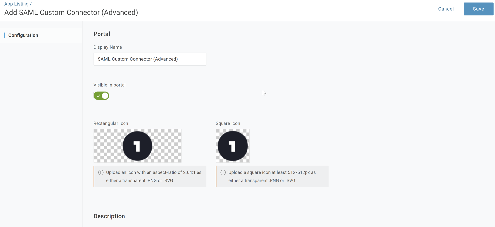
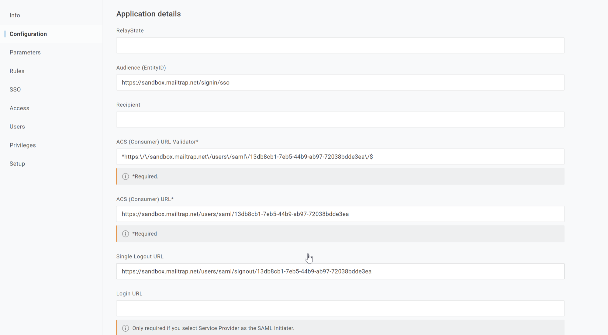

# OneLogin

## Overview

This guide walks you through setting up Single Sign-On (SSO) between Mailtrap and OneLogin using a SAML custom connector.



Navigate to the **Applications** section in your OneLogin admin console.




Look for "**SAML custom connector**" in the applications catalog.




Open the **SAML custom connector** configuration screen.




Configure the SAML connector with the **SSO details** provided by Mailtrap.

<figure><figcaption></figcaption></figure>



