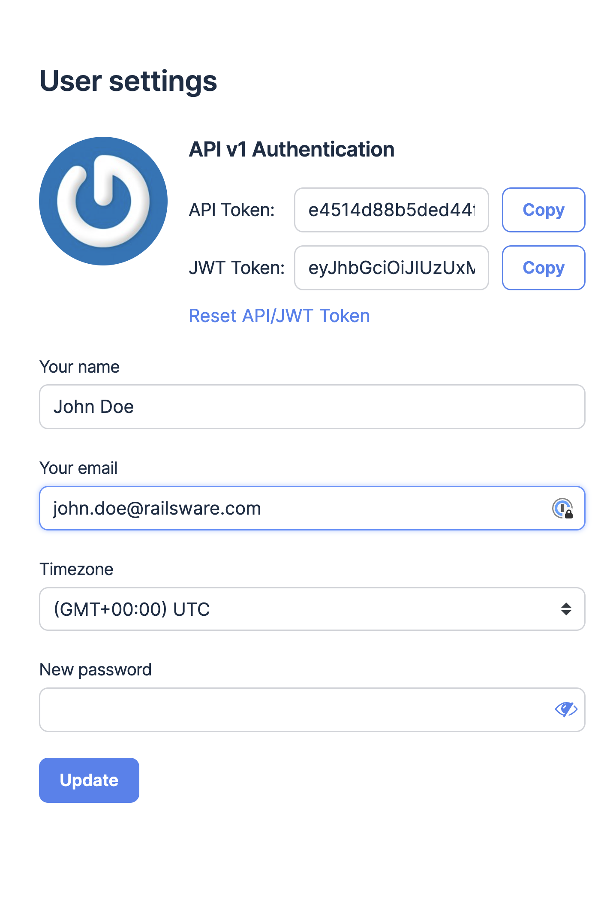
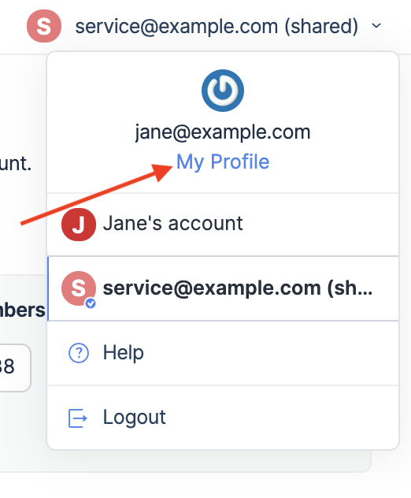
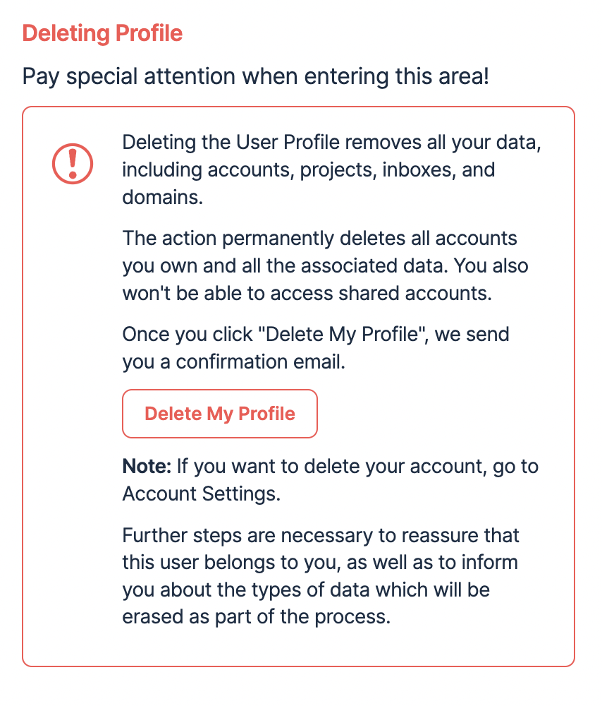
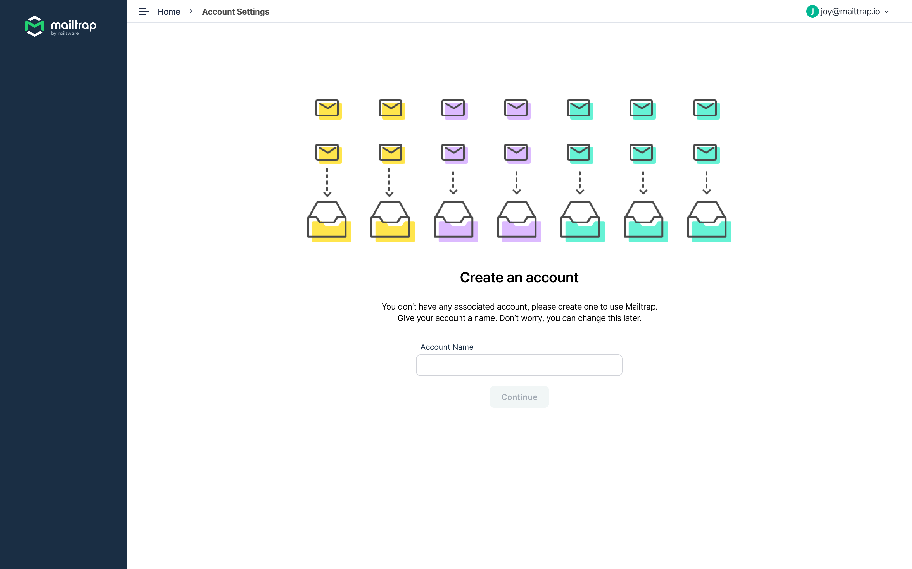
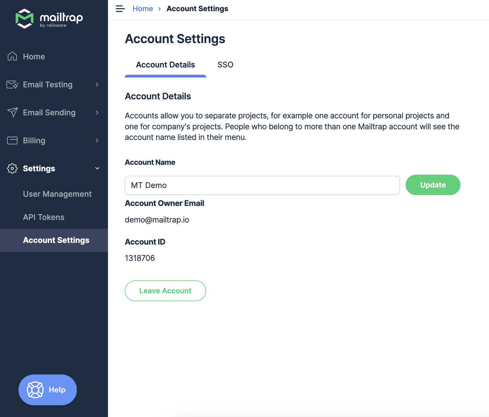

# User Profile

Once you register with Mailtrap, we automatically create an **account** and a **user profile** for you.**Users** belong to accounts (organisations). Each user and user profile is defined by their email address and may belong to multiple accounts. You use the same credentials to access all your Mailtrap accounts.

### User Profile Management

To manage your user profile, select your current account name or email address in the upper right corner, then click **MyProfile** in the drop-down menu.

There you will be able to copy or reset tokens, view, and edit OAuth providers, change your name, email, and/or password, and set the time zone.

And you can associate a different email address with your account manually, in case you need to transfer your Mailtrap user profile to another person.

**Important Note:**

The tokens under **User settings** work only with Mailtrap Email API v1 and will be deprecated in the future. [Click here](../../email-api-smtp/setup/api-tokens.md) to learn more about Email API tokens v2 and how to manage them.

### Deleting Your User Profile

Click on your account name or email address and choose **My Profile**.

Click the **Delete My Profile** button, and follow instructions to remove your user profile.

Only, keep in mind that the action is irreversible and wipes out all associated information. These include your account(s), project(s), sandbox(es), domain(s), and all the related messages.

If you have problems deleting your Mailtrap user profile, send us an email with your request at [support@mailtrap.io](mailto:support@mailtrap.io).

### Create Account

When you delete just your account, your Mailtrap user profile isn't deleted and you can create a new account. This is the only available thing to do when you don't own or don't belong to any account.

If you want to delete your Mailtrap user profile, follow the steps described in the previous section. For more information on privacy protection, check your [rights to be forgotten](https://mailtrap.io/dpa/#411-Deletion-or-Retrieval-of-Personal-Data).

### Leave Account

You can also leave accounts that you belong to but don't own them. All the account data stays intact, but you lose the access to it. Use this option if you no longer work with an organisation or a team and don't want to access their data anymore.

