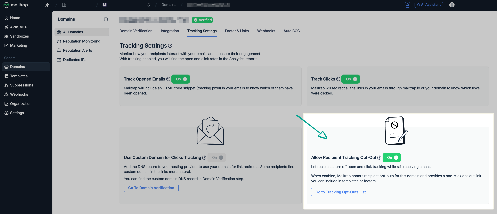
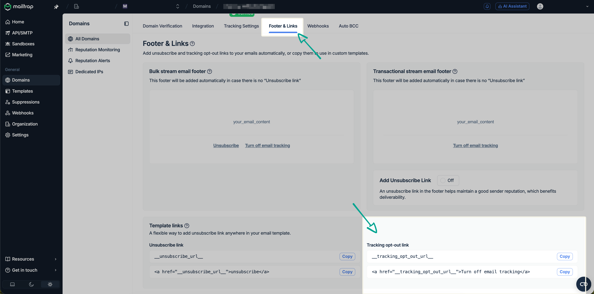
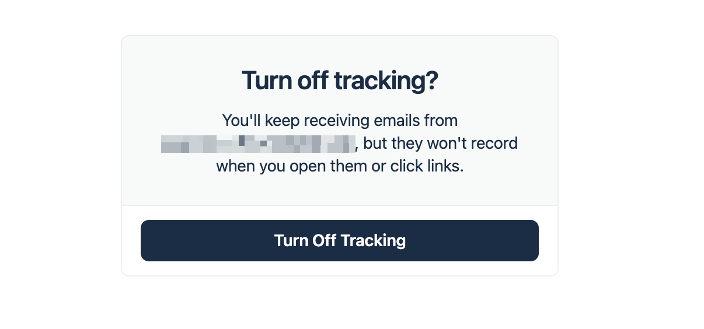
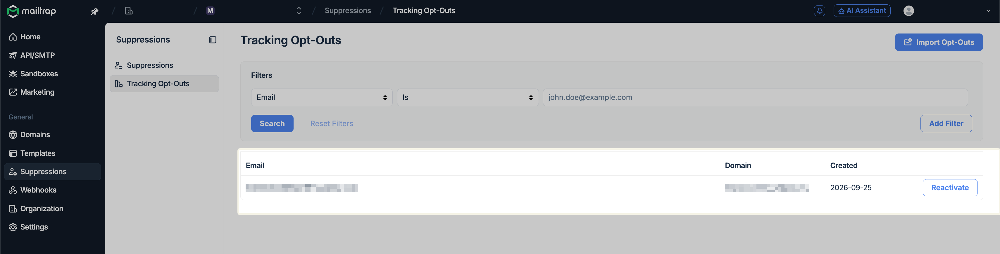

# Recipient Tracking Opt-Outs

Mailtrap's Recipient Tracking Opt-Outs feature is a per-recipient, per-domain opt-out mechanism that stops open- and click-tracking mechanisms from firing for individual email recipients without unsubscribing them.&#x20;

With it, you can stay compliant with legal requirements, such as, for example, [CNIL](https://www.cnil.fr/sites/default/files/2026-05/recommandation_tracking_pixels_emails.pdf), which requires you to provide French recipients of your marketing emails an easy way to opt out of open-tracking pixels.

> _This article is provided for informational purposes only and does not constitute legal advice. Whether and how you must obtain consent for, or offer opt-outs from, email tracking depends on your role as the sender, your recipients’ locations, and the applicable law (such as the CNIL recommendation in France). Mailtrap acts as a processor of the recipient data you send through the Service; you remain responsible for determining your legal obligations and lawful basis. We recommend consulting your DPO or legal counsel. Mailtrap’s Recipient Tracking Opt-Outs feature is a tool to help you meet those obligations, not a guarantee of compliance._

### How to use Recipient Tracking Opt-Outs

Navigate to **Domains**, select your domain, go to **Tracking Settings** and turn on the **Allow Recipient Tracking Opt-Out** setting.

<figure><figcaption></figcaption></figure>

Once enabled, every outbound email through that domain gets an "opt out of tracking" link in the footer (distinct from the unsubscribe link). If you're not satisfied with the link, you can use the following code, then the link won't be added: `<a href="__tracking_opt_out_url__">Turn off email tracking</a>`. You can find it under **Footer & Links**.

<figure><figcaption></figcaption></figure>

When a recipient clicks on the link, they will be led to a Mailtrap-hosted page confirming the opt-out.

<figure><figcaption></figcaption></figure>

When your recipient confirms the opt-out, from that moment on, no open or click tracking will happen in future emails to that address as well as the emails that have been already sent to this recipient.

Furthermore, you can see which recipients opted out under **Suppressions** → [**Tracking Opt-Outs**](https://mailtrap.io/suppressions/tracking-opt-outs).

<figure><figcaption></figcaption></figure>

