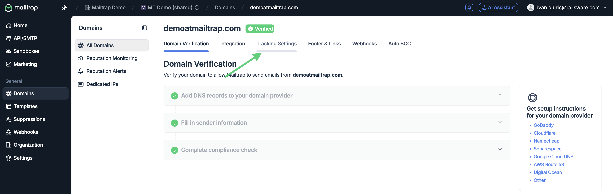
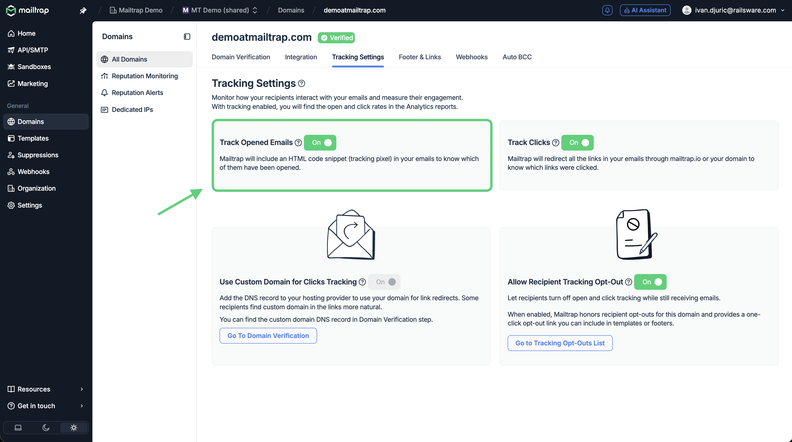
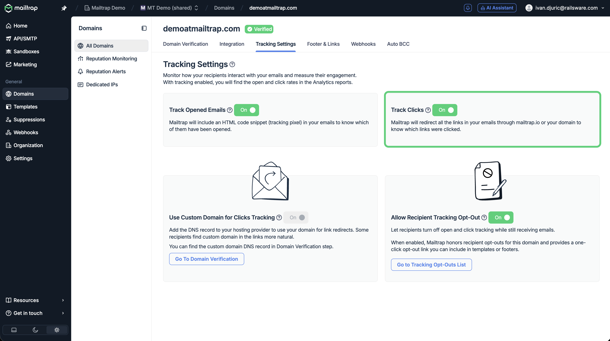

# Tracking settings - Opens and Clicks tracking

By default, Mailtrap tracks email opens for each email sent, and you can also enable click tracking.

With tracking enabled, you will find the open and click rates in the [Stats dashboard](https://docs.mailtrap.io/email-api-smtp/analytics/dashboard).


* Click tracking and custom domain for clicks tracking are available only for paid accounts.
* You can also allow recipients to turn off open and click tracking via an 'opt out of tracking' link. To learn more, [click here](https://docs.mailtrap.io/email-api-smtp/advanced/recipient-tracking-opt-outs).


### Enable or disable tracking for Opens

* Navigate to the **Tracking Settings** tab (Domains → choose your domain)

<figure><figcaption></figcaption></figure>

* Toggle the switch next to **Track Opened Emails** to enable or disable tracking opens


Tracking opened emails is turned on by default.


<figure><figcaption></figcaption></figure>

Mailtrap tracks email opens via an invisible pixel. It’s added to each message sent from your account. When an email is opened, a pixel is loaded, and an ‘open’ event is recorded. Each of these events will be visible in [Email Logs](https://docs.mailtrap.io/email-api-smtp/analytics/logs).


Some mailbox providers, browsers, and extensions block invisible pixels. Users can also choose not to display images, or a solution they use to retrieve emails may not support images by default. In each of these cases, an 'open' event won't be recorded even if an email is opened.


### Enable or disable tracking for Clicks

* Navigate to the **Tracking Settings** tab (Domains → choose your domain)

<figure><figcaption></figcaption></figure>

* Toggle the switch next to **Track Clicks** to enable or disable tracking clicks

<figure><figcaption></figcaption></figure>


If you enable click tracking, the toggle for **Custom Domain for Clicks Tracking** will be switched on automatically. That way, all links will be redirected through your domain (mt-link.yourdomain.com).

