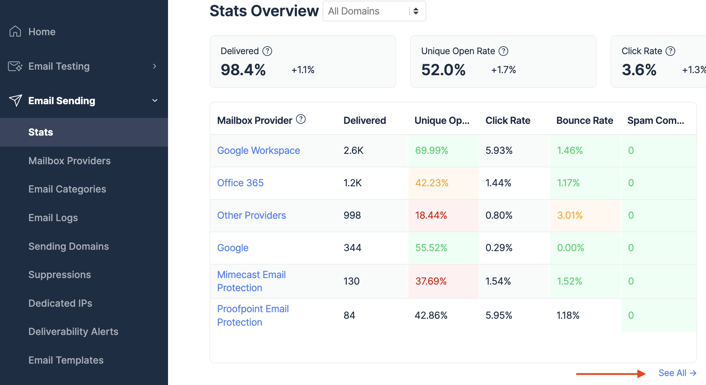

# Stats Dashboard

Mailtrap provides analytics for all the emails you send.

<figure><figcaption></figcaption></figure>

On the statistics dashboards, you can see the following metrics:

* Delivered emails
* Unique open rate
* Click rate
* Bounce rate
* Spam complaints

### **Navigating around the statistics dashboards**

In that **Stats** tab, you'll find a domain selector at the top of the page. Here, you can choose to show stats for a particular domain.

By default, the stats are shown for the last week + today.

### **Thresholds**

The thresholds are based on our extensive cross-industry research and, at this point, can’t be edited. The current values are:

* For bounce rate:
  * 2-5% is a warning level (yellow)
  * \>5% is a critical level (red)
* For spam rate:
  * 0.08%-0.1% is a warning level (yellow)
  * \>0.1% is a critical level (red)

### **Terminology**

#### **Delivered**

Delivered refers to the percentage of emails that were accepted by the recipient’s mailbox providers compared to all emails sent. Email is counted as delivered when a Delivery event is recorded in its Event History in [Email Logs.](logs.md)


"**Delivered**" status doesn't mean that a message went straight into the recipient's Primary folder. It may have still gone into Promotions and Updates, or it might have been automatically put into a Spam folder.


Mailtrap will reject an email if a recipient is on a suppression list for a given domain. Read more about [Suppressions](../suppressions-list.md).

On top of that, an email can be rejected on the recipient’s end for various reasons:

* A message is considered spam, phishing, or other foul play.
* A security policy on the recipient’s end dictates that a message should be declined.
* A server timeout occurs (in such case, Mailtrap will retry the delivery 10 times until it eventually gives up).
* Email authentication protocols (SPF, DKIM, DMARC) fail.

#### **Unique open rate**

Unique open rate refers to the percentage of emails that were opened at least once compared to all emails sent.

Open tracking needs to be enabled for a domain in question in the Sending Domains tab. Only then will email opens be recorded.

#### **Click rate**

Click rate refers to the percentage of emails that received at least one link click compared to all delivered emails.

When any of the links in an email are clicked, a **click** event is recorded. The same happens for any further clicks, even if a recipient keeps clicking on the same or different links.

You can see the details of each click (timestamp, Recipient's IP, URL) in the **Events History** in the **Email Logs**.

However, the metrics such as **clicked** and **click rate** used in the statistics are calculated differently.

**Clicked** metric indicates how many emails received at least one click on.

The **click rate** is basically clicked/delivered \* 100%.

#### **Bounce rate**

Bounce rate refers to the percentage of emails dispatched from Mailtrap that were rejected on the recipient’s end compared to all emails sent.

Emails may bounce for different reasons, most commonly:

* Invalid email address.
* Rejection by the recipient’s mailbox because email is deemed spam, phishing, etc.
* The security policy of a mailbox provider that rejects emails from all or some domains.
* Permanent connection issue.

The term bounce used in Mailtrap is also known as a hard bounce. This is different from a soft bounce - another event present in Mailtrap that refers to a temporary delivery problem.

If an email soft bounces, Mailtrap will try to deliver it 10 more times. If there’s no positive outcome, an email will (hard) bounce and get counted towards the bounce rate.

#### **Spam complaints**

Spam complaints refer to the percentage of emails that are reported as spam by recipients, as compared to all emails that were delivered.
