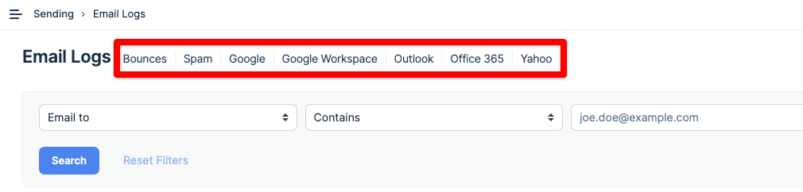
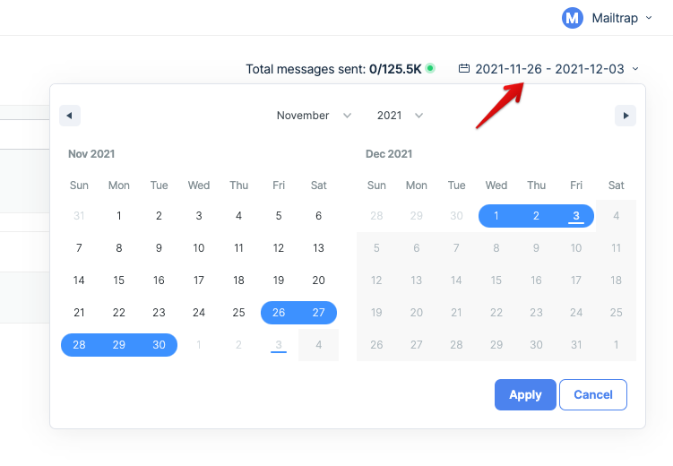
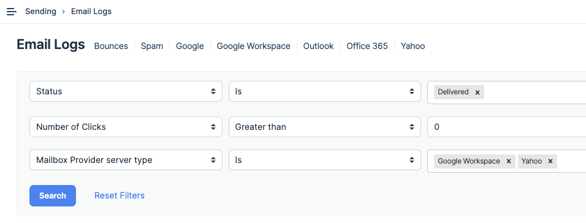
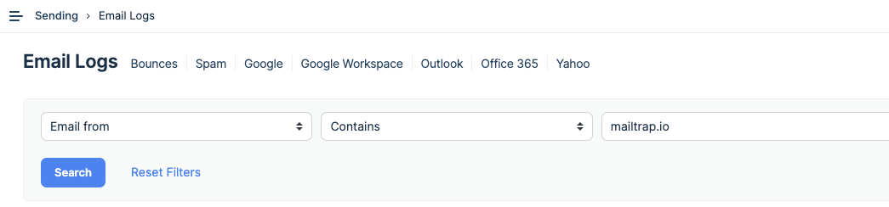
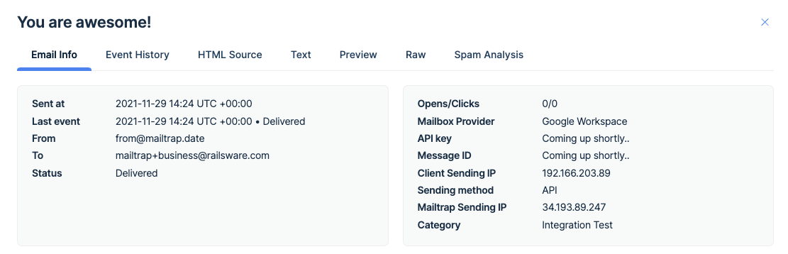

# Email Logs

It’s a place to view all the emails sent from your account, along with their corresponding details. These include the status of each message, its preview, event history, HTML source, and statistics.

#### How to use filters in Email Logs

These filters are a quick way to find:

* **Bounces** — All emails that were not accepted by the recipient’s mailbox provider (for any reason).
* **Spam** — All emails that were reported as spam by the recipients (this does not include emails that landed in the recipients’ spam folders).
* **Google** — All emails that were sent to free Gmail accounts.
* **Google Workspace** — All emails sent to mailboxes using Google Workspace, the paid version of Gmail used by businesses and organizations.
* **Outlook** — All emails that were sent to Outlook.com mailboxes.
* **Office 365** — All emails that were sent to Office 365 mailboxes.
* **Yahoo** — All emails that were sent to Yahoo mailboxes.


When an email is sent, Mailtrap doesn't yet know which Mailbox Provider (e.g., Google, Outlook, Hotmail, etc.) it sent a message to. It's only able to determine this when it receives a response from the recipient's Mailbox Provider, which may sometimes take a few minutes.


The number of days Mailtrap stores email logs depends on your [billing plan](https://mailtrap.io/pricing/).

#### Understanding the filters

If you prefer to set up your filters manually, you have plenty of options at your disposal. Here’s what you can filter by:

<table data-header-hidden><thead><tr><th width="206.75"></th><th width="291.34375"></th><th></th></tr></thead><tbody><tr><td><strong>Criteria</strong></td><td><strong>What is it?</strong></td><td><strong>Example operator and value</strong></td></tr><tr><td>Email to</td><td>Email address of a recipient, the <code>To:</code> header of a message.</td><td>Is: john.doe@mailtrap.io</td></tr><tr><td>Email from</td><td>Email address a message is sent from, the <code>From:</code> header of a message. Can be used to find messages sent from a specific domain.</td><td>Is: marketing@mailtrap.io</td></tr><tr><td>Subject</td><td>Subject line of a message. The value is not case-sensitive.</td><td>Contains: Product Update</td></tr><tr><td>Status</td><td>The current state of an email.</td><td>Is: Delivered, Not delivered, Enqueued, Opted Out</td></tr><tr><td>Events</td><td>An action that occurred to an email before, during, or after delivery. An email can have multiple events associated with it.</td><td>Include: Sending, Delivery, Open</td></tr><tr><td>Number of clicks</td><td>The total count of clicks that links in an email received. Click tracking must be enabled for clicks to be counted.</td><td>Greater than: 3</td></tr><tr><td>Number of opens</td><td>The total number of times that an email was opened. <em>Note</em>: some mailbox providers, browsers, or extensions can block tracking, which will affect the results. Open tracking must be enabled for opens to be counted.</td><td>Is: 2</td></tr><tr><td>Client sending IP</td><td>IP of a device (e.g., your computer) that an email was sent from.</td><td>Is: 107.177.200.201</td></tr><tr><td>Mailtrap sending IP</td><td>IP that Mailtrap used to send an email.</td><td>Is not: 34.193.89.247</td></tr><tr><td>Full response from the Mailbox provider server</td><td>The response Mailtrap received when an email failed to be delivered or when a soft bounce was recorded.</td><td>Contains: The email account that you tried to reach does not exist.</td></tr><tr><td>Mailbox provider server type</td><td>The name of the recipient’s mailbox provider. Available once an email is delivered or a response about a failed delivery is received.</td><td>Is: Proton Mail</td></tr><tr><td>Mailbox provider server raw</td><td>The name of the recipient’s mailbox provider, as specified in their MX record.</td><td>Contains: gmail-smtp-in.l.google.com</td></tr><tr><td>Categories</td><td>The category specified in the “X-MT-Category” header of an email.</td><td>Contains: Newsletter</td></tr></tbody></table>

You can combine different filters by using the **Add Filter** button to the right. In some fields, you may add multiple values to find emails matching either of them.

For example, here, we search for emails that were delivered or clicked, and the recipient has either a Google Workspace or Yahoo! mailbox.

Email Logs store emails sent from all your domains. If you wish to filter only for a particular domain or address, use **Email from**. For example:

#### Diving deeper into Email Logs

Email Logs provide much more information about each sent message. To access this, click on any of the messages.

The **Email info** tab provides the basic details of a message, including the timestamps, status, from/to addresses, or the IPs. If you’re confused about any of these terms, check our [Sending Glossary](../email-sandbox/sandbox-glossary.md).

Event History offers a list of all the events that have happened to this email since it was sent and until this moment.

You may know the HTML Source, Text, Preview, Raw, and Spam Analysis tabs well from Email Sandbox. Here, you can preview how your message looks on different devices, see its code, or see its spam score.
