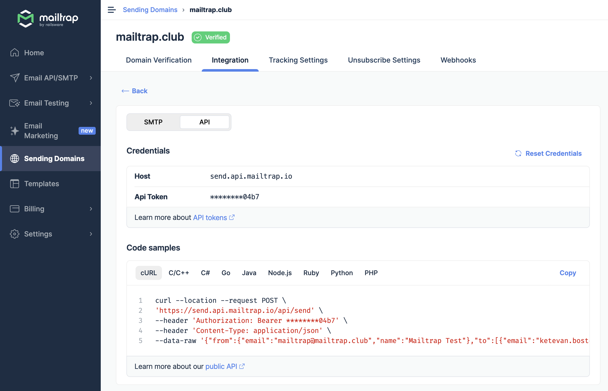
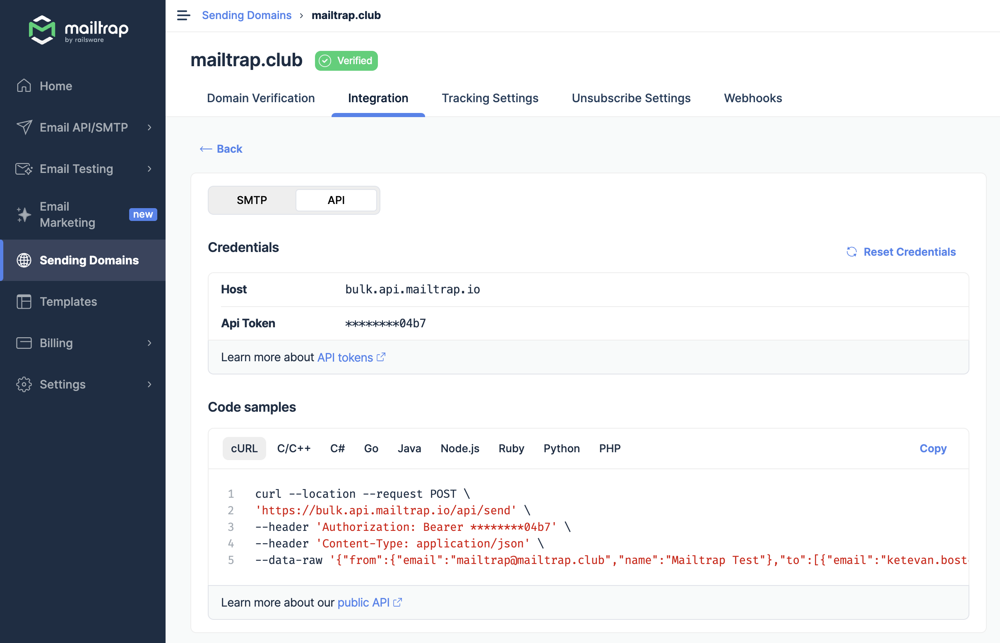
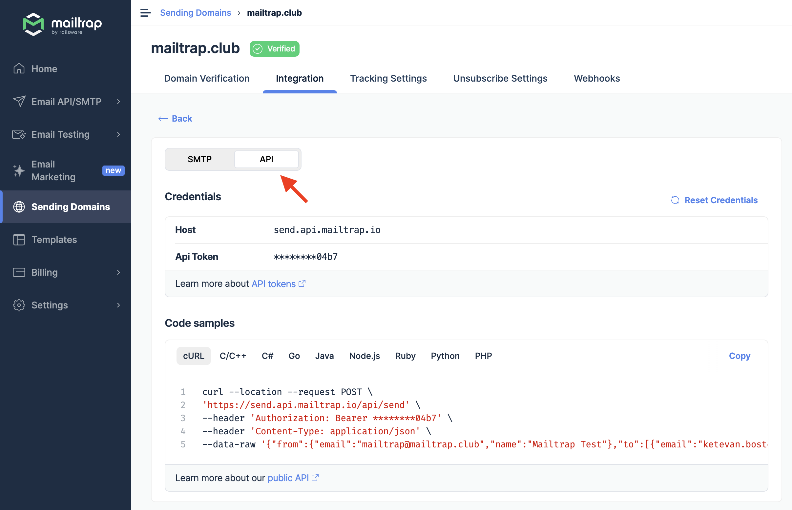
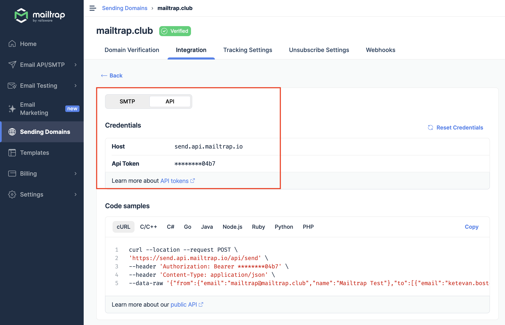
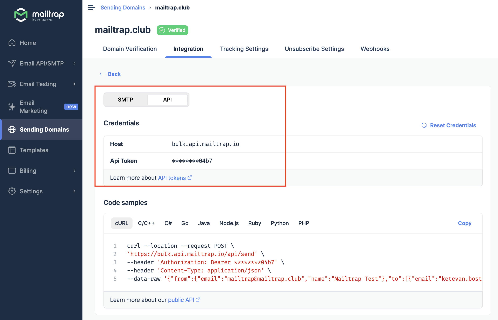
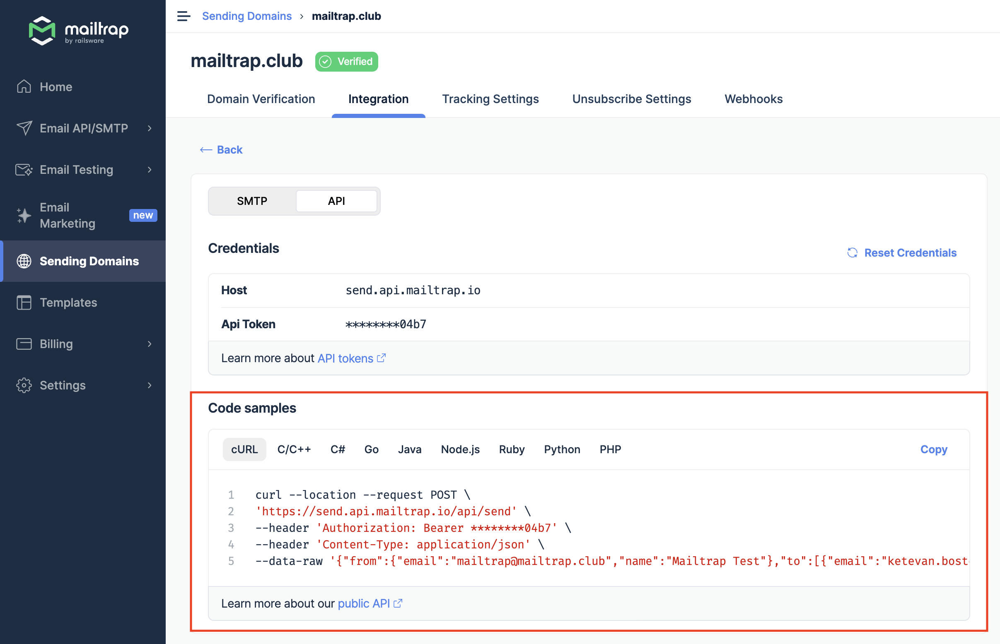
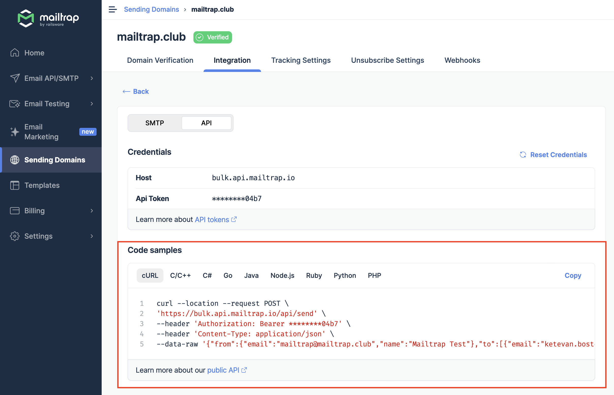
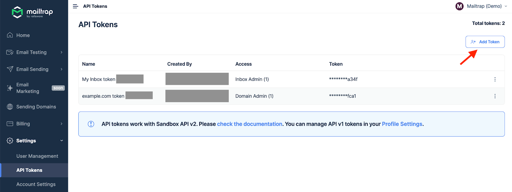

Use API credentials to integrate Mailtrap with your project.

1. Go to the Sending Domains tab and choose the domain you want to send emails from. Remember that you’ll be able to start sending emails once the domain is verified.
2. Open the Integration tab.

3. Click the Integrate button under Transactional Stream or Bulk Stream.

* Transactional Stream is used to send automated, non-promotional application emails triggered by the specific user action.

* Bulk Stream is used to send a single marketing campaign to a large group of recipients in bulk.

4. Toggle the switch to API.

5. Build the authenticated HTTP request in your programming language or framework and configure it with Mailtrap Host and API Token.

<figure><figcaption>
Transactional Stream API credentials
</figcaption></figure>

<figure><figcaption>
Bulk Stream API credentials
</figcaption></figure>

*   Alternatively, choose the programming language or framework from the menu under Code Samples and copy the sample configuration already containing your credentials. In this menu, you’ll find official SDKs for [PHP](https://github.com/railsware/mailtrap-php), [Python](https://github.com/railsware/mailtrap-python), [Ruby](https://github.com/railsware/mailtrap-ruby), and [Node.js](https://github.com/railsware/mailtrap-nodejs).

    _Note: For now, only Ruby, PHP (Laravel + Symfony), and Node.js SDKs support Bulk Stream, but others are in development. Request and response examples are also available_ [_here_](https://api-docs.mailtrap.io/docs/mailtrap-api-docs/67f1d70aeb62c-send-email-including-templates)_._

<figure><figcaption>
Transactional Stream code samples
</figcaption></figure>

<figure><figcaption>
Bulk Stream code samples
</figcaption></figure>

6. Complete your script and run it. If you did everything correctly, you should find the sent email in the inbox of the email address you indicated in the script. The email will also appear in Email Logs in Mailtrap.

Remember that each domain has different API tokens that you can always access by clicking on the desired domain and going to the Integration tab.

You can also create additional API tokens by going to Settings → API Tokens and clicking Add Token.

<a href="email-sandbox/email-marketing/account-and-billing/user-management/troubleshooting/privacy-and-security/api-tokens.md" class="button primary" data-icon="magnifying-glass">Learn more about API Tokens</a>

Mailtrap Email Sending API supports:

* attachments
* [email templates](email-sandbox/email-marketing/email-templates.md)
* [custom variables](custom-variables.md)
* [email categories](statistics/email-categories.md)


_If you need any help with API integration, please, contact our support team at_ [_support@mailtrap.io_](mailto:support@mailtrap.io)_._


