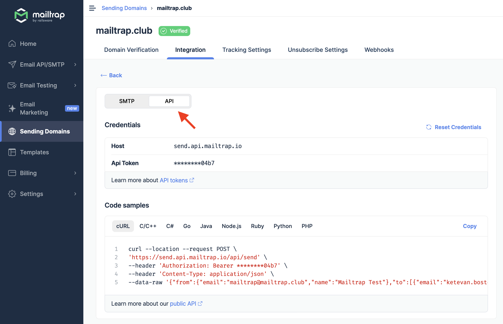
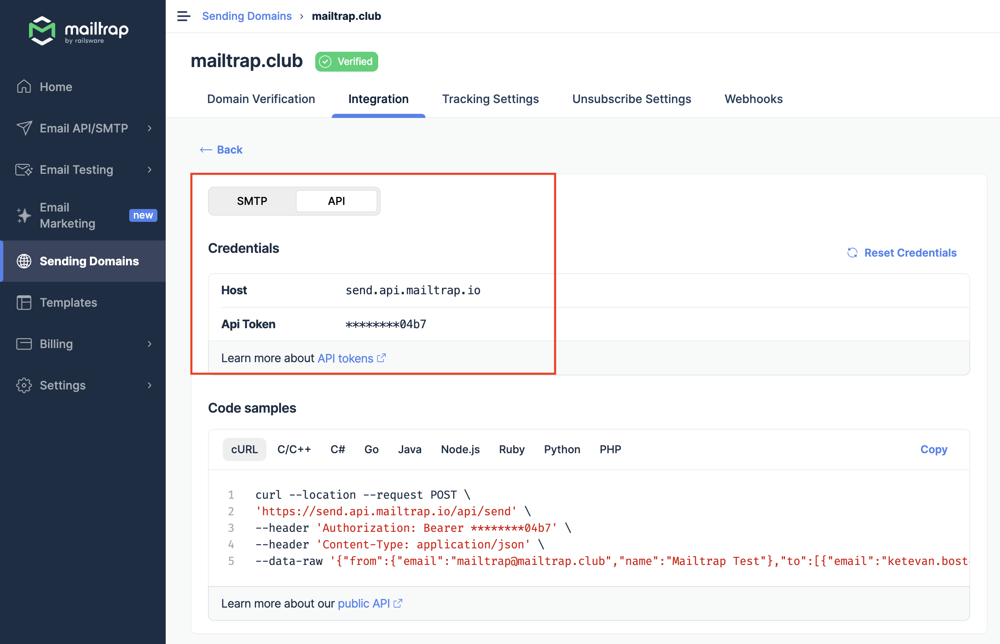
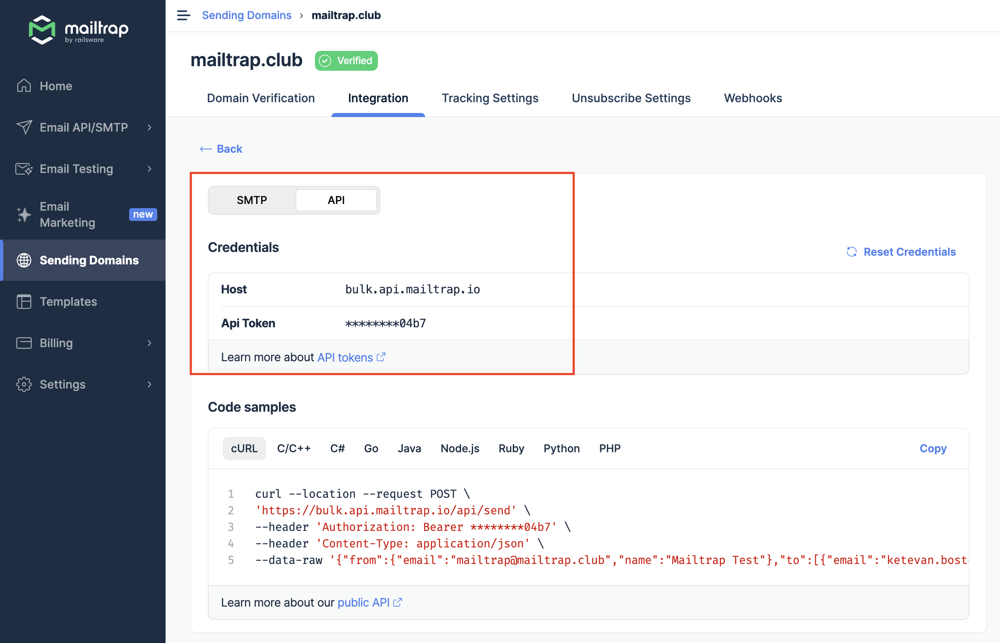
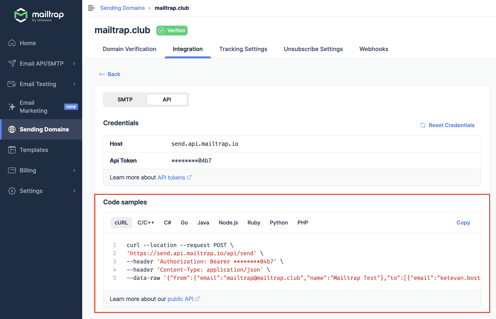
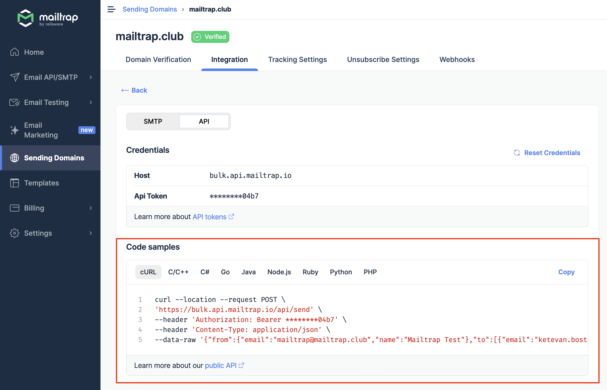
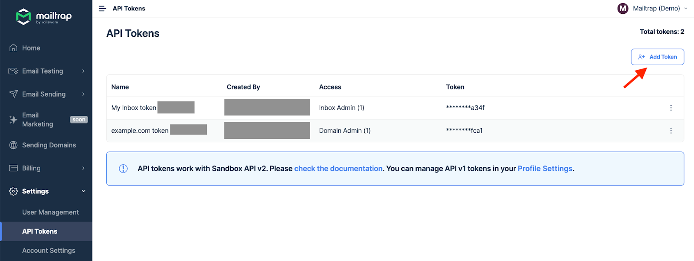

# API Integration

For use with AI assistants

AI-readable resources:

This page as Markdown — [https://docs.mailtrap.io/email-api-smtp/setup/api-integration.md](https://docs.mailtrap.io/email-api-smtp/setup/api-integration.md)

API reference as Markdown — [https://docs.mailtrap.io/developers/email-sending/transactional.md](https://docs.mailtrap.io/developers/email-sending/transactional.md), [https://docs.mailtrap.io/developers/email-sending/bulk.md](https://docs.mailtrap.io/developers/email-sending/bulk.md)

llms.txt — [https://docs.mailtrap.io/llms.txt](https://docs.mailtrap.io/llms.txt)

llms-full.txt — [https://docs.mailtrap.io/llms-full.txt](https://docs.mailtrap.io/llms-full.txt)

SDK repos:\
.NET — [https://github.com/mailtrap/mailtrap-dotnet](https://github.com/mailtrap/mailtrap-dotnet)\
Elixir — [https://github.com/mailtrap/mailtrap-elixir](https://github.com/mailtrap/mailtrap-elixir)\
Java — [https://github.com/mailtrap/mailtrap-java](https://github.com/mailtrap/mailtrap-java)\
Node.js — [https://github.com/mailtrap/mailtrap-nodejs](https://github.com/mailtrap/mailtrap-nodejs)\
PHP — [https://github.com/mailtrap/mailtrap-php](https://github.com/mailtrap/mailtrap-php)\
Python — [https://github.com/mailtrap/mailtrap-python](https://github.com/mailtrap/mailtrap-python)\
Ruby — [https://github.com/mailtrap/mailtrap-ruby](https://github.com/mailtrap/mailtrap-ruby)

For setup with AI assistant follow these steps. Pause and confirm with the user before proceeding at steps marked with ⏸️.

1. ⏸️ Ask the user for their tech stack (language/framework) and whether they need transactional emails, bulk emails, or both.
2. ⏸️ Ask the user for their API token, verified sending domain, and "from" email address (must be on the verified domain, e.g. [hello@yourdomain.com](mailto:hello@yourdomain.com)). If they don't have a token or domain yet, direct them to API Tokens setup ([https://docs.mailtrap.io/email-api-smtp/setup/api-tokens.md](https://docs.mailtrap.io/email-api-smtp/setup/api-tokens.md)) and Sending Domain setup ([https://docs.mailtrap.io/email-api-smtp/setup/sending-domain.md](https://docs.mailtrap.io/email-api-smtp/setup/sending-domain.md)).
3. Install the appropriate SDK if one is available for the user's stack. Refer to the matching SDK repo above for installation instructions.
4. Generate sending code using the Transactional Stream endpoint (POST [https://send.api.mailtrap.io/api/send](https://send.api.mailtrap.io/api/send)) or Bulk Stream endpoint (POST [https://bulk.api.mailtrap.io/api/send](https://bulk.api.mailtrap.io/api/send)) depending on the user's choice in step 1.
5. ⏸️ Send a test email to verify the integration works. Confirm the recipient address with the user before sending.
6. Check that the email appears in the recipient's inbox and in Mailtrap Email Logs ([https://mailtrap.io/sending/email\_logs](https://mailtrap.io/sending/email_logs)).

My tech stack: \[tell the assistant your language/framework]

My API token: \[paste your token here — only share in a private AI assistant session]

My sending domain: \[your verified domain]

My "from" address: \[e.g. [hello@yourdomain.com](mailto:hello@yourdomain.com)]

Transactional or bulk: \[tell the assistant which stream you need]

Use API credentials to integrate Mailtrap with your project.



Go to the **Sending Domains** tab and choose the domain you want to send emails from. Remember that you'll be able to start sending emails once the domain is verified.



Navigate to the **Integration** tab for your selected domain.

<figure><figcaption></figcaption></figure>




Click the **Integrate** button under **Transactional Stream** or **Bulk Stream**.

<figure><figcaption></figcaption></figure>

**Transactional Stream** is used to send automated, non-promotional application emails triggered by the specific user action.

<figure><figcaption></figcaption></figure>

**Bulk Stream** is used to send a single marketing campaign to a large group of recipients in bulk.

<figure><figcaption></figcaption></figure>




Toggle the switch to **API**.




Build the authenticated HTTP request in your programming language or framework and configure it with **Mailtrap Host** and **API Token**.

<figure><figcaption>
Transactional Stream API credentials
</figcaption></figure>

<figure><figcaption>
Bulk Stream API credentials
</figcaption></figure>

Alternatively, choose the programming language or framework from the menu under **Code Samples** and copy the sample configuration already containing your credentials. In this menu, you'll find official SDKs for [PHP](https://github.com/railsware/mailtrap-php), [Python](https://github.com/railsware/mailtrap-python), [Ruby](https://github.com/railsware/mailtrap-ruby), and [Node.js](https://github.com/railsware/mailtrap-nodejs).


Note: For now, only Ruby, PHP (Laravel + Symfony), and Node.js SDKs support Bulk Stream, but others are in development. Request and response examples are also available [here](https://api-docs.mailtrap.io/docs/mailtrap-api-docs/67f1d70aeb62c-send-email-including-templates).


<figure><figcaption>
Transactional Stream code samples
</figcaption></figure>

<figure><figcaption>
Bulk Stream code samples
</figcaption></figure>




Complete your script and run it. If you did everything correctly, you should find the sent email in the inbox of the email address you indicated in the script. The email will also appear in **Email Logs** in Mailtrap.

<figure><figcaption></figcaption></figure>




Remember that each domain has different API tokens that you can always access by clicking on the desired domain and going to the **Integration** tab.

You can also create additional API tokens by going to **Settings** → **API Tokens** and clicking **Add Token**.

<a href="setup/api-tokens.md" class="button primary" data-icon="magnifying-glass">Learn more about API Tokens</a>

Mailtrap Email Sending API supports:

* attachments
* [email templates](email-sandbox/email-marketing/email-templates.md)
* [custom variables](custom-variables.md)
* [email categories](analytics/categories.md)


If you need any help with API integration, please, contact our support team at [support@mailtrap.io](mailto:support@mailtrap.io).

