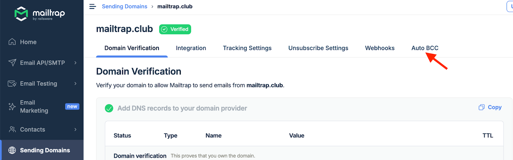
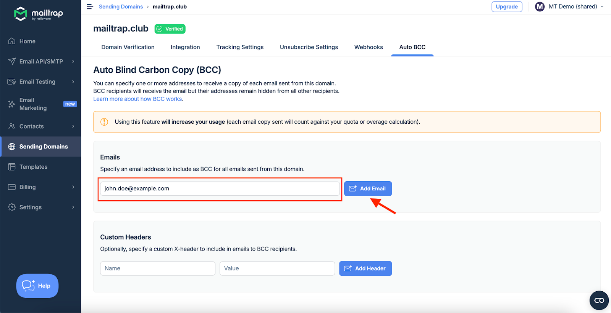
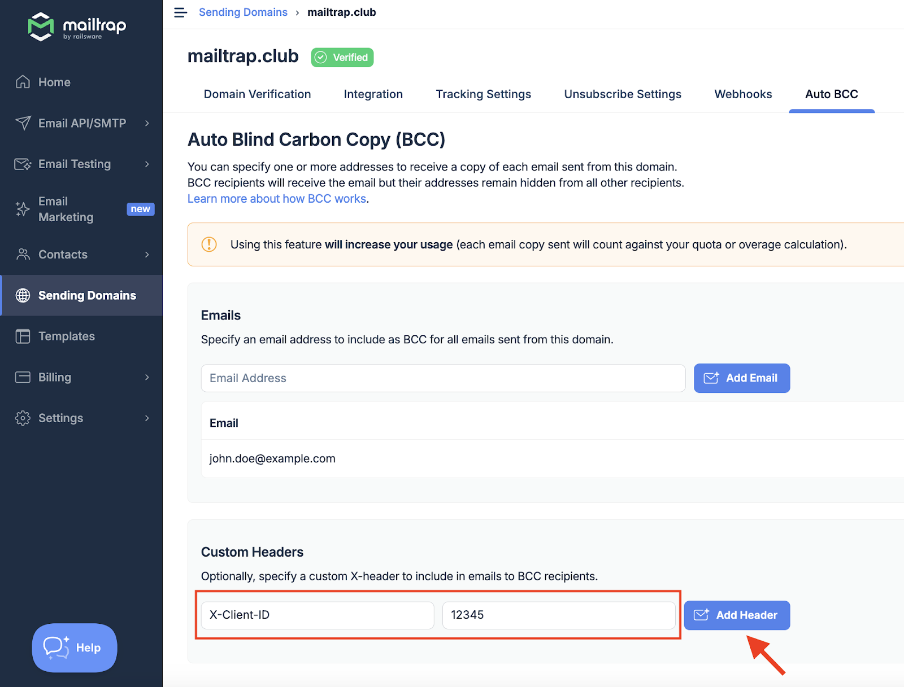
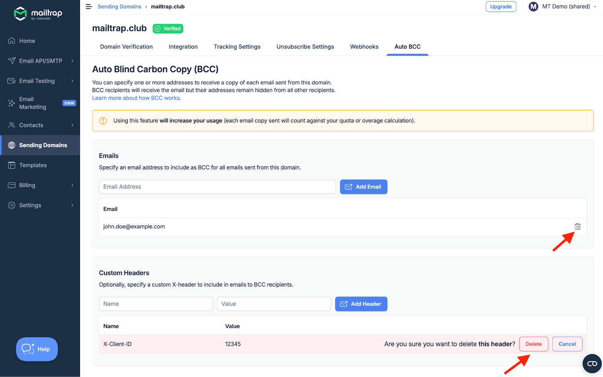

## How to set up Auto BCC



Go to Sending Domains and choose the domain you want to set up Auto BCC for.

<figure><figcaption>
Select domain from Sending Domains list
</figcaption></figure>



Navigate to the Auto BCC tab.

<figure><figcaption>
Open Auto BCC tab
</figcaption></figure>



Enter an email address that will be included as BCC in all the emails you send from this domain and click Add Email.

<figure><figcaption>
Add BCC email address
</figcaption></figure>



Optionally, specify a custom X-header that will be included in emails to BCC recipients. Enter the Name and Value, and click Add Header.

<figure><figcaption>
Add custom X-header
</figcaption></figure>



To delete the email address or a custom header, click the trash bin icon and confirm the action by clicking Delete.

<figure><figcaption>
Delete email or header confirmation
</figcaption></figure>



## Important notes

* You can add multiple BCC email addresses, and all of them will receive email copies;
* You can’t use Auto BCC with a demo domain;
* Using this feature will increase your usage. Each email copy sent will count against your quota or overage calculation.
