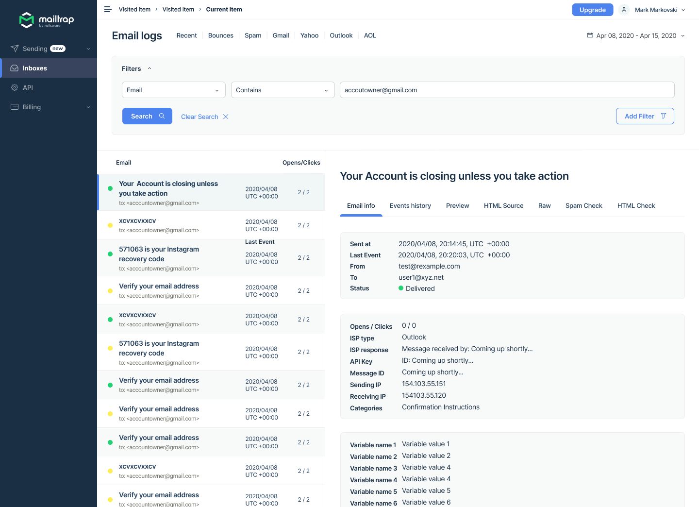
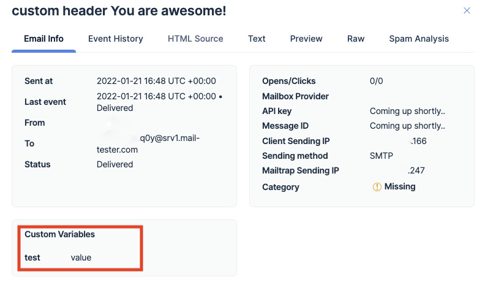

# 🏷️ Custom Variables

Custom variables are pieces of information that you can include with emails to better manage them in the future. They allow you to add unique data to each message, for example, the data can be an internal `user_id`, `inbox_id`, etc.

For now, you can only access them via Email Logs.

#### How to access custom variables

1. Click on the given functionality
2. Choose an email
3. Check the variables (Variable name 1, 2, 3…) under the Email info tab

<div align="left" data-with-frame="true"></div>

#### **How to set up custom variables with SMTP**

Mailtrap has an option to pass unique arguments to each sent email via the `X-MT-Custom-Variables`. And we add the arguments to the RAW email body. Of course, the RAW data is visible to the sender but not the end-user.

To set custom variables, you only need to set the unique argument in the following format - `{"variable name": "variable value"}`.

Here’s a code snippet, to show you where to look for it, and how to set the variable. Note that this applies when you set Mailtrap as your SMTP server.


```bash
curl --ssl-reqd \
  --url 'smtp://send.smtp.mailtrap.io:587' \
  --user 'api:49ad7a716f18d9c64xxxxx' \
  --mail-from 'example@mailtrap.io' \
  --mail-rcpt 'email@exampledomain.com' \
  --upload-file - <<EOF
To: Mailtrap Sandbox
Subject: custom header
X-MT-Custom-Variables: {"variable name":"variable value"}
Content-Type: multipart/alternative; boundary="boundary-string"

--boundary-string
Content-Type: text/plain; charset="utf-8"
Content-Transfer-Encoding: quoted-printable
Content-Disposition: inline

You are awesome!
EOF
```


As you can see, you only need to add the variable name and value in the given format. The exemplary mail has one variable; and you can add more, of course.

The format for adding more custom variables is - `X-MT-Custom-Variables: {"variable1":"value1", "variable2":"value2"}`. Also, here’s another example of how custom variables appear in Mailtrap UI.

<div align="left" data-with-frame="true"></div>

Lastly, keep in mind that we don’t support arrays. If you want to add arrays - `[“index0”,”index1”,”index2”]`, for example, Mailtrap only takes the first value (`"index0"`) and ignores the rest.

\{% hint style="warning" %\} We limit the custom variables payload to 1000 bytes, and it’s a valid JSON string. If the payload is more than 1000 bytes, Mailtrap ignores the `X-MT-Custom-Variables`.

We use only - `X-MT-Custom-Variables`; and it can’t get appended with another one.
