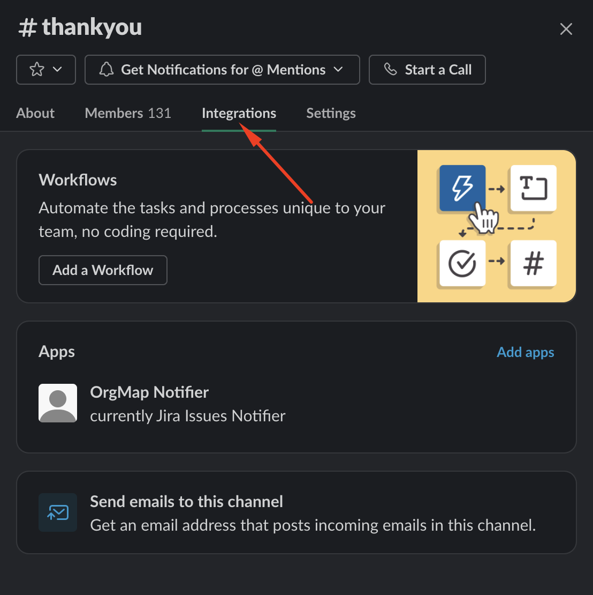
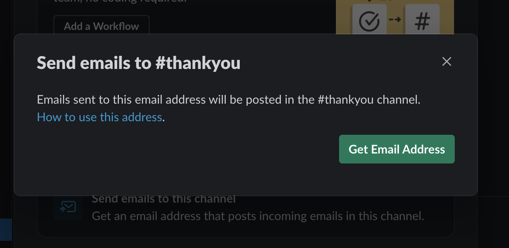
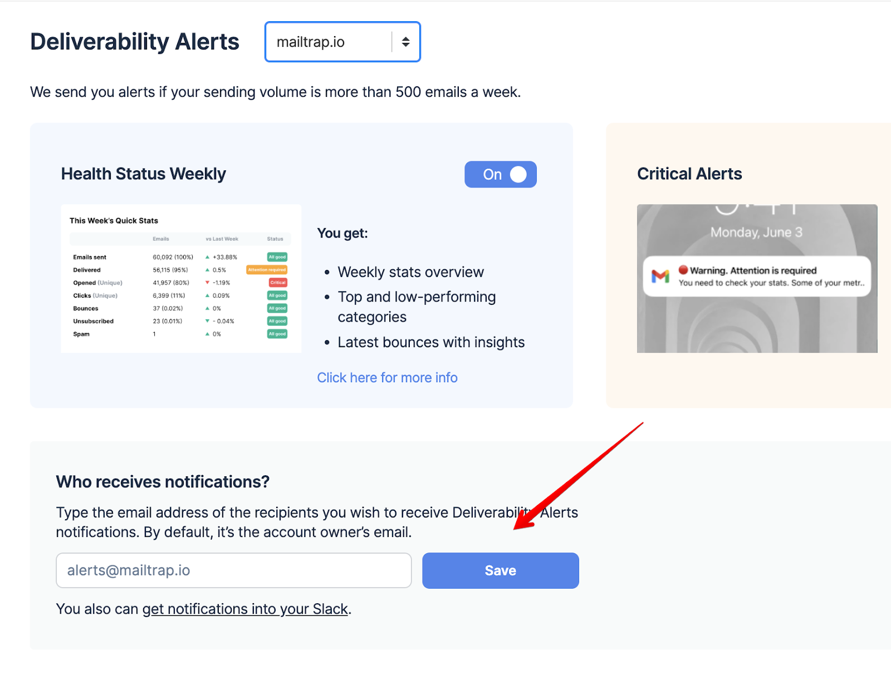

# Reputation Alerts

Deliverability Alerts help you monitor your email performance by providing automated notifications about your sending metrics.


A minimum of 1,000 emails per week is required to receive alerts, as the system needs sufficient data to provide meaningful statistics.


If you want, you can toggle the alerts off. However, we recommend keeping them enabled because a missed issue may affect your domain authority and sender reputation.

### How to enable Reputation Alerts

To enable Reputation Alerts, navigate to **Domains** → **Reputation Alerts** and then click the toggle button for **Health Status Weekly** or **Critical Alerts**, or both.

Then, right underneath, you can select Mailtrap users who will receive notifications or enter any email address that belongs to a [verified sending domain](https://docs.mailtrap.io/email-api-smtp/setup/sending-domain).

<figure><figcaption></figcaption></figure>

## Health Status Weekly

Health Status Weekly alerts are sent out on Mondays and provide a detailed preview of the following:

<figure><figcaption></figcaption></figure>

The report includes clearly color-coded comparisons to the previous week, making it immediately obvious if one or more stats need your attention or show a negative trend. Additionally, there are insights (digest explanations of the stats) to help you troubleshoot your email infrastructure faster.

## Critical Alerts

Critical Alerts can cover all metrics shown in Reputation Monitoring dashboard, but an email is sent only when a metric changes from non-critical to critical. No repeat emails are sent while it remains critical. If it improves and later becomes critical again, a new email is sent.

<figure><figcaption></figcaption></figure>

Critical Alerts are sent hourly (the system checks your metrics every three hours for the past 24 hours) when one or more of your critical stats are below the predetermined threshold.

<figure><figcaption></figcaption></figure>

The predetermined thresholds are based on extensive cross-industry research and examples of best practices.


If you're getting a lot of false positives or negatives, feel free to reach out to us at [support@mailtrap.io](mailto:support@mailtrap.io).


## Integrate Mailtrap Alerts with Slack

Each Slack channel has a unique email address. You can leverage that to route Mailtrap Alerts directly to Slack. Here's how to do it on the desktop app:



Click the channel name in the header and select **Integrations**.

<figure><figcaption></figcaption></figure>




Click **Send emails to this channel**, then the **Get Email Address** button.

<figure><figcaption></figcaption></figure>




Navigate to the Deliverability Alerts page in Mailtrap, and paste the Slack email address into the field under **Who receives notifications?**

<figure><figcaption></figcaption></figure>




Click **Save** and all alerts will be routed to the Slack channel instead of your email.


