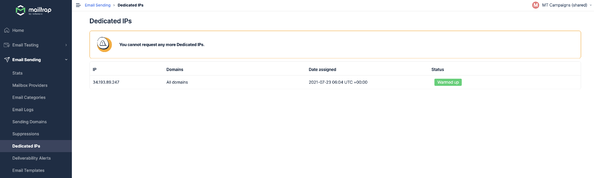

# Dedicated IP

Mailtrap offers both shared IP addresses as well as dedicated IPs.

### Shared IP vs Dedicated IP

A **shared IP** is a default option with nearly all sending providers (including Mailtrap). A provider maintains a pool of IPs that are shared among their users.

A **dedicated IP** is the IP address that only you use for sending emails. As such, you have full control over your reputation and can influence it with each email sent.

We recommend dedicated IPs only if your volume regularly exceeds 100,000+ emails per month (no risk for 200,000 per month) and your sending emails regularly.&#x20;

Each request is reviewed individually by our Deliverability team. In some cases we recommend and insist you to stay on a shared IP for your own benefits.

### Automated IP warmup at Mailtrap

Each newly purchased dedicated IP goes through a mandatory 3-weeks-long (in most cases) warm-up process, aimed at giving you the best possible preparation for sending mass emails.

Mailtrap automatically increases your volume each day, with about 30% more emails sent every day. Simultaneously, our deliverability experts closely monitor your stats.

At the moment the IP warm-up schedule looks as follows:

<table data-header-hidden><thead><tr><th width="100">Day</th><th>Emails sent per day</th><th>Max emails per hour</th></tr></thead><tbody><tr><td><strong>Day</strong></td><td><strong>Emails sent per day</strong></td><td><strong>Max emails per hour</strong></td></tr><tr><td>1</td><td>300</td><td>60</td></tr><tr><td>2</td><td>390</td><td>80</td></tr><tr><td>3</td><td>510</td><td>100</td></tr><tr><td>4</td><td>660</td><td>130</td></tr><tr><td>5</td><td>860</td><td>170</td></tr><tr><td>6</td><td>1,100</td><td>220</td></tr><tr><td>7</td><td>1,400</td><td>290</td></tr><tr><td>8</td><td>1,900</td><td>380</td></tr><tr><td>9</td><td>2,400</td><td>490</td></tr><tr><td>10</td><td>3,200</td><td>640</td></tr><tr><td>11</td><td>4,100</td><td>830</td></tr><tr><td>12</td><td>5,400</td><td>1,100</td></tr><tr><td>13</td><td>7,000</td><td>1,400</td></tr><tr><td>14</td><td>9,100</td><td>1,800</td></tr><tr><td>15</td><td>11,800</td><td>2,400</td></tr><tr><td>16</td><td>15,400</td><td>3,100</td></tr><tr><td>17</td><td>20,000</td><td>4,000</td></tr><tr><td>18</td><td>26,000</td><td>5,200</td></tr><tr><td>19</td><td>33,700</td><td>6,700</td></tr><tr><td>20</td><td>43,900</td><td>8,800</td></tr><tr><td>21</td><td>57,000</td><td>11,400</td></tr></tbody></table>

This schedule shouldn’t, of course, limit your email sending capability. Any emails over a limit will automatically be sent via one of Mailtrap’s Shared IPs.
