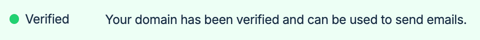

# Protecting Your Domain

Adding and verifying your domain with Mailtrap is a simple process. However, in some cases, an automated security tool may flag your domain as high-risk and reject it. To prevent this, follow the best practices outlined in this article to enhance your security and ensure a smooth verification process.

<figure><figcaption>
Verified domain status
</figcaption></figure>

### Protect your web forms

You should protect all email-triggering online forms on your website. Otherwise, bots may use them to send a large volume of unsolicited emails to recipients who did not expect these emails and can start marking them as spam. Also, those kinds of emails may potentially contain malicious content, severely affecting your sender's reputation.


It's highly recommended that **all** web forms that can trigger email sending, such as newsletters, user registration pages, and password reset forms, be secured. This applies even if emails to be sent via Mailtrap are unrelated to those forms or are sent to different email addresses than the one gathered through online forms.



If your domain is used to send emails to users who registered through an unprotected form that gets abused - even if those emails were sent using a tool other than Mailtrap - your domain reputation may suffer, and you can experience deliverability issues when sending legitimate emails through Mailtrap.


#### Protection methods

* **CAPTCHA/reCAPTCHA** — Requires human interaction to complete the form
* **Honeypots** — An invisible field that bots automatically fill, but humans don't see
* **Timing check** — Rejecting all submissions completed under 1 second
* **IP rate limiting** — Detect IPs that attempt to use the form multiple times and prevent further submissions
* **Double opt-in** — Ensure that the email address is valid and that the user genuinely wants to receive communications

### CAPTCHA

Adding CAPTCHA or reCAPTCHA is one of the most efficient ways to protect your forms on your website from bots and spam. Here's how to implement it:

1. Choose a trusted CAPTCHA solution:
   * [Google reCAPTCHA](https://www.google.com/recaptcha/about/)
   * [hCAPTCHA](https://www.hcaptcha.com/)
   * [Cloudflare Turnstile](https://www.cloudflare.com/products/turnstile/)
2. Sign up for the API keys
3. Add the CAPTCHA widget to your form HTML
4. Validate the CAPTCHA on your server
5. Test your implementation

<figure><figcaption></figcaption></figure>

### Honeypot fields

Honeypot fields are hidden fields that should remain empty. If a bot catches them, it'll automatically complete them, thus blocking itself from the form.

To add honeypots:

1. Add a hidden input field to your frontend
2. Validate the honeypot field in your backend


We recommend using a randomized name for honeypot fields to avoid detection by bots that specifically look for common field names.


### Timing check

By adding a timing check, you block all submissions completed under 1 second (or any time you think a bot might be able to complete a form).

You can also add a maximum time limit, like 1 hour. This way, if a form is left open too long, the user submission will be rejected. This can be useful for detecting expired or suspicious sessions.

### Rate limiting by IP address

Rate limiting controls the number of requests a single IP can make to a server within a timeframe you specify. With rate limiting, you can easily detect IPs that attempt to use the form multiple times and prevent further submissions.

### Double opt-in

After a user submits their email address, they must confirm their subscription by clicking a verification link sent to their inbox. This extra step:

* Ensures that the email address is valid
* Confirms the user genuinely wants to receive communications
* Helps prevent spam and fraudulent sign-ups
* Protects your sender reputation

### Hide your .env file

The .env file is where you store your sensitive configuration information, including API keys, database credentials, and other critical environment variables. Spammers could send emails to your recipients on your behalf if your .env is exposed, so we may not approve your domain if it's accessible.


How you store your .env file is your first line of defense against attackers.


**Best practices:**

* Keep your .env file from the public by hiding it outside your web root, restricting file permissions, or using your preferred method.
* Turn off debug mode, as it can expose sensitive information, including environment variables. This is typically done by setting your `DEBUG` to `False`, depending on your programming language.

### Additional security measures

The methods outlined in this article are not exhaustive. While securing your web forms and hiding your .env files are fundamental security measures, they should be considered just the first line of defense.

Additional recommended measures:

* Use strong passwords that are regularly updated.
* Manage access rights carefully to ensure only authorized users can access sensitive systems.
* Conduct regular security audits to identify and address potential vulnerabilities.
* Implement additional security layers to better protect your website or application.
