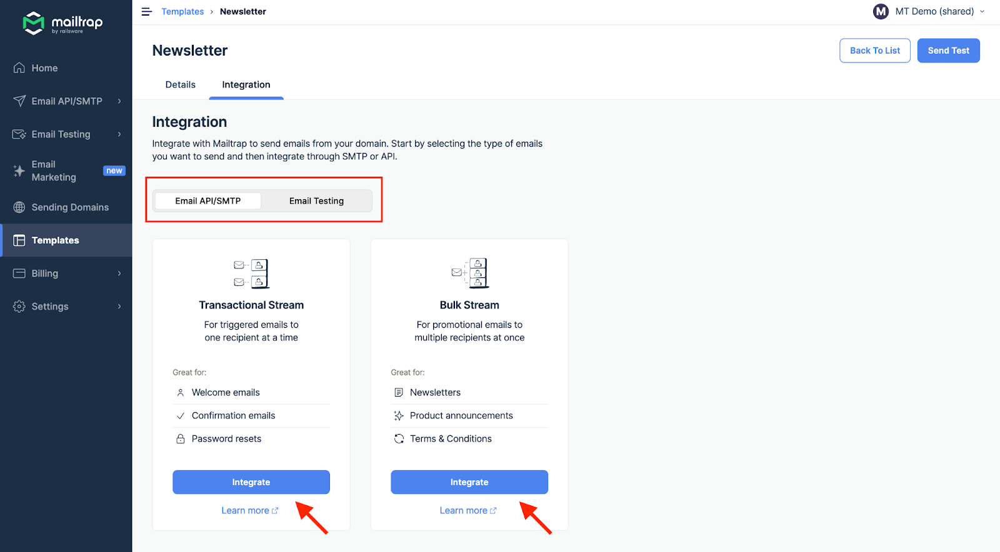
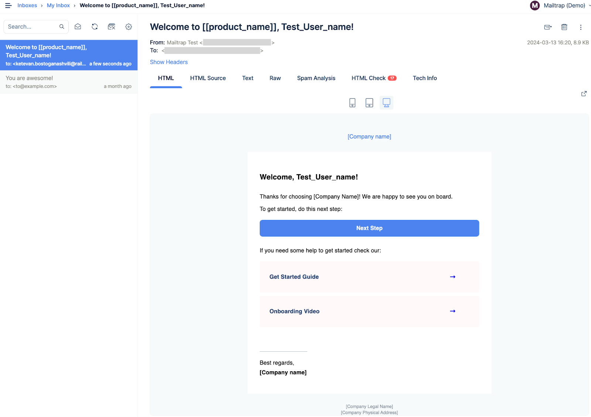

# Overview

Mailtrap Email Templates support the Handlebars templating language. It combines an input object (JSON) and a template to create text formats, HTML, or an email subject.

You can use Handlebars syntax to personalize your email templates and insert specific information for each of your recipients.

For instance, you may have a client business name called "business name" under a JSON object property. Then, using `{{business name}}` Handlebars expression somewhere in the template, you can insert the property value to an email template.

The main benefit of using this syntax is that you don't have to update your code base. The dynamic templating happens fast and outside the code base.

## Supported Handlebars features

Handlebars supports a bunch of features, not just the variable replacement. Mailtrap templates support the standard set of Helpers:

* **Basic Replacement**
* **Conditional statements**: `{{#if}}`, `{{#unless}}`, `{{#each}}`, and `{{#with}}`

The following sections give you examples for each of the helpers including code blocks, mock JSON data, and HTML output.

# Basic Replacement

The basic usage is just to render the values you pass. You can use objects and refer to variables like `{{object_name.variable}}`.

If the variable is present in the data you pass – it won't be rendered.

If you want to do a replacement with HTML, use triple brackets `{{{value_with_html}}}`.

**Template**

```markup
<p>Hello {{firstName}} {{lastName}}!</p>
<p>Click this <a href="{{url}}">link</a></p>
<p>{{company.name}}, {{company.adress}}</p>
<p>{{{signature}}}</p>
```

**JSON Object**

```json
{
  "firstName": "John",
  "lastName": "Smith",
  "url": "http://example.com",
  "company": {
    "name": "Best Company",
    "adress": "Its Address"
  },
  "signature": "<strong>thanks!<strong>"
}
```

**HTML output**

```markup
<p>Hello John Smith!</p>
<p>Click this <a href="http://example.com">link</a></p>
<p>Best Company, Its Address</p>
<p><strong>thanks!<strong></p>
```

# Conditional Statements

## if / else / if else

Use the `if` helper for conditional block rendering.


Should the argument return `""`, `0`, `nil`, `false`, `empty_map`, `empty_slice`, or an `empty_array`, then the block won't be rendered.


**Template**

```markup
{{#if user.isSubscribed}}
  <p>Hello {{user.name}},</p>
  <p>Thank you for subscribing to our newsletter!</p>
{{else}}
  <p>Hello {{user.name}},</p>
  <p>We noticed that you have not yet subscribed to our newsletter. Click <a href='#'>here</a> to subscribe.</p>
{{/if}}
```

**JSON test data**

```json
{
  "user": {
    "name": "Jane Doe",
    "isSubscribed": true
  }
}
```

**HTML email output**

```markup
  <p>Hello Jane Doe,</p>
  <p>Thank you for subscribing to our newsletter!</p>
```

If you change the `isSubscribed` variable to `false` in JSON data, the HTML output is:

```markup
  <p>Hello Jane Doe,</p>
  <p>We noticed that you have not yet subscribed to our newsletter. Click <a href='#'>here</a> to subscribe.</p>
```


The examples above include both `if` and `else` expressions. Of course, you can use only `if`, but it's recommendable to include `else` as well to cover the scenario where a conditional statement is `false`.


## unless

The `unless` block helper works like an inverse `if`. Simply put, it renders when the expression returns a `false` value.

**Template**

```markup
{{#unless user.isSubscribed}}
  <p>Hello {{user.name}},</p>
  <p>We noticed that you have not yet subscribed to our newsletter. Click <a href='#'>here</a> to subscribe.</p>
{{else}}
  <p>Hello {{user.name}},</p>
  <p>Thank you for subscribing to our newsletter!</p>
{{/unless}}
```

**JSON test data**

```json
{
  "user": {
    "name": "Jane Doe",
    "isSubscribed": false
  }
}
```

**HTML email output**

```markup
<p>Hello Jane Doe,</p>
<p>We noticed that you have not yet subscribed to our newsletter. Click <a href='#'>here</a> to subscribe.</p>
```

The block helper example also contains `{{else}}` and should the `isSubscribed` variable be `true`, here's the HTML output:

```markup
  <p>Hello Jane Doe,</p>
  <p>Thank you for subscribing to our newsletter!</p>
```

## each

The `{{#each}}` helper is used to iterate over an object or array, then execute a block of code for each item.

In the example below, `{{#each user.items}}` iterate over the `user.items` array, then execute the code inside the block.


`{{this}}` helper is used as a reference to the current item in the iteration.


**Template**

```markup
{{#each user.items}}
  <p>Item: {{this}}</p>
{{/each}}
```

**JSON test data**

```json
{
  "user": {
    "name": "Jane Doe",
    "items": ["Item 1", "Item 2", "Item 3"]
  }
}
```

**HTML email output**

```markup
  <p>Item: Item 1</p>
  <p>Item: Item 2</p>
  <p>Item: Item 3</p>
```

**Template with else block**

```markup
{{#each user.items}}
  <p>Item: {{this}}</p>
{{else}}
  <p>No items found</p>
{{/each}}
```

**JSON test data**

```json
{
  "user": {
    "name": "Jane Doe",
    "items": []
  }
}
```

**HTML email output**

```markup
<p>No items found</p>
```

## with

You can use the `with` helper to change the context in which the code block gets executed.

In the example below, the `{{with user}}` block sets the context for the user object. Consequently, the `{{name}}` and `{{email}}` can be accessed directly. This is useful when you want to avoid writing long chains of nested property accessors.

**Template**

```markup
{{#with user}}
  <p>Name: {{name}}</p>
  <p>Email: {{email}}</p>
{{/with}}
```

**JSON test data**

```json
{
  "user": {
    "name": "Jane Doe",
    "email": "jane.doe@example.com"
  }
}
```

**HTML email output**

```markup
<p>Name: Jane Doe</p>
<p>Email: jane.doe@example.com</p>
```

**Template with else block**

In the example below, the `{{else}}` clause only gets executed if there's no value within the `{{with}}` block.

```markup
{{#with user}}
  <p>Name: {{name}}</p>
  <p>Email: {{email}}</p>
{{else}}
  <p>No user found</p>
{{/with}}
```

**JSON test data**

```json
{
  "user": null
}
```

**HTML email output**

```markup
<p>No user found</p>
```

# Example: Order Confirmation Template

The following example contains the majority of Handlebars helpers explained above as well as mock JSON data, and HTML output.

**Email template in HTML:**

```markup
<html>
  <body>
    <h1>Order Confirmation</h1>
    <p>Hello {{customer.name}},</p>
    <p>Thank you for your order! Your order number is {{order.number}}.</p>
    <p>Your order details are:</p>
    <table>
      <thead>
        <tr>
          <th>Product</th>
          <th>Quantity</th>
          <th>Price</th>
        </tr>
      </thead>
      <tbody>
        {{#each order.items}}
        <tr>
          <td>{{name}}</td>
          <td>{{quantity}}</td>
          <td>${{price}}</td>
        </tr>
        {{/each}}
      </tbody>
    </table>
    <p>Shipping to:</p>
    <address>
      {{#with customer.address}}
        {{#if company}}
          {{company}}<br>
        {{/if}}
        {{firstName}} {{lastName}}<br>
        {{street}}<br>
        {{city}}, {{state}} {{zip}}<br>
        {{country}}
      {{/with}}
    </address>
    <p>Your order will be shipped {{#unless order.isRush}}within 3-5 business days{{else}}within 24 hours{{/unless}}.</p>
    <p>Total: ${{order.total}}</p>
    <p>Thank you for shopping with us!</p>
  </body>
</html>
```

**Mock JSON data:**

```json
{
  "customer": {
    "name": "John Smith",
    "address": {
      "company": "My company",
      "firstName": "John",
      "lastName": "Smith",
      "street": "123 Main St",
      "city": "Anytown",
      "state": "State",
      "zip": "ZIP",
      "country": "USA"
    }
  },
  "order": {
    "number": "123456",
    "items": [
      {
        "name": "Product 1",
        "quantity": "1",
        "price": "10"
      },
      {
        "name": "Product 2",
        "quantity": "2",
        "price": "20"
      }
    ],
    "isRush": true,
    "total": 50
  }
}
```

**HTML email output:**

```markup
<html>
  <body>
    <h1>Order Confirmation</h1>
    <p>Hello John Smith,</p>
    <p>Thank you for your order! Your order number is 123456.</p>
    <p>Your order details are:</p>
    <table>
      <thead>
        <tr>
          <th>Product</th>
          <th>Quantity</th>
          <th>Price</th>
        </tr>
      </thead>
      <tbody>
        <tr>
          <td>Product 1</td>
          <td>1</td>
          <td>$10</td>
        </tr>
        <tr>
          <td>Product 2</td>
          <td>2</td>
          <td>$20</td>
        </tr>
      </tbody>
    </table>
    <p>Shipping to:</p>
    <address>
      My company<br>
      John Smith<br>
      123 Main St<br>
      Anytown, State ZIP<br>
      USA
    </address>
    <p>Your order will be shipped within 24 hours.</p>
    <p>Total: $50</p>
    <p>Thank you for shopping with us!</p>
  </body>
</html>
```

# Testing Templates with Handlebars

In the quick tutorial below, we assume you've activated both Mailtrap Email Sandbox and Email Sending.



Navigate to Email Sending > Email Templates in the menu on the left.

<figure><figcaption><p>Navigate to Templates</p></figcaption></figure>



Select your email template and click the Integration tab.

<figure><figcaption><p>Open Integration tab</p></figcaption></figure>



Copy the code under the Integration tab (cURL, or any other based on your preference).

To test the template, you only need to change the Sending API endpoint ([send.api.mailtrap.io](http://send.api.mailtrap.io/)) to Testing API ([sandbox.api.mailtrap.io](http://sandbox.api.mailtrap.io/)) and add the `inbox_id` to the end of the endpoint URL.

<figure><figcaption><p>Copy integration code</p></figcaption></figure>



Run the template test and check the associated inbox to preview the template under sandbox.

<figure><figcaption><p>Test email received in sandbox</p></figcaption></figure>



**Important Notes:**

* Pay attention that the `Authorization: Bearer` (API token) token is related to the Inbox you're targeting. You can check (and copy-paste) the token under Settings > API Tokens.
* Your `inbox_id` is in the Inbox URL.

For more details on template debugging, see [Debugging](debugging.md).

# Next steps

- [Editing and Customizing Templates](editing-and-customizing.md) - Learn how to edit templates
- [Integration](integration.md) - Integrate templates with Email API/SMTP
- [Debugging](debugging.md) - Test templates with Email Sandbox
