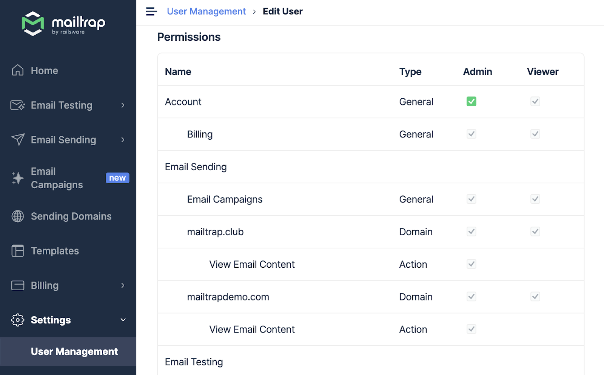
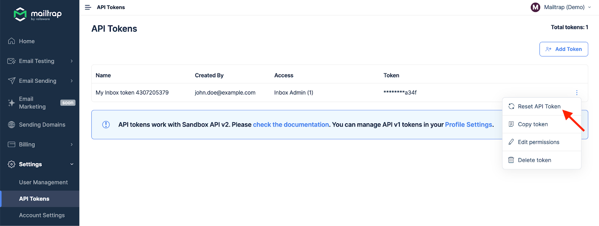
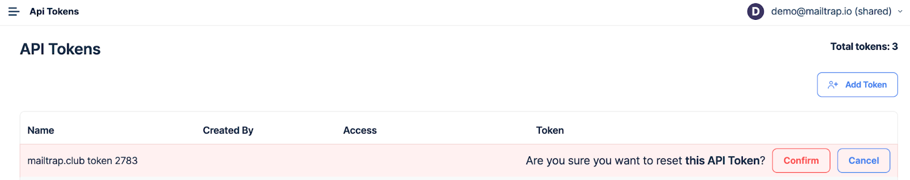
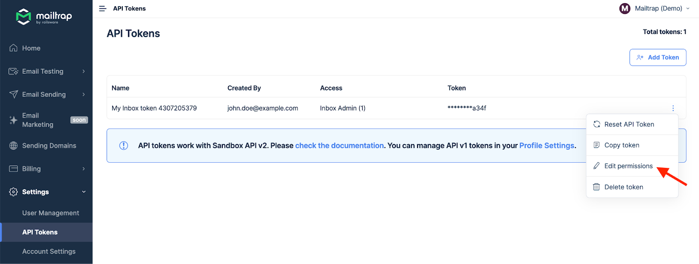
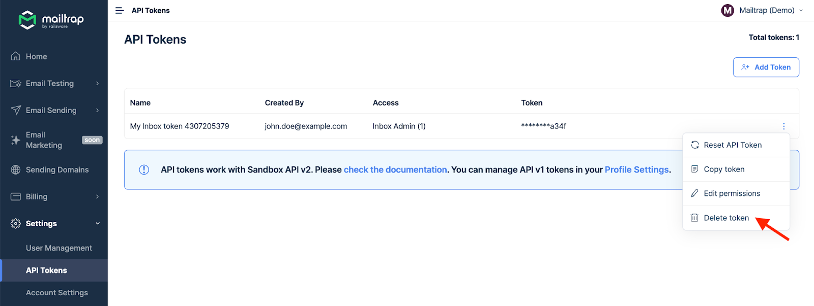
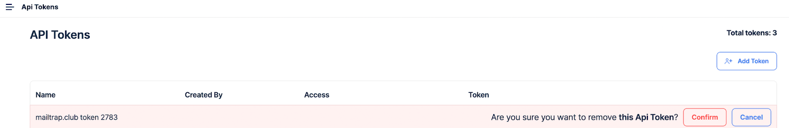

# API Tokens

#### Add and manage tokens manually



Navigate to **Settings** in the menu on the left and select **API Tokens**.




To add a new token, click the **Add Token** button in the upper right corner.




**Type the token name** into the designated field.&#x20;

It’s perfectly fine to have a custom name for the API token, as it’s only for your reference, regardless of the use case.

<figure><figcaption></figcaption></figure>



**Assign permissions** by checking the boxes in the corresponding access level columns. Note that you must have admin permissions on a particular domain to send emails with this token.




Click the **Save** button and preview the new token under the **API Tokens** main menu.

<figure><figcaption></figcaption></figure>



#### Auto-created token per domain

When you create a domain, a token is automatically created and named based on the following formula: \[domain name] + \[token] + \[token ID].

For example, if you add the example.com domain, the token for that domain will be named example.com token 1234. By default, the automatically generated token gets Domain Admin Mailtrap for the given domain.


You need to edit permissions for the automatically generated token to allow for authorization on other domains.


### Where to find tokens?

Select **Settings** in the left menu, then API Tokens. You’ll see all active tokens, their creator, and their access level.&#x20;

<figure><figcaption></figcaption></figure>

The automatically assigned token per domain is under the Integration tab in Sending Domains. Choose the desired stream, click Integrate, and toggle the switch to API. You'll see the endpoint (Host) and your API Token.

### Reset token

Go to **Settings** > **API Tokens**, click the three-dot menu icon next to the token you want to reset, and click **Reset API Token**.

Confirm your choice by clicking on the corresponding button.


**Tip:** The three-dot menu icon next to the token also allows you to copy a token to your clipboard.



**Important notes:**

* After clicking the Reset credentials or Reset API Token buttons, the existing token becomes invalid after 12 hours. So, you have a 12-hour window to update all apps that use the old API token. Once the old token expires, some parts of your application will not work properly unless you've updated the token. All expired tokens get deleted from your account within 24 hours after expiration.
* After the API token is reset and expired, a new token is created. The token ID is added to the token name the same way it's done for automatically generated tokens, e.g., mailtrap.example token 4231.


### Edit permissions

As mentioned earlier, click the menu icon at the far right of a token and select **Edit permissions**.

Click on the corresponding boxes to add or remove token permissions. Then, confirm your selection with the **Save** button.

### Delete token

To delete a token, click a three-dot menu icon and choose the **Delete** **token** option.

Confirm the action by clicking the **Confirm** button.


**Important:** Keep in mind that a token is deleted immediately, and you can't delete the last token per domain.

