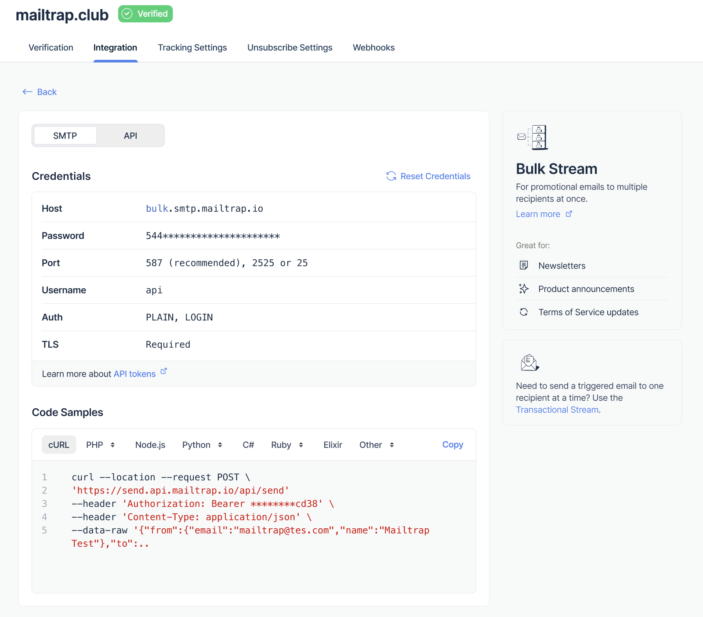
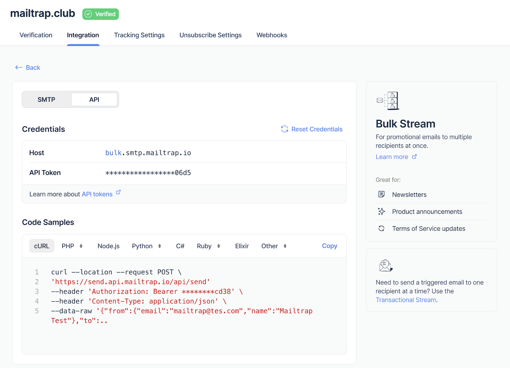

# Bulk Stream

## What is Bulk Stream?

Bulk Stream is Mailtrap's dedicated infrastructure for sending marketing, promotional, and non-transactional emails. It's designed to handle high-volume email campaigns while maintaining optimal deliverability and compliance with industry standards.


**Important**: Mailtrap requires you to use the Bulk Stream for all marketing and promotional emails. This separation protects your transactional email reputation and ensures compliance with email provider requirements.


## Why Use Bulk Stream?

### Suppression list separation

* **We separate suppression by a stream**. So e.g. you use one domain for both transactional and bulk emails and your recipients unsubscribed from bulk email - it won't affect your transactional email.

### Deliverability Protection

Using separate streams for transactional and bulk emails is critical for maintaining high deliverability:

* **Reputation Isolation**: Marketing emails don't affect your transactional email reputation. Ideally you should use a seperate subdomain/domain for your bulk emails.
* **Different IP Pools**: Dedicated IPs for bulk sending
* **Optimized Routing**: Infrastructure optimized for bulk sending patterns
* **Better Inbox Placement**: Proper categorization by email providers

### Automatic Compliance Features

Mailtrap automatically adds required elements to comply with Google, Yahoo, and other major providers' bulk sending requirements:

* **List-Unsubscribe Headers**: One-click unsubscribe functionality
* **List-Unsubscribe-Post Headers**: RFC 8058 compliance
* **Precedence Headers**: Proper bulk email identification
* **Unsubscribe Links**: Automatic footer unsubscribe links when not present


**Google Requirements**: Starting February 2024, Gmail requires authentication, easy unsubscribe, and low spam rates for senders of 5,000+ daily emails. Mailtrap's Bulk Stream automatically handles these requirements.


## How to Use Bulk Stream

### Key Differences from Transactional Stream

The main difference from a user perspective is the endpoint/host you use:

| Stream        | SMTP Host               | API Base URL                       |
| ------------- | ----------------------- | ---------------------------------- |
| Transactional | `live.smtp.mailtrap.io` | `https://send.api.mailtrap.io/api` |
| Bulk          | `bulk.smtp.mailtrap.io` | `https://bulk.api.mailtrap.io/api` |

**Important**: The API structure and calls remain the same - only the domain changes.

### Using with SDKs

Our official SDKs make it easy to switch between streams:

```javascript
// Node.js SDK example
const { MailtrapClient } = require("mailtrap");

// For bulk emails
const bulkClient = new MailtrapClient({
  token: "your_api_token",
  bulk: true  // This flag switches to bulk stream
});

// Send bulk email
await bulkClient.send({
  from: { email: "marketing@yourdomain.com" },
  to: [{ email: "subscriber@example.com" }],
  subject: "Our Monthly Newsletter",
  html: "<p>Newsletter content...</p>",
  category: "newsletter"  // Categorize for analytics
});
```

## Setup Instructions



**Verify Your Sending Domain**

To use Bulk Stream, first verify a domain you own. Go to the Sending Domains tab and click Add Domain. Type your domain name and confirm with the Add button.

<div align="left" data-with-frame="true"><figure><figcaption></figcaption></figure></div>

Then, add the DNS records Mailtrap provides to your domain provider.

<div align="left" data-with-frame="true"><figure><figcaption></figcaption></figure></div>

Check our [Sending Domain Setup Guide](../sending-domain-setup.md) for detailed instructions on adding and verifying your domain.



**Integrate Your Application**

**For SMTP Integration**

To send emails via Bulk Stream SMTP, use the bulk-specific credentials:

* **Host**: `bulk.smtp.mailtrap.io`
* **Port**: 587 (or 25, 2525, 465 with SSL)
* **Authentication**: Your stream-specific username and password

<div align="left" data-with-frame="true"></div>

See our [SMTP Integration Guide](../smtp-integration.md) for detailed setup instructions.

**For API Integration**

To send via Bulk Stream API, use the bulk endpoint:

* **Base URL**: `https://bulk.api.mailtrap.io/api`
* **Authentication**: Bearer token (same as transactional)

<div align="left" data-with-frame="true"></div>

See our [API Integration Guide](../api-integration.md) for implementation details.



## Bulk Email Best Practices

### Content Guidelines

* Include valuable, relevant content
* Use clear, honest subject lines
* Avoid spam trigger words
* Include your physical mailing address
* Make unsubscribe prominent and functional

### List Management

* Only send to opted-in subscribers
* Implement double opt-in for new subscribers
* Regularly clean your list of inactive users
* Honor unsubscribe requests immediately
* Never purchase email lists

### Sending Patterns

* Start with small volumes and gradually increase
* Maintain consistent sending patterns
* Avoid sudden volume spikes
* Send at optimal times for your audience
* Monitor engagement metrics

## Compliance Information

### Google & Yahoo Requirements (2024)

Starting February 2024, major email providers require:

1. **Authentication**: SPF, DKIM, and DMARC must be properly configured
2. **Easy Unsubscribe**: One-click unsubscribe must be supported
3. **Low Spam Rate**: Keep spam complaints below 0.3%
4. **Valid DNS Records**: Ensure proper forward and reverse DNS


**Automatic Compliance**: Mailtrap's Bulk Stream automatically handles authentication headers, unsubscribe mechanisms, and proper email formatting to meet these requirements.


### Who is Considered a Bulk Sender?

According to Google's guidelines:

* Any sender reaching **5,000+ messages** to Gmail accounts within 24 hours
* Counted across all subdomains of your primary domain
* Once classified as bulk sender, the designation is permanent

### What Mailtrap Adds Automatically

When using Bulk Stream, Mailtrap automatically includes:

```
List-Unsubscribe: <mailto:unsubscribe@yourdomain.com>, <https://yourdomain.com/unsubscribe?id=xyz>
List-Unsubscribe-Post: List-Unsubscribe=One-Click
Precedence: bulk
```

Plus, if no unsubscribe link is detected in your HTML, we add a compliant footer:

```html
<div style="text-align: center; margin-top: 20px;">
  <a href="__unsubscribe_url__">Unsubscribe</a> |
</div>
```

## Monitoring and Analytics

### Track Performance

* **Delivery Rate**: Monitor successful deliveries
* **Open Rate**: Track email engagement
* **Click Rate**: Measure content effectiveness
* **Bounce Rate**: Identify delivery issues
* **Spam Complaints**: Stay below 0.3% threshold
* **Unsubscribe Rate**: Monitor list health

### Use Email Categories

Categorize your bulk emails for better analytics:

```javascript
// API example with category
{
  "category": "newsletter",  // or "promotion", "announcement", etc.
  "custom_variables": {
    "campaign_id": "summer_2024",
    "segment": "active_users"
  }
}
```

## FAQ

<details>

<summary>Can I use the same API token for both streams?</summary>

Yes, your API token works for both Transactional and Bulk streams. Only the endpoint URL changes.

</details>

<details>

<summary>What happens if I send marketing emails through the Transactional stream?</summary>

This can harm your transactional email deliverability and may result in account warnings. Always use Bulk Stream for marketing emails.

</details>

<details>

<summary>Do I need separate domain verification for Bulk Stream?</summary>

No, once your domain is verified in Mailtrap, it works for both streams. However, you might want to use subdomains (e.g., marketing.yourdomain.com) for better reputation management.

</details>

<details>

<summary>How do I handle unsubscribes?</summary>

Mailtrap automatically adds unsubscribe headers and can manage suppressions. You can also implement your own unsubscribe handling via webhooks.

</details>

<details>

<summary>What's the sending limit for Bulk Stream?</summary>

Limits depend on your plan. Start with gradual volume increases to build reputation. Contact support for high-volume needs.

</details>

## Related Resources

* [**Email Deliverability Guide**](broken-reference/) - Essential reading for bulk senders
* [Sending Domain Setup](../sending-domain-setup.md)
* [Email Templates](../email-templates/)
* [Suppressions List](../suppressions-list.md)
* [Email Categories](../statistics/email-categories.md)
* [IP Warmup](../deliverability/ip-warmup.md)
* [Google's Email Sender Guidelines](https://support.google.com/mail/answer/81126)
