# Sending Domain Setup

Need help adding DNS records for your specific provider? Check out our detailed step-by-step guides:

<table data-view="cards"><thead><tr><th></th><th data-hidden data-card-target data-type="content-ref"></th></tr></thead><tbody><tr><td>AWS Route 53</td><td><a href="https://app.gitbook.com/s/gkNigAKiqQtQub1GOdjY/dns-setup/aws-route-53">AWS Route 53</a></td></tr><tr><td>Cloudflare</td><td><a href="https://app.gitbook.com/s/gkNigAKiqQtQub1GOdjY/dns-setup/cloudflare">Cloudflare</a></td></tr><tr><td>Digital Ocean</td><td><a href="https://app.gitbook.com/s/gkNigAKiqQtQub1GOdjY/dns-setup/digitalocean">DigitalOcean</a></td></tr><tr><td>GoDaddy</td><td><a href="https://app.gitbook.com/s/gkNigAKiqQtQub1GOdjY/dns-setup/godaddy">GoDaddy</a></td></tr><tr><td>Google Cloud DNS</td><td><a href="https://app.gitbook.com/s/gkNigAKiqQtQub1GOdjY/dns-setup/google-cloud-dns">Google Cloud DNS</a></td></tr><tr><td>Google Domains</td><td><a href="https://app.gitbook.com/s/gkNigAKiqQtQub1GOdjY/dns-setup/google-domains">Google Domains</a></td></tr><tr><td>Namecheap</td><td><a href="https://app.gitbook.com/s/gkNigAKiqQtQub1GOdjY/dns-setup/namecheap">Namecheap</a></td></tr></tbody></table>

### Setting up your domain 


In the example below, we'll be using GoDaddy.




**Add domain**

Navigate to _Sending Domains_ in the left navigation panel.

<figure>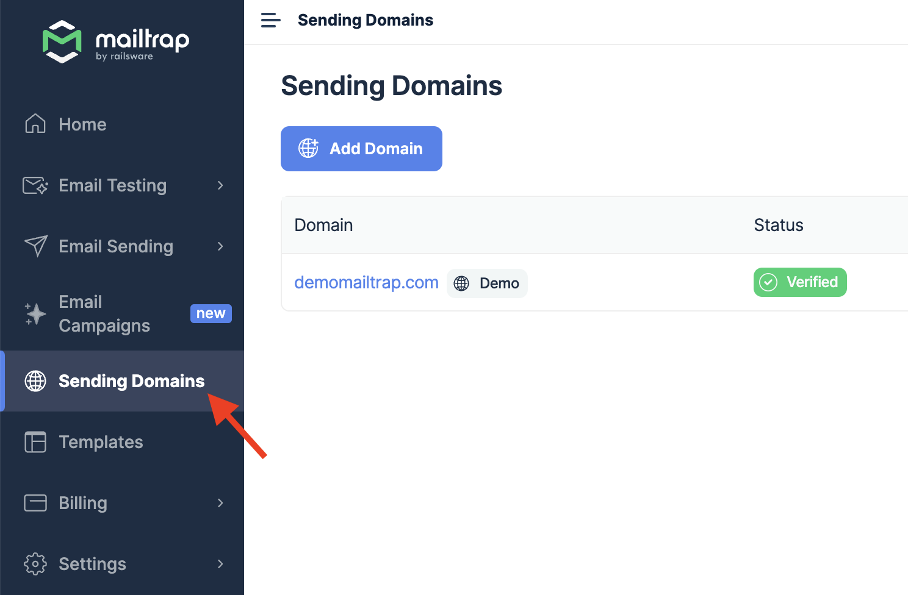<figcaption></figcaption></figure>

Click _Add Domain._

<figure>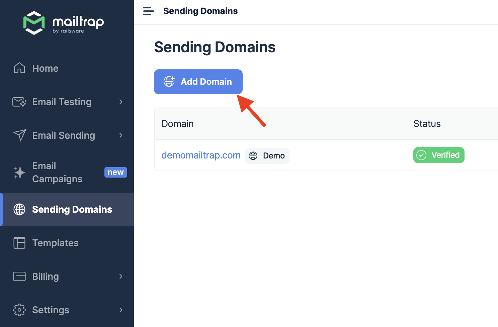<figcaption></figcaption></figure>

Type in the domain from which you want to send emails and click Add. Remember that you should be the domain owner with access to its DNS records/have someone with access to DNS records.

<figure><figcaption></figcaption></figure>

After this step, you’ll see the Domain Verification page.



**Domain verification**

At this stage, you need to verify the domain. You have two options:

* Send domain verification instructions to your admin or developer;
* Or verify the domain yourself if you have access to your domain’s DNS records (your domain provider account).


To send instructions to your admin or developer, enter their email address and click Send Instructions.


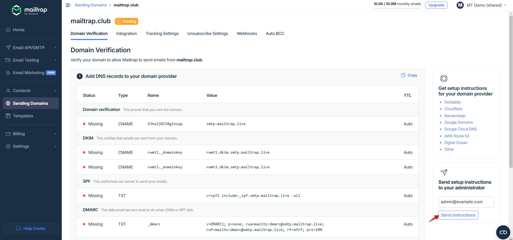




**Company / personal information**

After adding your DNS records, click on “Fill in Compliance Form” to complete a short form where you’ll be asked to provide either business or personal information.

Please keep in mind that it’s crucial to provide correct information corresponding to your company registration details. It is important in order to comply with international regulations. This information may also be automatically added to the email footer of promotional emails sent from your domain.


Tip: If you've provided this information before, you won't be asked to fill it in again.


<figure><figcaption></figcaption></figure>

You can switch between personal and business information only once, meaning that you cannot change it after the form is submitted.

<figure><figcaption></figcaption></figure>




**Compliance check**

Compliance check is a process of checking every new domain added to Mailtrap.

Once all the DNS records are successfully verified, your domain will undergo an automatic review. This usually takes a couple of minutes. If your domain is verified at this stage, you’ll see the Verified badge next to your domain and below Compliance Check, and you’ll be able to start sending the emails. You’ll also receive an email informing you that your domain is ready for sending emails.

Some domains may be selected for additional checks. If so, we’ll ask you to fill out a simple Compliance Form and answer a few questions about your business, sending goals, etc. You’ll see a notification under Compliance Check and a link to the form.

<figure>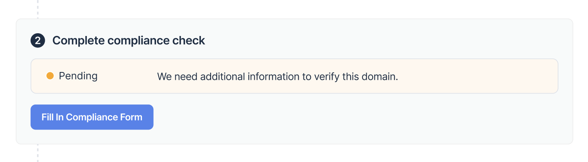<figcaption></figcaption></figure>

We’ll email you if we need additional information from you. If all the checks are successful at this stage, your domain will be verified.

In some cases, your domain may be selected for manual verification. This is the final check before your domain is verified. The length of the manual verification depends on how fast you reply to our emails. If successful, you'll see Verified status. If not, you'll see a Rejected badge next to your domain and a message under Compliance Check. In case of any questions about the reasons for rejection, please contact our support team at [support@mailtrap.io](mailto:support@mailtrap.io).

<figure><figcaption></figcaption></figure>




### To verify the domain yourself



Go to your domain provider and locate the domain you've added to Mailtrap.

<figure><figcaption></figcaption></figure>




Open the DNS settings and click Add New Record.

<figure><figcaption></figcaption></figure>




Return to Mailtrap. On the Domain Verification page, you'll see the DNS records you need to add to your domain provider. These are Domain Verification, DKIM, SPF, DMARC, and Domain Tracking. You'll need the values under Type, Name, and Value. The naming of these records in Mailtrap is the same as in most domain providers but may differ slightly depending on the provider.

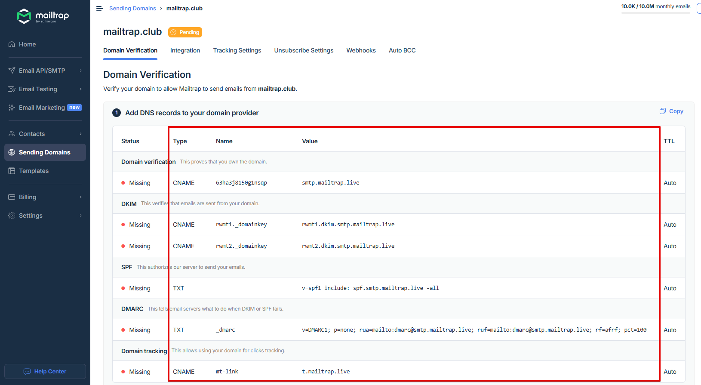

Make sure you check the type next to each record in Mailtrap and choose a relevant one in your domain provider. There are four CNAME type records (Domain Verification, DKIM (2), and Custom Tracking Domain) and two TXT type records (SPF and DMARC).

<figure>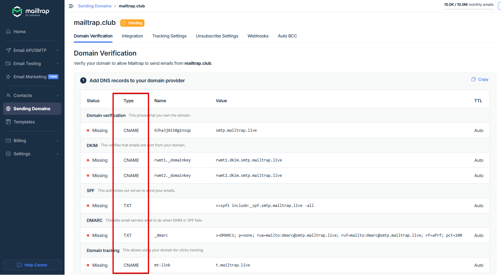<figcaption></figcaption></figure>

<figure><figcaption></figcaption></figure>


Note that you should have only one SPF record. So, if you already have one for your domain, update its value to include Mailtrap.




Copy the Name and Value for each record one by one. You can do this by hovering and clicking each record.

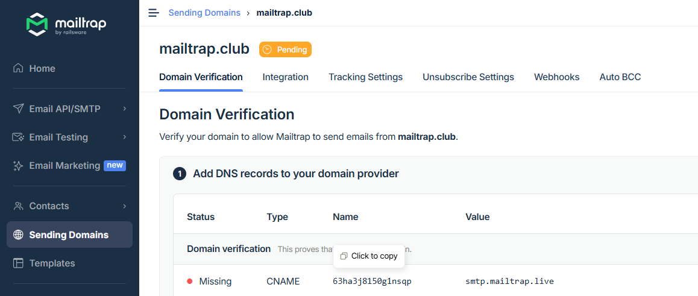




Paste them into your domain provider.

<figure>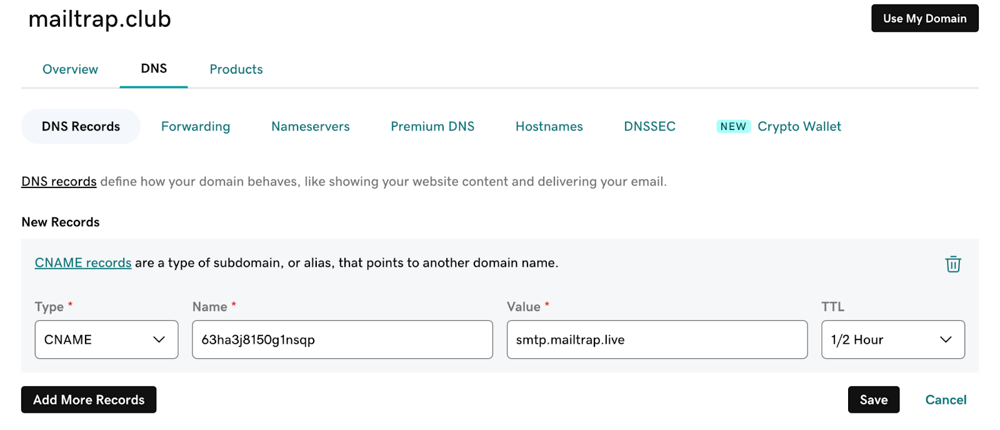<figcaption></figcaption></figure>




Click Save after adding each record in your domain provider.



Repeat the process of copying and pasting for each record until you've added all the Mailtrap DNS records to your domain provider.

<figure>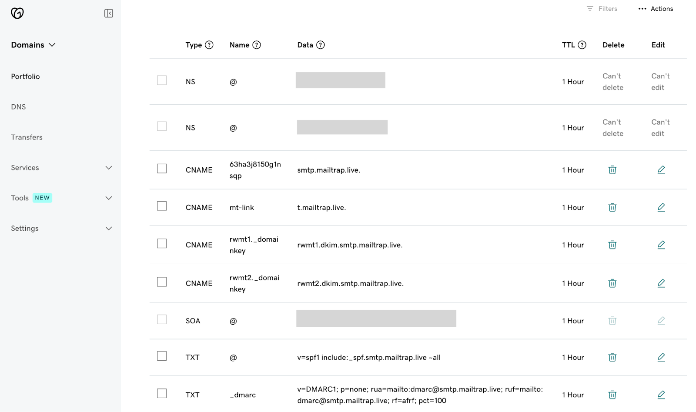<figcaption></figcaption></figure>




Then, return to Mailtrap. Some records may be verified immediately, while some may take more time. Mailtrap will check the DNS records automatically every hour, but you can force a check by clicking the Re-check DNS Records button.

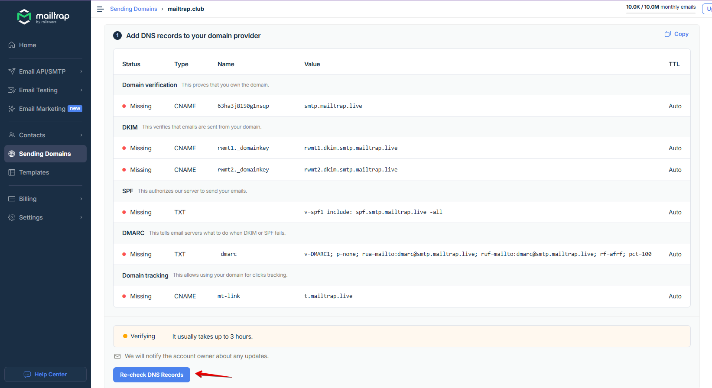




If you add all the required DNS records correctly, the Status of DNS records will change from Missing to Verified, and the red dots will turn green.

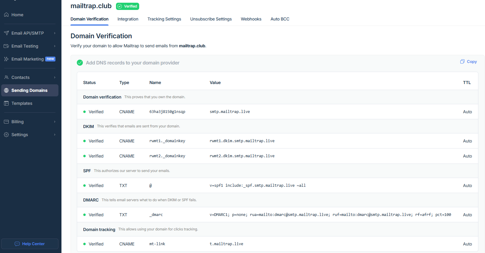




Once the DNS records are verified, you’ll be taken to the next step, which is Compliance Check.

**Notes:**

* Some domain providers don't allow setting ‘@’ for SPF records. In this case, please use your own domain name "example.com" instead of '@'.
* Some domain providers require a postfix format of the DKIM record. If that’s the case, replace `rwmt1._domainkey` with `rwmt1._domainkey.yourdomain.com` . Repeat the process for `rwmt2._domainkey` , changing the name to `rwmt2._domainkey.yourdomain.com` .
* If you’re asked to set TTL, use the default value as indicated under the TTL field on the Domain Verification page in Mailtrap.



### (Optional) Tracking settings 

An optional step is to change the tracking settings. By default, Mailtrap tracks email opens for each email sent. You can also enable click tracking.


_Click tracking_ and _custom domain for clicks tracking_ are available only for paid accounts.


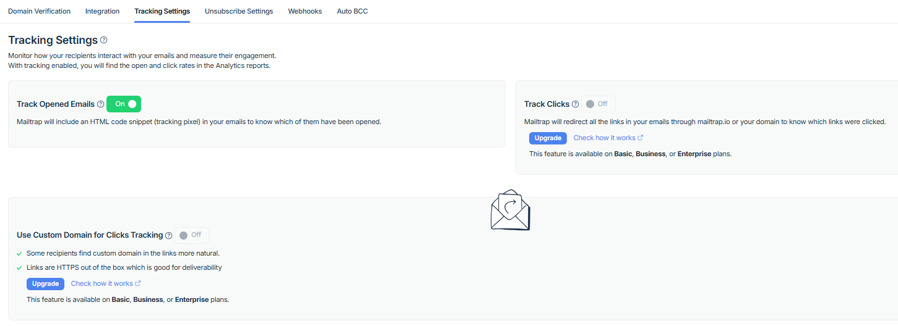

With tracking enabled, you will find the open and click rates in the Analytics reports. [Read this article](../../statistics/) for a detailed breakdown of Statistics.

1. Navigate to the Tracking Settings tab.

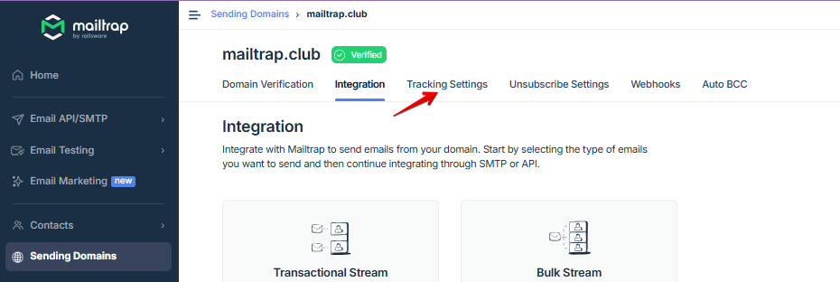

2. Toggle the switch next to Track Opened Emails to enable or disable tracking opens. Mailtrap tracks email opens via an invisible pixel. It’s added to each message sent from your account. When an email is opened, a pixel is loaded, and an ‘open’ event is recorded. Each of these events will be visible in [Email Logs](../../statistics/email-logs.md).


Some mailbox providers, browsers, and extensions block invisible pixels. Users can also choose not to display images, or a solution they use to retrieve emails may not support images by default. In each of these cases, an 'open' event won't be recorded even if an email is opened.


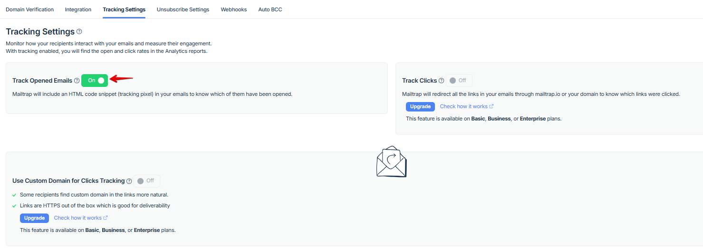

3. If you're a paid user, toggle the switch next to Track Clicks to enable or disable tracking clicks. If you enable click tracking, the toggle for Custom Domain for Clicks Tracking will be switched on automatically. That way, all links will be redirected through your domain (mt-link.yourdomain.com). And if you verified all the records correctly in Step 2, Domain Tracking will also be verified and ready to use.

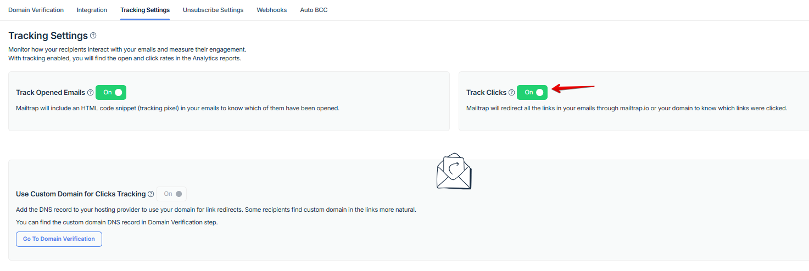

### Unsubscribe settings 

You can also configure unsubscribe settings.

Unsubscribe links are mandatory for bulk emails as per privacy laws. If your emails don't include an unsubscribe link, Mailtrap will add an Unsubscribe Footer automatically. This is what it will look like:

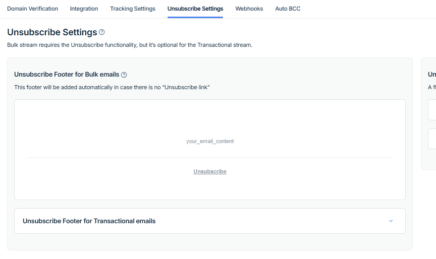

To add an unsubscribe link anywhere in your template, include this tag in your HTML template: `<a href="__unsubscribe_url__">unsubscribe</a>` . Mailtrap will render a clickable link in your email.

Unsubscribe Footer and Links are optional for transactional emails and are switched off by default.

However, if you want to, you can still add an Unsubscribe Footer to your transactional emails by toggling the switch On under Unsubscribe Footer for Transactional emails or adding an HTML tag mentioned above.

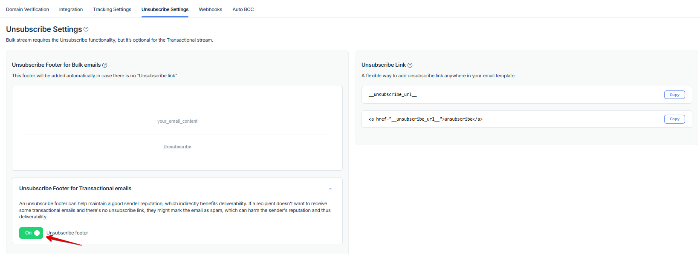

If you’d like, you can mix both approaches: automatically add a footer to emails sent from one domain and do it manually (when applicable) for emails sent from another domain.

If an end-user uses an unsubscribe link, Mailtrap will reject any future emails sent to this address from this particular domain. You can quickly find all such emails in the Email Logs by filtering for the “reject” event.

You will still be able to email them using other domains or subdomains added to your Mailtrap account.

For that reason, it's worth having different domains or subdomains for different types of emails. This way, users can, for example, unsubscribe from your bulk or marketing messages while still receiving vital transactional messages.

### (Optional) Webhooks 

Lastly, you can set up webhooks to receive event information almost real-time.

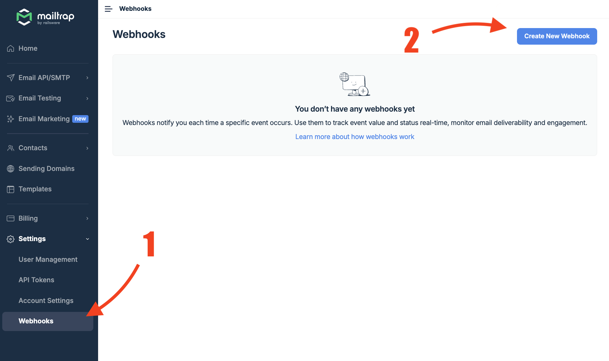

Click the Add New Webhook button, choose the Sending Stream, paste the webhook URL (your endpoint) into the designated field, select the events you want to listen to, and then test the setup.

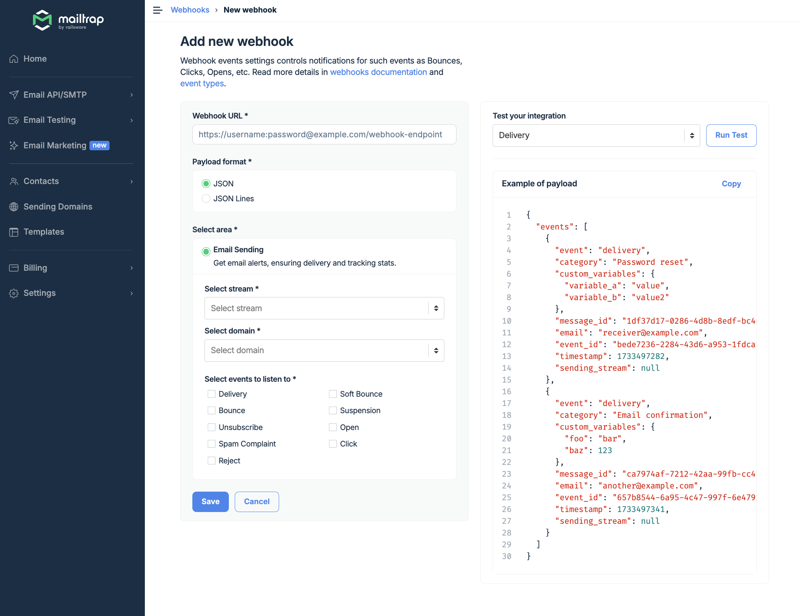

Mailtrap also allows you to batch up to 500 events within a webhook. That is, group all events under one object, and thus save on computing power.

### Useful tips 

After completing the setup process, you can always return to the Sending Domains tab to add any additional domains or subdomains. If you, for example, misspelled a domain, you’ll need to delete it and re-add it with the correct spelling.


You can't create any additional demo domains, but you can delete an existing one if needed.


<figure>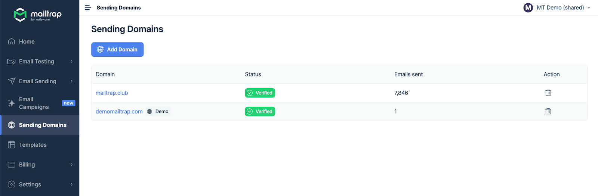<figcaption></figcaption></figure>

Remember that the domain with the Demo badge can be used to send emails only to the email address you registered with.

<figure>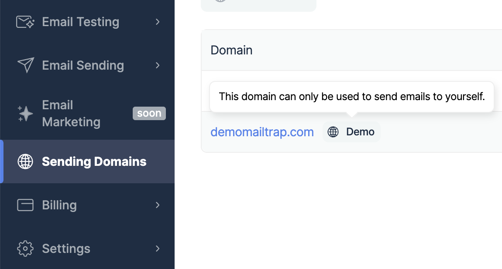<figcaption></figcaption></figure>

You can send emails to your recipients only from domains that have a Verified status. If the status is Pending or Rejected, you won't be able to send emails.

<figure>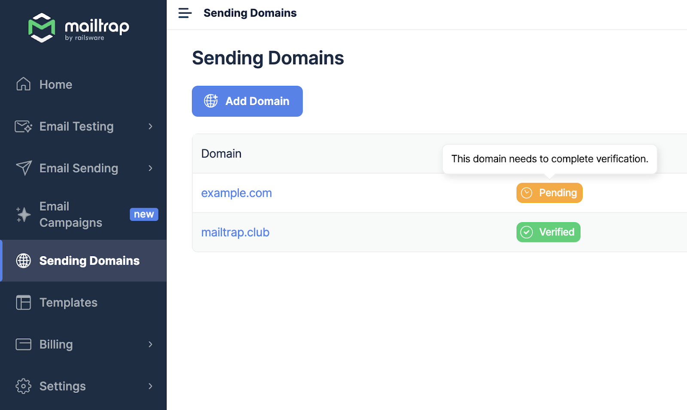<figcaption></figcaption></figure>

From the Sending Domains menu, you can also delete the domains, subdomains, or the demo domain you no longer use. Just press the bin icon next to the domain. This will remove the domain from the list, and you won't be able to send any further emails until you add and verify it again.

<figure>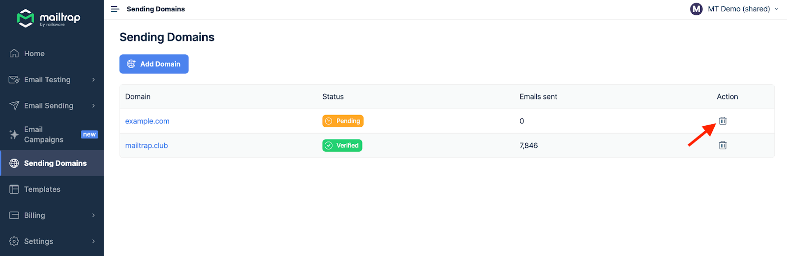<figcaption></figcaption></figure>

Note that removing a domain won't remove it from your Mailtrap account completely. It will still appear, for example, in analytics, and will be displayed with the (deleted) suffix, just like in the example below:

<figure>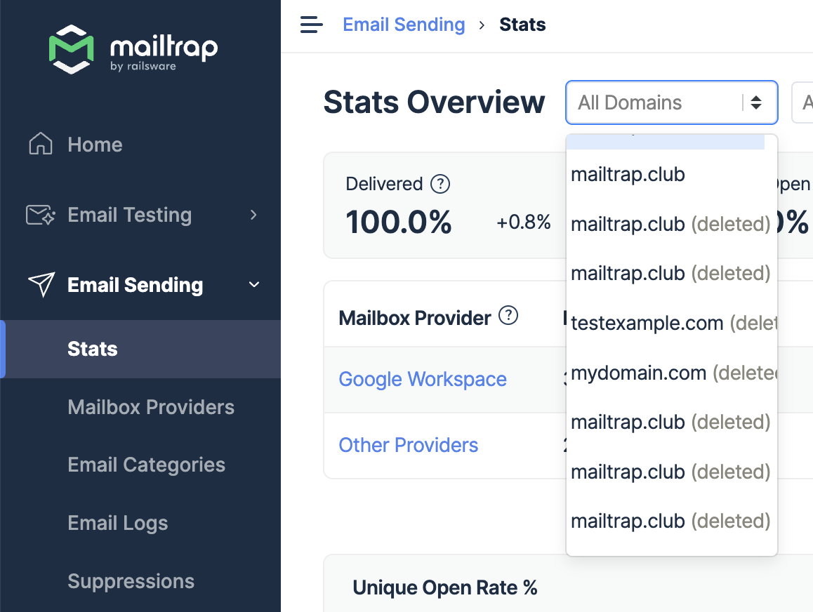<figcaption></figcaption></figure>

We do this to preserve your historical stats that would otherwise be lost.
