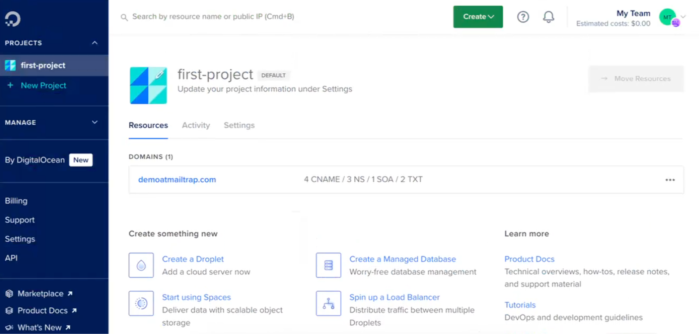
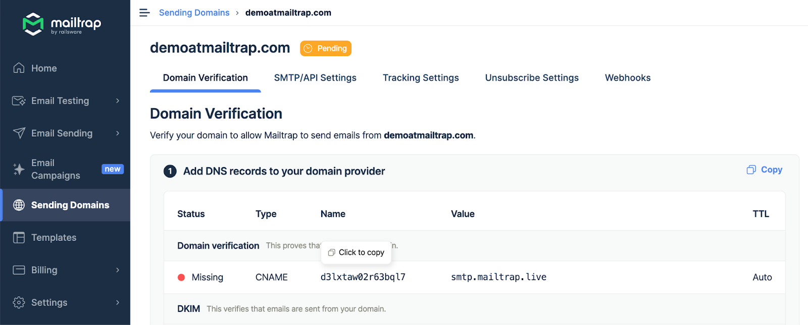
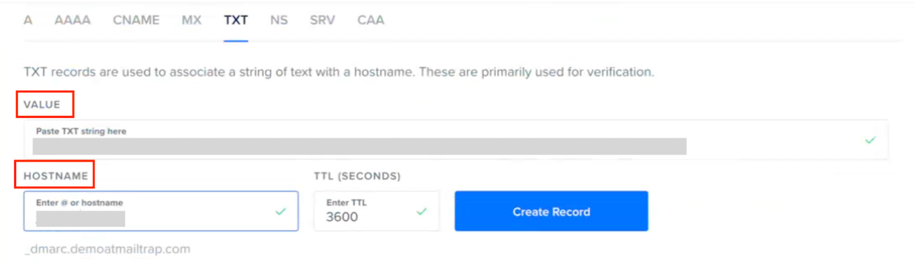
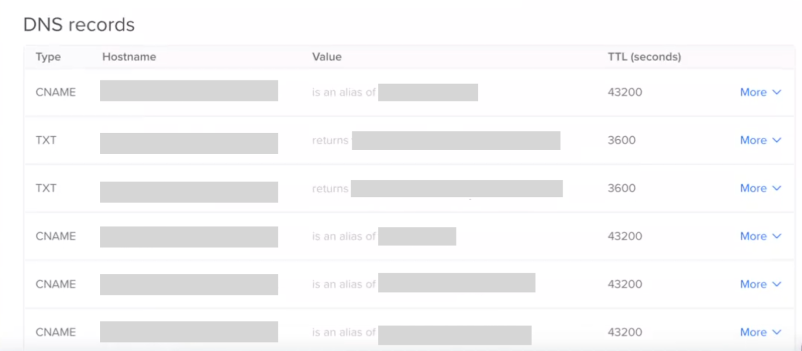

# DigitalOcean

To start sending emails with Mailtrap, you need to own a domain (e.g., `yourcompany.com`) and then verify your ownership over it. For this, you'll need access to your domain provider account, more specifically, the DNS records management page.

In this guide, you'll learn how to add and verify a domain from DigitalOcean.

This guide assumes your domain uses DigitalOcean's nameservers (e.g., `ns1.digitalocean.com`, `ns2.digitalocean.com`, or `ns3.digitalocean.com`). This applies whether you registered your domain directly with DigitalOcean or just pointed your DNS to DigitalOcean from another registrar. Not sure? Check your domain registrar's settings or look for where you manage your DNS records. If it's in the DigitalOcean control panel, you're in the right place.

### Step-by-step guide



Choose **Networking** in the main menu of the control panel and click the domain you've added to Mailtrap.

You'll see the Create new record heading.




On the Domain Verification page in Mailtrap, you'll see the DNS records you need to add to DigitalOcean. These are **Domain Verification**, **DKIM**, **DMARC**, and **Domain Tracking**. You'll need the values under **Type**, **Name**, and **Value**.




Check the type next to each record in Mailtrap and choose a relevant one in DigitalOcean (CNAME or TXT). Mailtrap has **four CNAME type records** (Domain Verification, DKIM (2), and Custom Tracking Domain) and **one TXT type record** (DMARC).

<figure><figcaption></figcaption></figure>

<figure><figcaption></figcaption></figure>


The SPF check for your mail is covered by the domain verification record. There is no need to add a separate SPF record on your sending domain.




Copy the **Name** and **Value** for each record one by one. You can do this by hovering and clicking each record.




**Paste the values into DigitalOcean**. Remember that DigitalOcean refers to the Name field as Hostname for all record types. For CNAME type records, it refers to the Value field as Is an Alias of.

<figure><figcaption></figcaption></figure>

<figure><figcaption></figcaption></figure>




Use the default value for TTL.

Click Create Record after adding each record in DigitalOcean.



Repeat the process of copying and pasting for each record until you've added all Mailtrap DNS records to DigitalOcean.




Some records may be verified immediately, while some may take more time. Mailtrap will check the DNS records automatically every hour, but you can force a check by clicking the Re-check DNS Records button.




If you add all the required DNS records correctly, the Status of DNS records will change from Missing to Verified, and the red dots will turn green.





If you have additional questions, consult the official [DigitalOcean documentation](https://docs.digitalocean.com/products/networking/dns/how-to/manage-records/) or contact us at [support@mailtrap.io](mailto:support@mailtrap.io).

