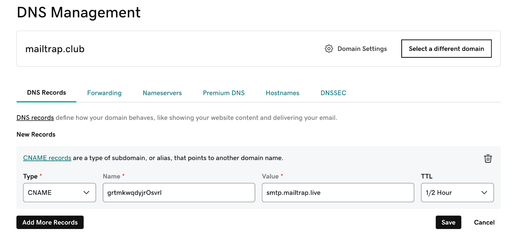

# GoDaddy

To start sending emails with Mailtrap, you need to own a domain (e.g., `yourcompany.com`) and then verify your ownership over it. For this, you'll need access to your domain provider account, more specifically, the DNS records management page.

In this guide, you'll learn how to add and verify a domain from GoDaddy.

This guide assumes your domain uses GoDaddy's nameservers (e.g., `ns1.domaincontrol.com` or `ns2.domaincontrol.com`). This applies whether you registered your domain directly with GoDaddy or just pointed your DNS to GoDaddy from another registrar. Not sure? Check your domain registrar's settings or look for where you manage your DNS records. If it's in the GoDaddy dashboard, you're in the right place.



Go to GoDaddy and locate the domain you've added to Mailtrap.




Open the DNS settings and click **Add New Record**.




On the Domain Verification page in Mailtrap, you'll see the DNS records you need to add to GoDaddy. These are **Domain Verification**, **DKIM**, **DMARC**, and **Domain Tracking**. You'll need the values under **Type**, **Name**, and **Value**. The naming of these records in Mailtrap is the same as in GoDaddy.

Make sure you check the type next to each record in Mailtrap and choose a relevant one in GoDaddy. There are **four CNAME type records** (Domain Verification, DKIM (2), and Custom Tracking Domain) and **one TXT type record** (DMARC).

<figure><figcaption></figcaption></figure>

<figure><figcaption></figcaption></figure>


The SPF check for your mail is covered by the domain verification record. There is no need to add a separate SPF record on your sending domain.




Copy the **Name** and **Value** for each record one by one. You can do this by hovering and clicking each record.




Paste the values into GoDaddy DNS management page.




Use the default value for TTL.

Click Save after adding each record in GoDaddy.



Repeat the process of copying and pasting for each record until you've added all the Mailtrap DNS records to GoDaddy.




Some records may be verified immediately, while some may take more time. Mailtrap will check the DNS records automatically every hour, but you can force a check by clicking the Re-check DNS Records button.




If you add all the required DNS records correctly, the Status of DNS records will change from Missing to Verified, and the red dots will turn green.





If you have additional questions, consult the official [GoDaddy documentation](https://uk.godaddy.com/help/manage-dns-records-680) or contact us at [support@mailtrap.io](mailto:support@mailtrap.io).

