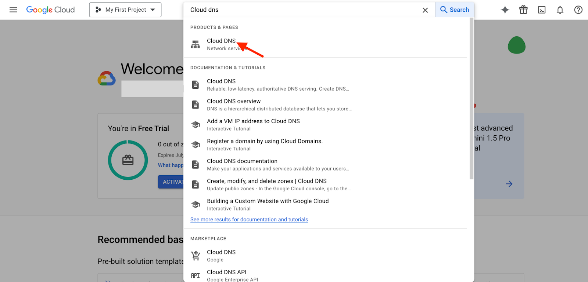
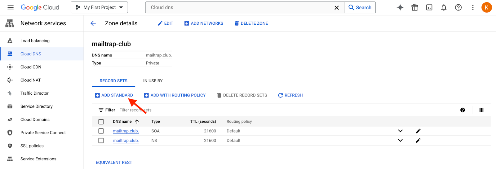
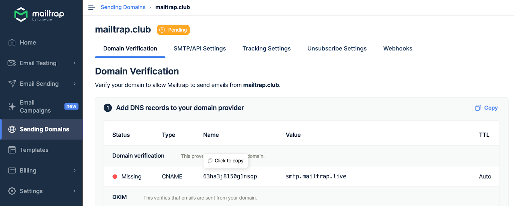
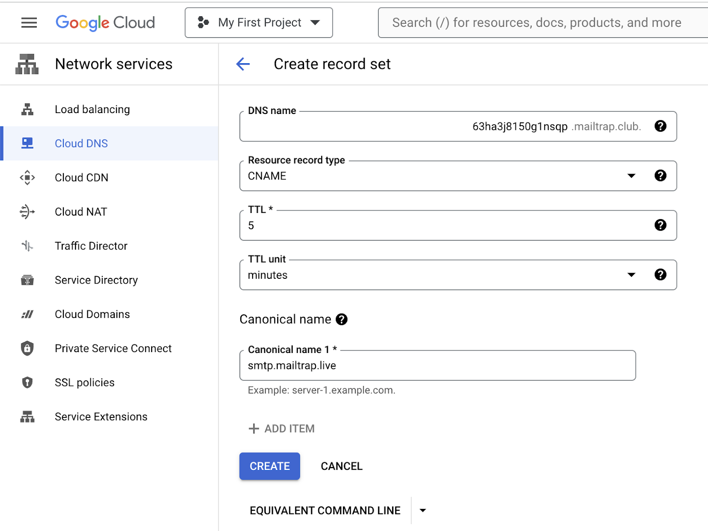
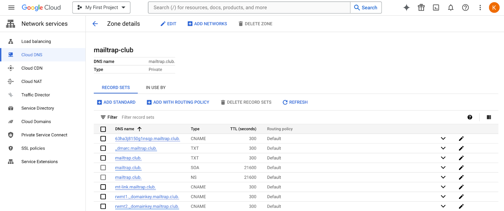

# Google Cloud DNS

To start sending emails with Mailtrap, you need to own a domain (e.g., `yourcompany.com`) and then verify your ownership over it. For this, you'll need access to your domain provider account, more specifically, the DNS records management page.

In this guide, you'll learn how to add and verify a domain from Google Cloud DNS.

This guide assumes your domain uses Google Cloud DNS nameservers (e.g., `ns-cloud-a1.googledomains.com` or `ns-cloud-b1.googledomains.com`). This applies whether you registered your domain directly with Google or just pointed your DNS to Google Cloud DNS from another registrar. Not sure? Check your domain registrar's settings or look for where you manage your DNS records. If it's in the Google Cloud Console, you're in the right place.

### Step-by-step guide



Go to Google Cloud Console, type **Cloud DNS** in the search bar, and choose it from the results.




In the Cloud DNS Zones page, open the **Zone details** for the domain you've added to Mailtrap by clicking on the **Zone name**.




Click **Add Standard**.




On the Domain Verification page in Mailtrap, you'll see the DNS records you need to add to Google Cloud DNS. These are **Domain Verification**, **DKIM**, **DMARC**, and **Domain Tracking**. You'll need the values under **Type**, **Name**, and **Value**.

Make sure you check the type next to each record in Mailtrap and choose a relevant one in Google Cloud DNS. There are **four CNAME type records** (Domain Verification, DKIM (2), and Custom Tracking Domain) and **one TXT type record** (SPF and DMARC). Ignore Google's SPF type record; it's deprecated.

<figure><figcaption></figcaption></figure>


The SPF check for your mail is covered by the domain verification record. There is no need to add a separate SPF record on your sending domain.




Copy the **Name** and **Value** for each record one by one. You can do this by hovering and clicking each record.




And paste the values into Google Cloud DNS. Remember that Google Cloud DNS refers to the Name field as DNS Name and the Value field as either Canonical name (for CNAME-type records) or TXT data (for TXT-type records).

<figure><figcaption></figcaption></figure>

<figure><figcaption></figcaption></figure>

When adding TXT-type records, add double quotes in the beginning and the end of the record string in the TXT data field.



Use the default value for TTL.

Click **Create** after adding each record in Google Cloud DNS.




Repeat the process of copying and pasting for each record until you've added all the Mailtrap DNS records to Google Cloud DNS.




Some records may be verified immediately, while some may take more time. Mailtrap will check the DNS records automatically every hour, but you can force a check by clicking the Re-check DNS Records button.




If you add all the required DNS records correctly, the Status of DNS records will change from **Missing** to **Verified**, and the red dots will turn green.





If you have additional questions, consult the official [Google Cloud DNS documentation](https://cloud.google.com/dns/docs/records) or contact us at [support@mailtrap.io](mailto:support@mailtrap.io).

