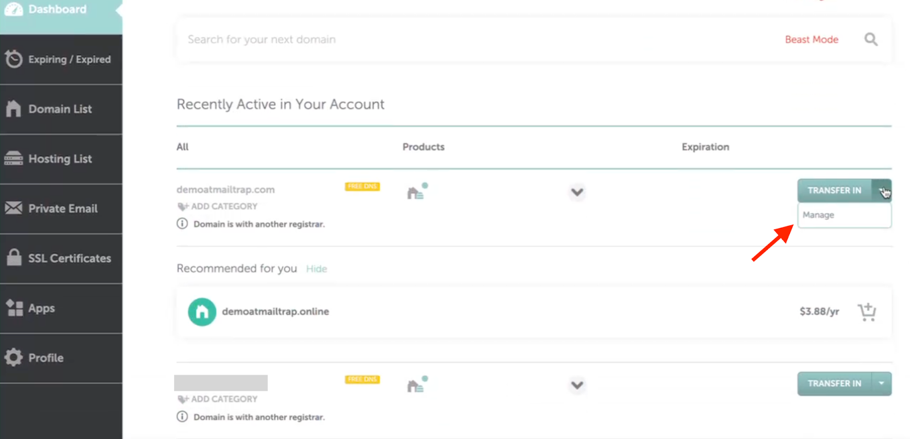
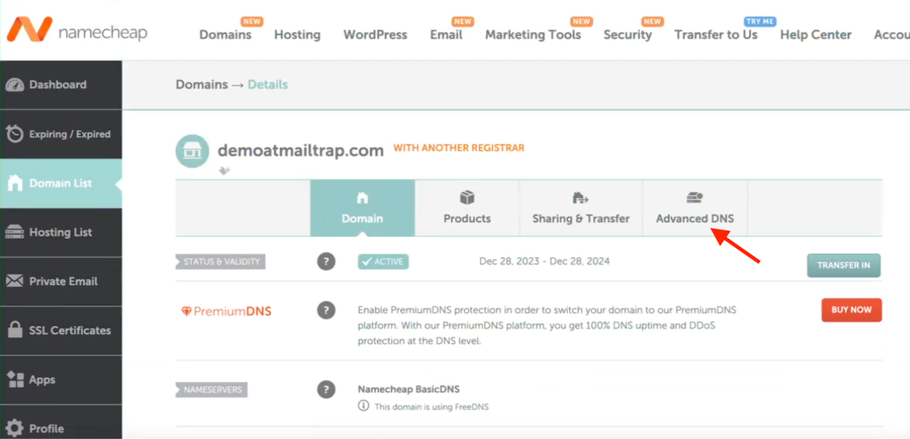
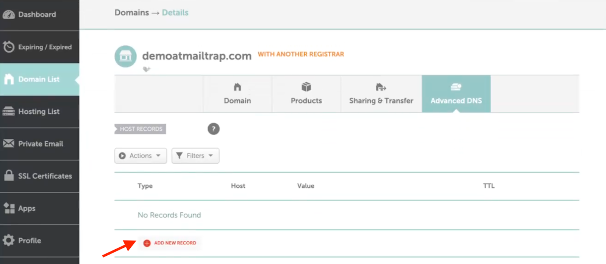
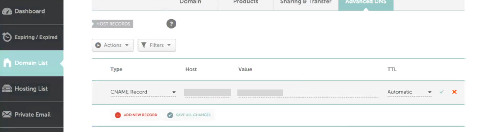
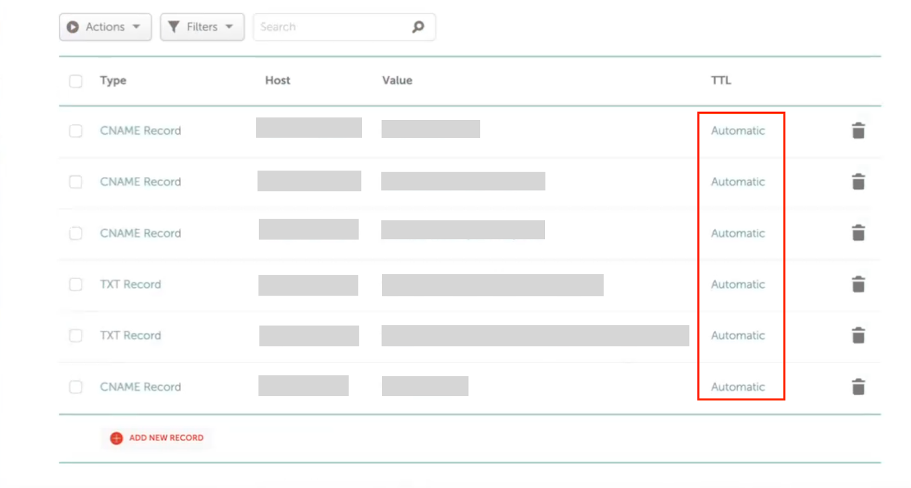
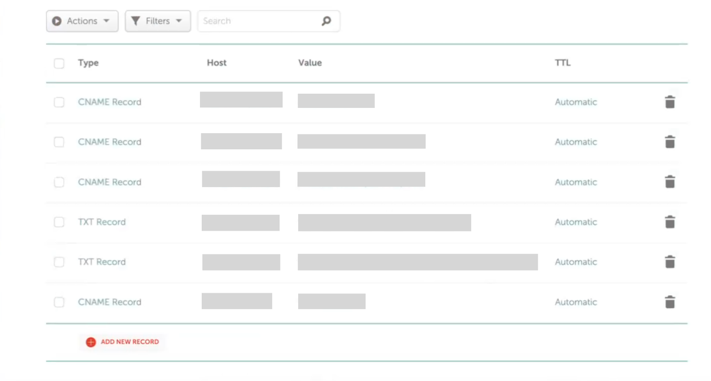
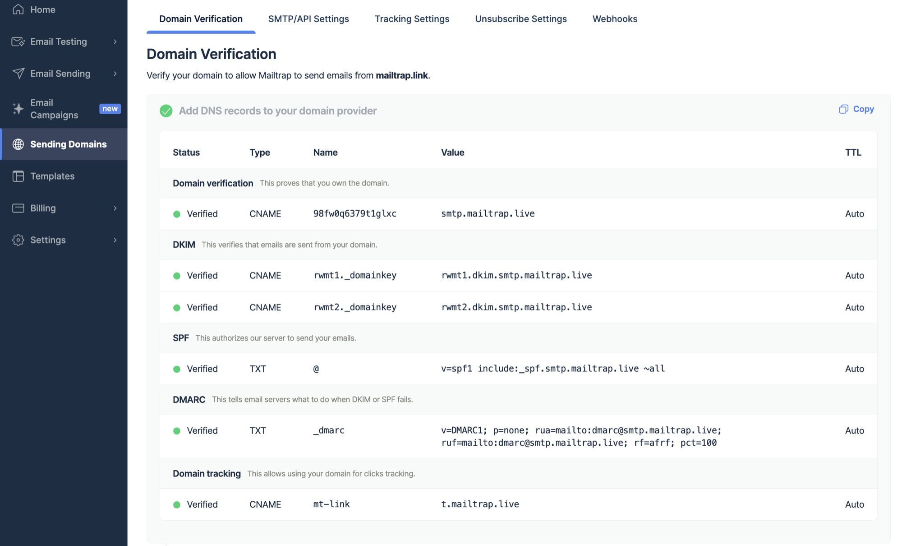

# Namecheap

To start sending emails with Mailtrap, you need to own a domain (e.g., `yourcompany.com`) and then verify your ownership over it. For this, you'll need access to your domain provider account, more specifically, the DNS records management page.

In this guide, you'll learn how to add and verify a domain from Namecheap.

This guide assumes your domain uses Namecheap's nameservers (e.g., `dns1.registrar-servers.com` or `dns2.registrar-servers.com`). This applies whether you registered your domain directly with Namecheap or just pointed your DNS to Namecheap from another registrar. Not sure? Check your domain registrar's settings or look for where you manage your DNS records. If it's in the Namecheap dashboard, you're in the right place.

### Step-by-step guide



Go to Namecheap, locate the domain you've added to Mailtrap on the dashboard, and click **Manage**.




Navigate to the **Advanced DNS** tab.




Click **Add New Record**.




On the Domain Verification page in Mailtrap, you'll see the DNS records you need to add to Namecheap. These are Domain Verification, DKIM, DMARC, and Domain Tracking. You'll need the values under Type, Name, and Value.

Make sure you check the type next to each record in Mailtrap and choose a relevant one in Namecheap. There are **four CNAME type records** (Domain Verification, DKIM (2), and Custom Tracking Domain) and **one TXT type record** (DMARC).

<figure><figcaption></figcaption></figure>


The SPF check for your mail is covered by the domain verification record. There is no need to add a separate SPF record on your sending domain.




Copy the **Name** and **Value** for each record one by one. You can do this by hovering and clicking each record.




And paste the values into Namecheap. Remember that Namecheap refers to the **Name** **field** as **Host**.




Use the **default** value for TTL.




Repeat the process of copying, pasting, and clicking **Add New Record** for each record until you've added all the Mailtrap DNS records to Namecheap. Click **Save All Changes**.




Some records may be verified immediately, while some may take more time. Mailtrap will check the DNS records automatically every hour, but you can force a check by clicking the Re-check DNS Records button.




If you add all the required DNS records correctly, the Status of DNS records will change from **Missing** to **Verified**, and the red dots will turn green.





If you have additional questions, consult the official [Namecheap documentation](https://www.namecheap.com/support/knowledgebase/article.aspx/434/2237/how-do-i-set-up-host-records-for-a-domain/) or contact us at [support@mailtrap.io](mailto:support@mailtrap.io).

