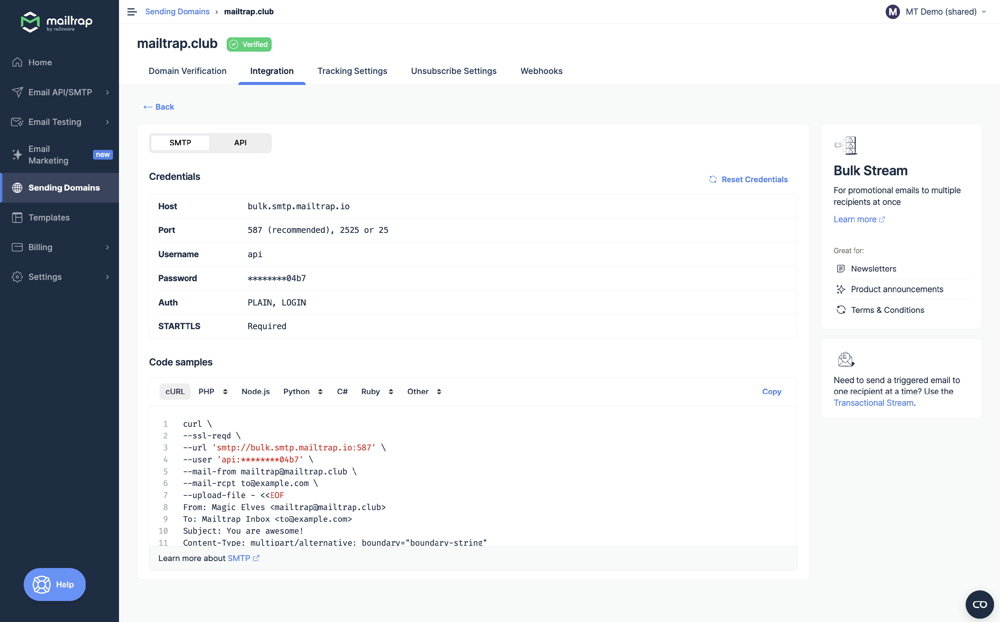
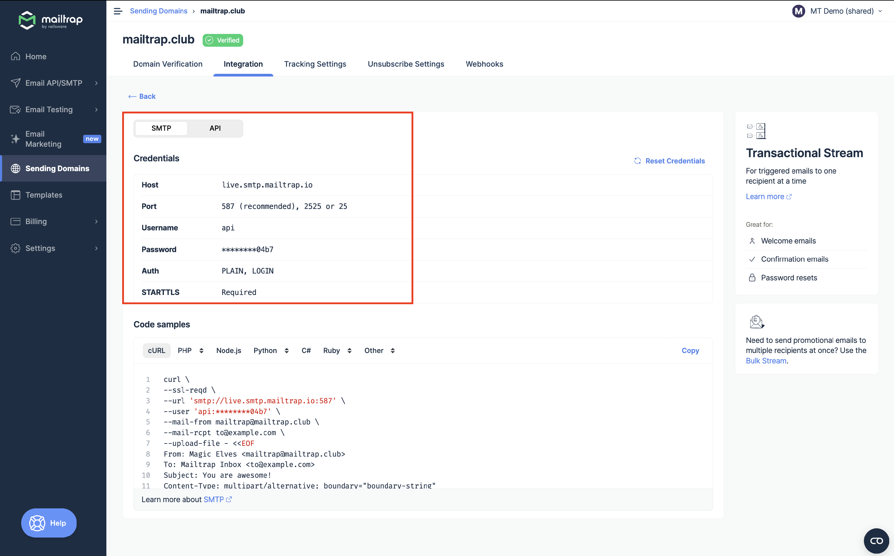
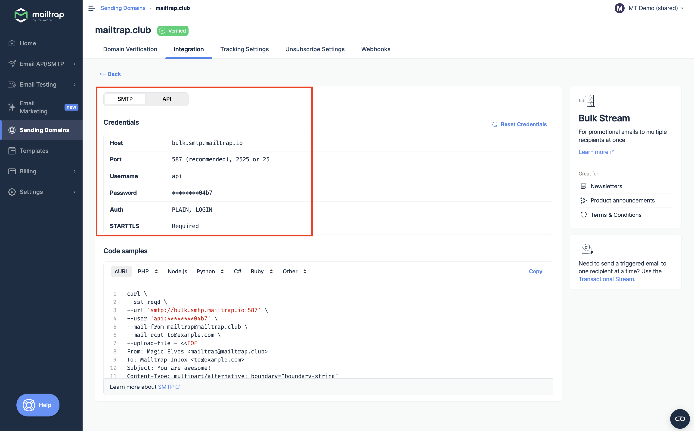
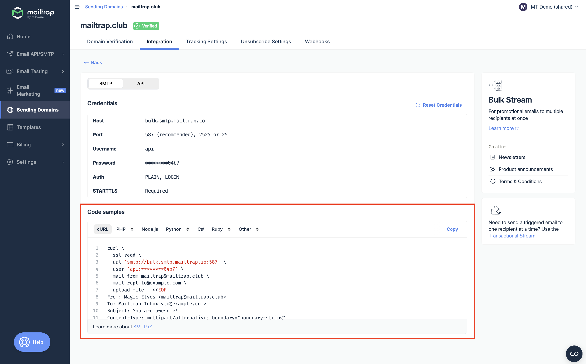
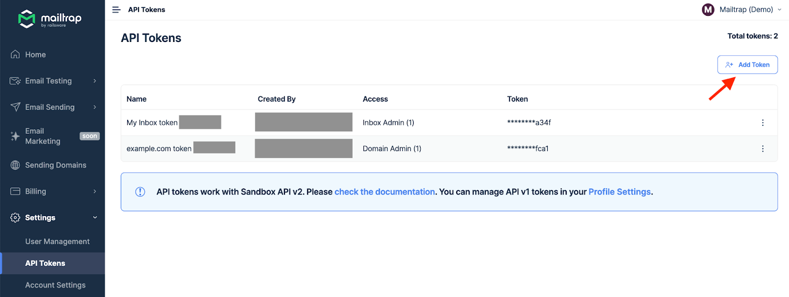

# SMTP Integration

Learn how to integrate your application via SMTP.



Go to the **Sending Domains** tab and choose the domain you want to send emails from. Remember that you'll be able to start sending emails once the [domain is verified](sending-domain-setup/).



Navigate to the **Integrations** tab for your selected domain.




Click the Integrate button under **Transactional Stream** or **Bulk Stream**.

**Transactional Stream** is used to send automated, non-promotional application emails that are triggered by the user's specific action.

**Bulk Stream** is used to send a single marketing campaign to a large group of recipients in bulk.




Toggle the switch to SMTP and copy credentials, such as **Host**, **Port**, **Username**, and **Password** and paste them into your project, app, email-sending service, or any platform that supports SMTP.

<figure><figcaption>
Transactional Stream SMTP credentials
</figcaption></figure>

<figure><figcaption>
Bulk Stream SMTP credentials
</figcaption></figure>

Alternatively, choose the programming language or framework from the menu under **Code Samples** and copy the sample configuration containing your credentials.

<figure><figcaption>
Transactional Stream code samples
</figcaption></figure>

<figure><figcaption>
Bulk Stream code samples
</figcaption></figure>




Complete your email-sending script and run it. If you did everything correctly, you should find the sent email in the inbox of the email address you indicated in the script. The email will also appear in Email Logs in Mailtrap.

<figure><figcaption></figcaption></figure>




Remember that each domain has different SMTP credentials that you can always access by clicking on the desired domain and going to the **Integrations** tab.

You can also create additional API tokens (or SMTP passwords) by going to **Settings** → **API Tokens** and clicking **Add Token**.

<a href="setup/api-tokens.md" class="button primary" data-icon="magnifying-glass">Learn more about API Tokens</a>


If you need any help with SMTP integration, please, contact our support team at [support@mailtrap.io](mailto:support@mailtrap.io).

