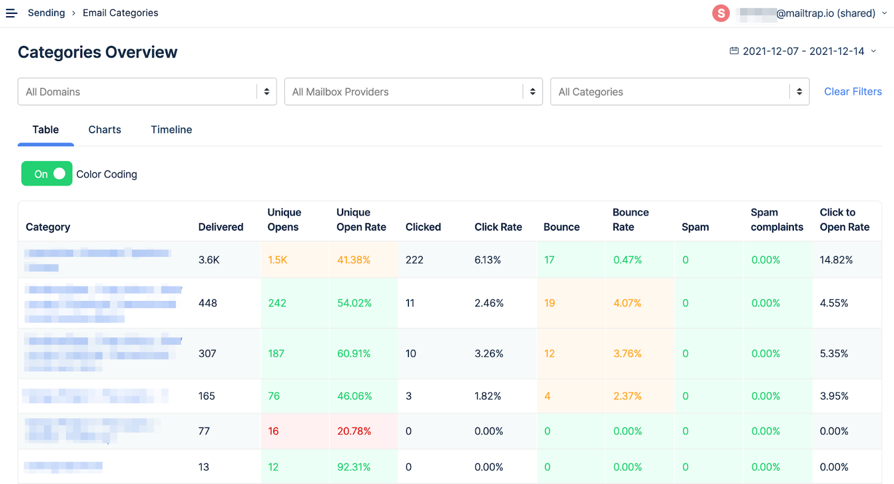
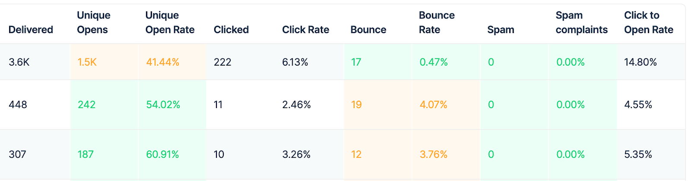
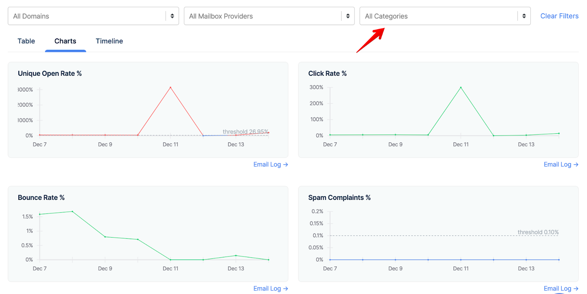
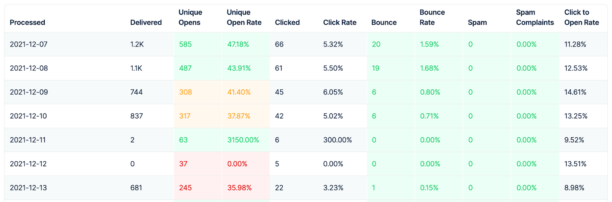

Email Categories were built to show the performance of various types of emails, such as welcome emails, billing emails, confirmation emails, etc.

### Why should you use categories?

* See statistics for each type of email you send.
* Analyze key metrics of each category, such as open, click, or bounce rates. A single underperforming category can influence your overall sender reputation.
* Compare different types of emails and know straight away which perform better.
* Debug specific templates when, for example, an open rate suddenly drops.
* Simplify the search for any particular message. Filter out only emails matching a certain category to narrow down the results.

Email categories examples:

* “Feature XYZ intro”
* “Password reset 1st email”
* “Test A Order Confirmation”
* “Downgrade flow Tier 1”
* “Onboarding Msg 3”
* “Newsletter 04/20”

### How to use

You specify categories when creating an email to be sent with Mailtrap, by inserting a category name into the `X-MT-Category` header if you are using SMTP.

If you are using the API, refer to our [Api Docs](https://api-docs.mailtrap.io/docs/mailtrap-api-docs/67f1d70aeb62c-send-email-including-templates).

At this point, categories can only be specified when sending an email. Once you add one to an email and a message is sent, the category will appear in Mailtrap - in the Email Logs’ filters as well as in statistics.

Categories cannot be removed or modified at this point. The number of categories in your account is unlimited.

### How to analyze performance

Categories can be tracked via the Email Categories tab in the Stats menu.

You can filter out the data for specific domains or mailbox providers using the filters. You can also limit the number of domains displayed and compare statistics only for some of them.

Mailtrap tracks statistics for each day separately, which can sometimes lead to, for example, open rates going into hundreds of percent.

