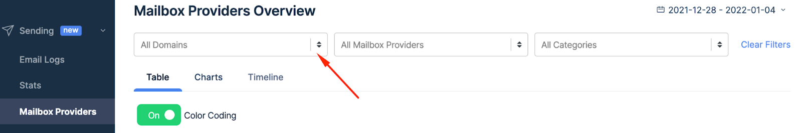
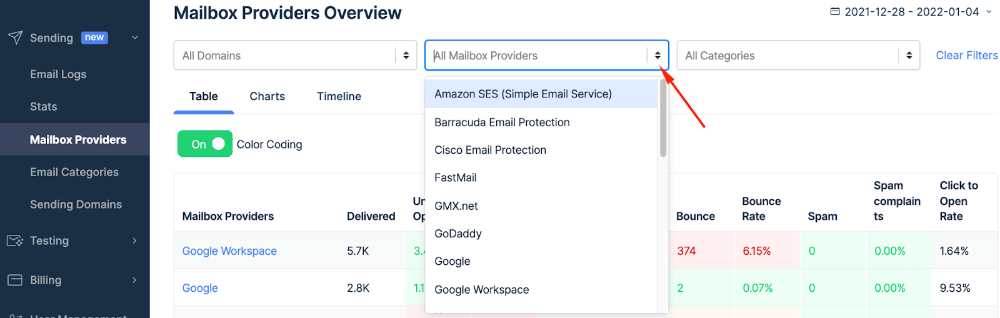
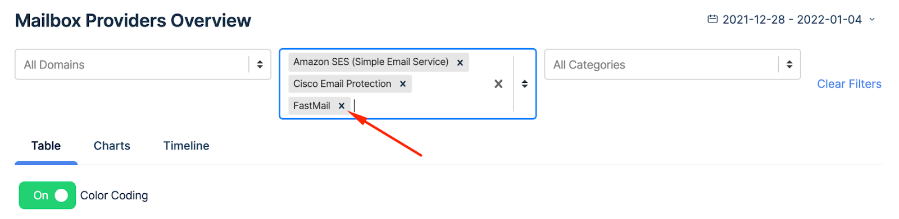
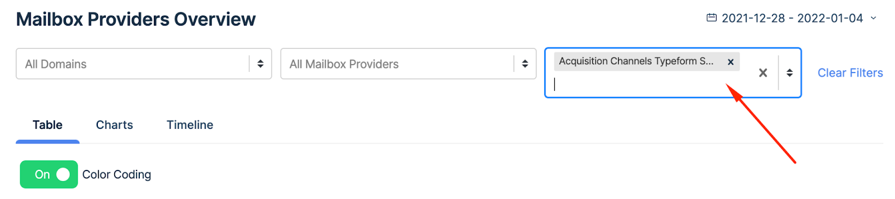
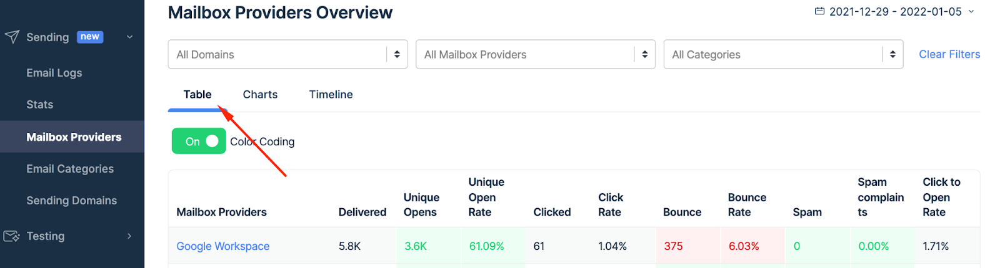
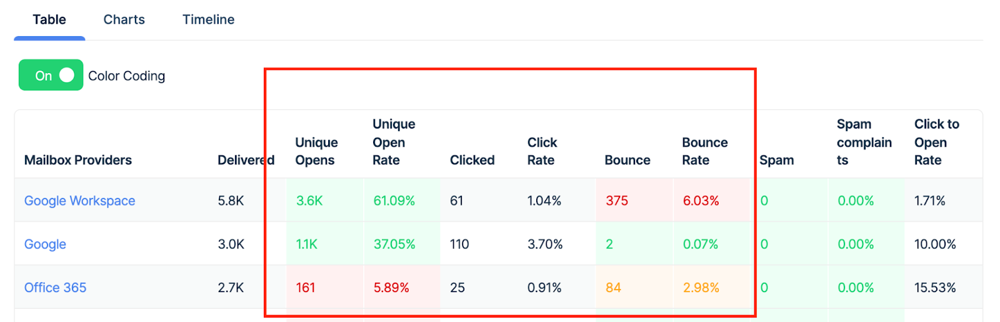
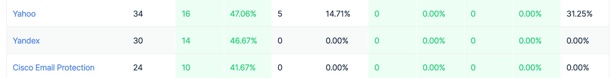
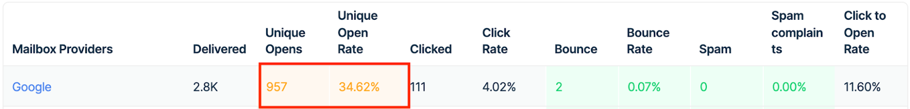
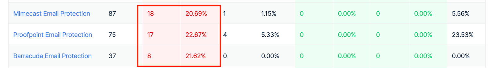

Why is it important to monitor mailbox provider stats?

It’s important because the deliverability towards a specific provider can suddenly drop. This is a clear sign that a provider has started treating you negatively, so it’s critical to take action to improve the situation.

The following sections detail how to take advantage of **Mailbox Providers** feature within **Mailtrap API/SMTP**.

### Mailbox Providers filters 

Mailbox Providers Overview panel allows you to filter by **Domains**, **Mailbox Providers**, and **Categories**. Here’s how to use each filter.

#### Domains 

1. Click on arrows in the All Domains box.
2. Choose one or more domains you’d like to use.
3. When you select the domain, the Table automatically shows corresponding statistics.

#### Mailbox providers filter 

1. Click the arrows in the Mailbox Provider box.
2. Choose the provider you’d like to use.
3. Check the corresponding stats in the table below.

You can select a few providers at the same time - just repeat the actions listed above.

#### Categories 

1. Click the arrows in the **Categories** box.
2. Choose a category or categories.
3. Preview the stats for that category in the table below.

### Navigating mailbox providers 

#### Table 

The first column features **Mailbox Providers** of your recipients.

The stats include the number of **Delivered** emails. You can also see **Unique Opens** and **Unique Open Rate**, as well as **Clicked** emails and **Click Rate**.

Also, the Tables tab shows **Bounce** emails and **Bounce Rate**, plus **Spam** and Spam **Complaints**. Finally, you can see the **Clicked to Open Rate**.

You can learn more about [Stats](./) here.

**Color coding**

To immediately understand email deliverability, the table features colors that signal if the value is good, bad, or just average.

* Green - good results - exceed what we perceive as a satisfactory value for a particular data point.

* <mark style="background-color:yellow;">Yellow</mark> - borderline results - neither good nor bad, and may require your attention or action.

* <mark style="background-color:red;">Red</mark> - the result is under the threshold we consider satisfactory and it requires your action to improve the performance of a specific mailbox provider.

