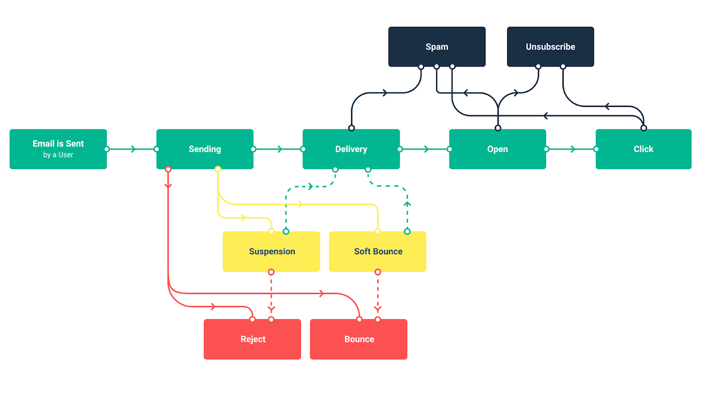

# Statuses and Events

When sending emails with Mailtrap, you’ll often encounter the terms Status and Event.

**Status** is the latest delivery status of an email. Each status bears a distinct color, and an email can only have one status at a time. The available statuses are: **Delivered, Not Delivered, Enqueued,** and **Opted Out**.

As an email changes status, multiple **events** can occur. Events are one-time occurrences that are logged into the **Event History**. Multiple events can (and often are) recorded for an email.

For example, a certain email can have the status **Opted Out.** This indicates that the recipient marked your message as spam or unsubscribed from the list. The **Event History** tab for such an email may look like this:

The chart below showcases all the possible events and the relations between them.

Here’s a summary of all the possible events and statuses:



Email has been queued for sending or has been dispatched, but something prevented its delivery.

<table><thead><tr><th width="188.58203125">Event</th><th>Event Description</th></tr></thead><tbody><tr><td>Sending</td><td>Email sending is in process, or it’s in the queue.</td></tr><tr><td>Soft bounce</td><td>Email couldn’t be delivered, most commonly due to a server timeout, full inbox, or too large size. The delivery will be attempted 10 more times. Possible outcomes: Delivery or Bounce.</td></tr><tr><td>Suspension</td><td>Email was sent from an unverified domain. We’ll re-check the domain status 10 more times. If it’s verified during this time, an email will be sent. Possible outcomes: Delivery, Reject.</td></tr></tbody></table>



Email failed to be delivered, and no further attempts will be made.

<table><thead><tr><th width="189.0625">Event</th><th>Event Description</th></tr></thead><tbody><tr><td>Reject</td><td>The domain in question was not verified in time after an initial suspension of an email, and a message was rejected. Or, a recipient is on a suppression list for this domain.</td></tr><tr><td>Bounce</td><td>Email recorded a bounce (permanent delivery failure), and no further attempts will be made to deliver it. Most commonly this happens because of an invalid email address or a rejection by the recipient’s mailbox provider.</td></tr></tbody></table>



Email was accepted by the recipient’s mailbox provider.

<table><thead><tr><th width="188.8046875">Event</th><th>Event Desription</th></tr></thead><tbody><tr><td>Delivery</td><td>Email was accepted by the recipient’s mailbox provider. Note: this doesn’t exclude a delivery to a spam folder. In some cases, an email may be accepted, but an internal policy may prevent it from reaching an sandbox.</td></tr><tr><td>Open</td><td>Email was opened by a recipient or another person that a message was forwarded to. Multiple open events can be recorded.</td></tr><tr><td>Click</td><td>Any link in an email was clicked.</td></tr></tbody></table>



A recipient opted out of receiving any further messages and has been added to Mailtrap’s suppression list for this domain.


This doesn't prevent you from emailing them from other verified domains


<table><thead><tr><th width="188.83984375">Event</th><th>Event Description</th></tr></thead><tbody><tr><td>Unsubscribe</td><td>The recipient unsubscribed from receiving emails. Mailtrap won’t send any further emails to them from this domain.</td></tr><tr><td>Spam</td><td>User reported a message as spam. Mailtrap won’t send them any more messages from this domain.</td></tr></tbody></table>



<table><thead><tr><th width="138.8515625">Status</th><th width="223.07421875">Status Description</th><th width="137.93359375">Event</th><th>Event Description</th></tr></thead><tbody><tr><td>Enqueued</td><td>Email has been queued for sending or has been dispatched, but something prevented its delivery.</td><td>Sending</td><td>Email sending is in process, or it’s in the queue.</td></tr><tr><td> </td><td> </td><td>Soft bounce</td><td>Email couldn’t be delivered, most commonly due to a server timeout, full inbox, or too large size. The delivery will be attempted 10 more times. Possible outcomes: Delivery or Bounce.</td></tr><tr><td> </td><td> </td><td>Suspension</td><td>Email was sent from an unverified domain. We’ll re-check the domain status 10 more times. If it’s verified during this time, an email will be sent. Possible outcomes: Delivery, Reject.</td></tr><tr><td>Not delivered</td><td>Email failed to be delivered, and no further attempts will be made.</td><td>Reject</td><td>The domain in question was not verified in time after an initial suspension of an email, and a message was rejected. Or, a recipient is on a suppression list for this domain.</td></tr><tr><td> </td><td> </td><td>Bounce</td><td>Email recorded a bounce (permanent delivery failure), and no further attempts will be made to deliver it. Most commonly this happens because of an invalid email address or a rejection by the recipient’s mailbox provider.</td></tr><tr><td>Delivered</td><td>Email was accepted by the recipient’s mailbox provider.</td><td>Delivery</td><td>Email was accepted by the recipient’s mailbox provider. Note: this doesn’t exclude a delivery to a spam folder. In some cases, an email may be accepted, but an internal policy may prevent it from reaching an sandbox.</td></tr><tr><td> </td><td> </td><td>Open</td><td>Email was opened by a recipient or another person that a message was forwarded to. Multiple open events can be recorded.</td></tr><tr><td> </td><td> </td><td>Click</td><td>Any link in an email was clicked.</td></tr><tr><td>Opted Out</td><td>A recipient opted out of receiving any further messages and has been added to Mailtrap’s suppression list for this domain. Note: this doesn’t prevent you from emailing them from other verified domains.</td><td>Unsubscribe</td><td>The recipient unsubscribed from receiving emails. Mailtrap won’t send any further emails to them from this domain.</td></tr><tr><td> </td><td> </td><td>Spam</td><td>User reported a message as spam. Mailtrap won’t send them any more messages from this domain.</td></tr></tbody></table>


If you want to track how many emails were delivered, it's better to use the **Delivery** event rather than the **Delivered** status.


When a recipient unsubscribes or reports your message as spam, an email's status changes to Opted Out. At the same time, the Delivery event remains in its Events History. By filtering for this event, you’ll easily find all emails that were delivered in a chosen timeframe, regardless of what happened to them next.

Some useful definitions:

* **Client Sending IP** - IP address of a device that was used to send an email.
* **Mailtrap Sending IP** - IP address of Mailtrap, used to send a message to the final recipient.
* **Recipient IP** - IP address of a device or an email server where an email was opened. If a message is opened on devices using different IP addresses, multiple Recipient IPs will be recorded. If a message is not opened at all, no Recipient IP will be displayed.

<a href="email-sandbox/sandbox-glossary.md" class="button primary">Find more definitions in Sending Glossary</a>
