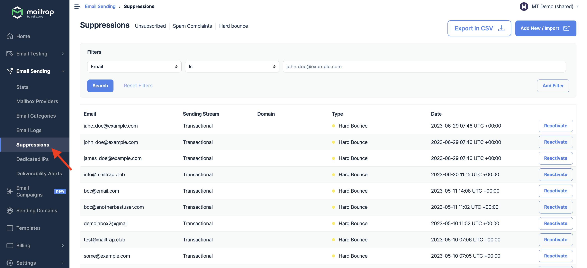
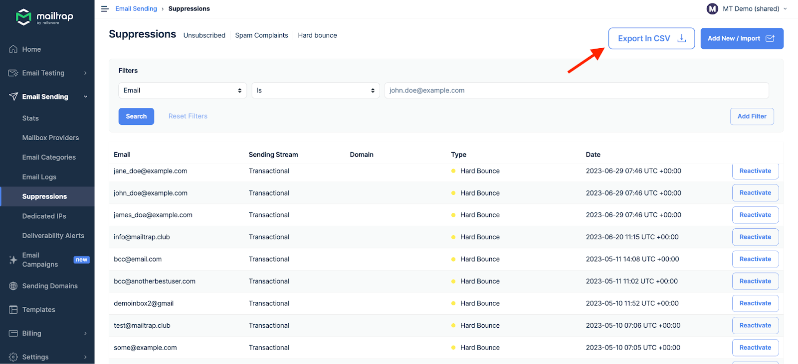
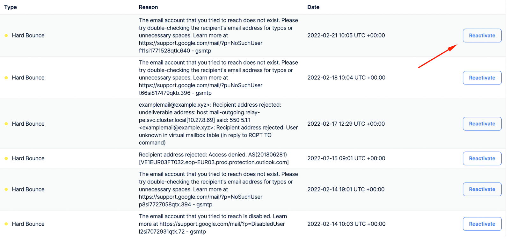
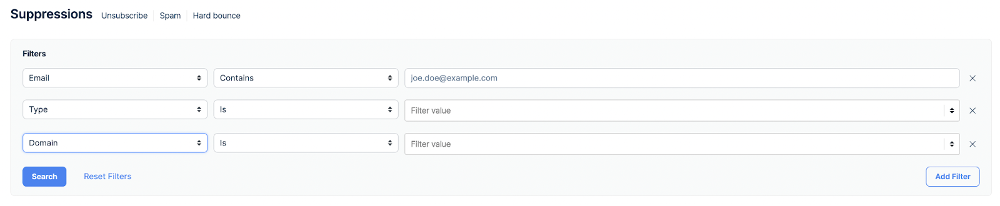
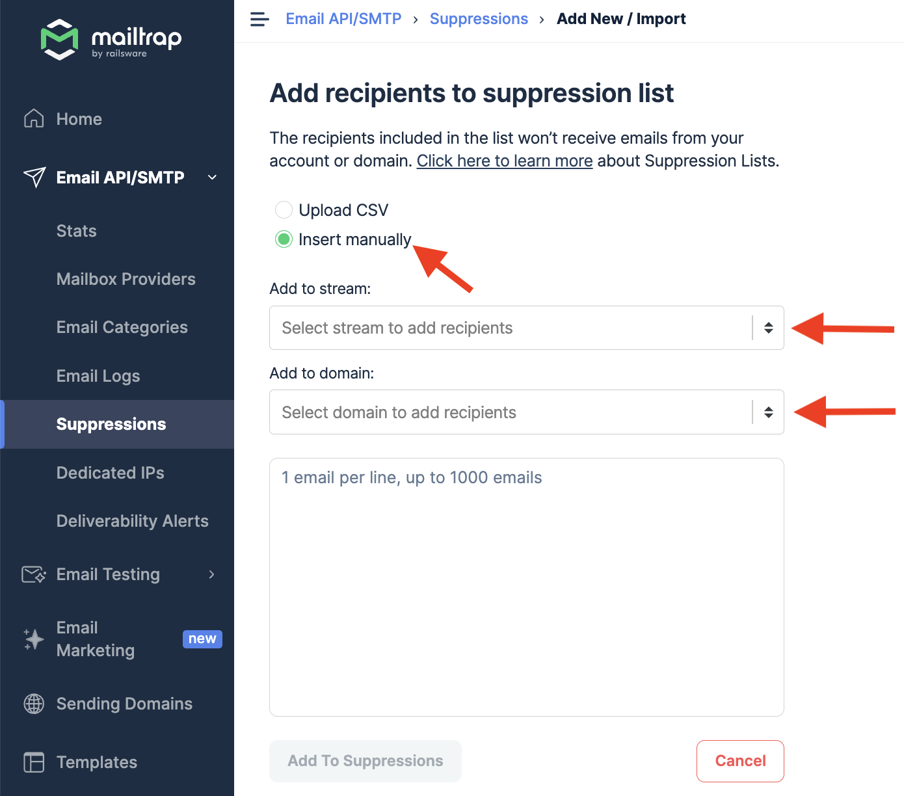
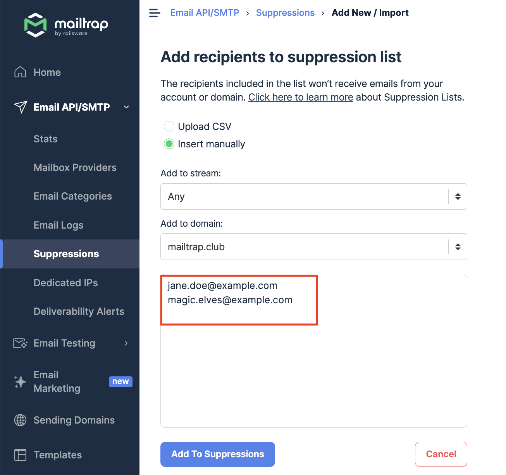
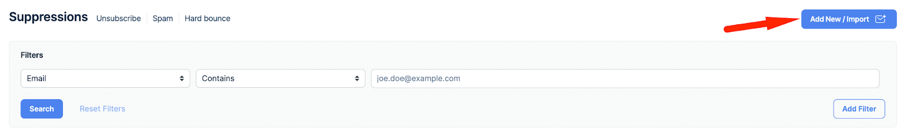
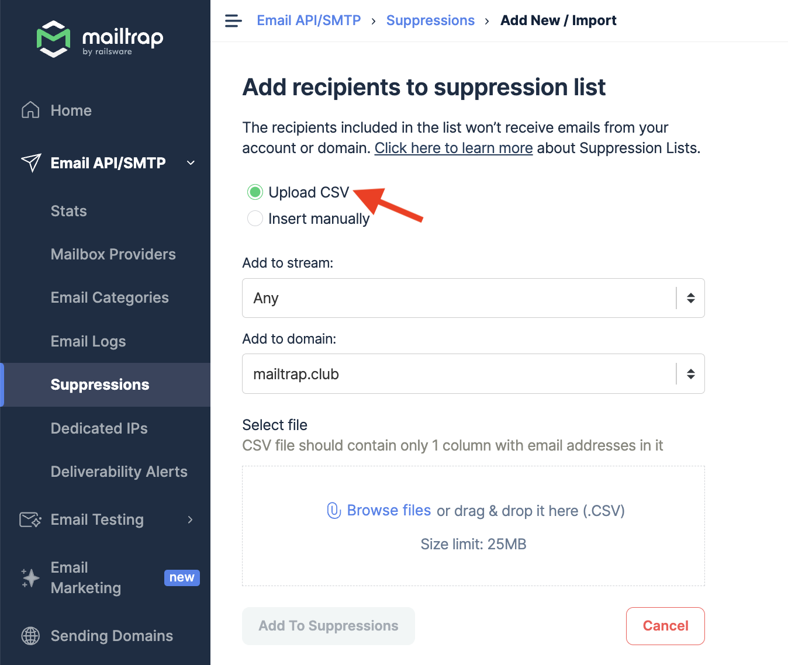

When hard bounce, unsubscribe, and spam complaints events occur, Mailtrap adds the email address to a suppression list. The suppression list contains all the addresses you cannot send emails to.

You'll find all the addresses on suppression lists in the **Suppressions** menu to the left.

The menu contains the data for all your domains. If an email address was suppressed for more than one domain, it appears multiple times on the list.

You can export the whole Suppressions list.

#### How to remove an email from a suppression list?

If you believe an email landed on a suppression list by accident, you can remove it by clicking the **Reactivate** button to the right.

However, we advise you not to misuse the feature.

If someone decided to report your message as spam or leave your email list, you really don’t want to be emailing them again (unless they explicitly told you they had done it by mistake). Any further attempts will probably result in the same outcome, immediately hurting your email deliverability.

### Suppression list filters

You can filter the suppression list for:

* Specific email address
* Sending domain
* Type of suppression
* Reason for suppression

### How to add recipients to the suppression list

Mailtrap allows you to add recipients manually or upload CSV.

#### Manual method

Select Insert manually. Then, under Add to stream, choose Bulk, Transactional, or Any. Under Add to domain, choose all or one of your domains.

After you select the domain and stream, type or copy-paste the email addresses you want to suppress into the designated box. Then, click the Add To Suppressions button to complete the action.

You can add only one email address per line and up to 1000 emails per selected domain.

Note that there's also the **Add New/Import** button at the top right of the screen in the Suppressions main dashboard. It allows you to access the Add recipients to suppression list menu quickly.

#### Upload CSV

Before you upload CSV to Mailtrap, you first need to export the document from your current sending provider. See how to do it with SendGrid, Postmark, and Mailgun.

**Exporting Suppressions**

**Sendgrid**

Navigate to Suppression Management - this is where you’ll find the list of all your Unsubscribe Groups. You’ll see the default groups and the ones you created.

To export the CSV file, you’ll need to click the Settings button (the gear icon) next to each group, then choose **Export**.

**Mailgun**

Mailgun keeps three suppression lists (complaints, bounces, and unsubscribes) for each of your sending domains. There’s no global, account-level suppression list, so you’d need to export separate lists for each domain you transfer to Mailtrap.

To get the list in CSV format, make sure you choose the correct domain and use the Mailgun dashboard to export the lists.

**Postmark**

There’s an Export button in the Postmark dashboard. This allows you to export up to 500 records in a JSON file. For more records, you’d need to use Postmark’s Messages API.

Many online services offer services for converting JSON to CSV. [Postmark’s help page](https://postmarkapp.com/support/article/881-can-i-export-a-list-of-all-bounces) provides more information.

**Importing to Mailtrap**

Select **Upload CSV** and then choose the stream and the domain.

Click **Browse file** to select the CSV file from your computer or drag and drop it into the **Select file** box.

To complete the action, click **Add To Suppressions** and you’re done. If you wish, you can also download our CSV template by clicking on the corresponding option.
