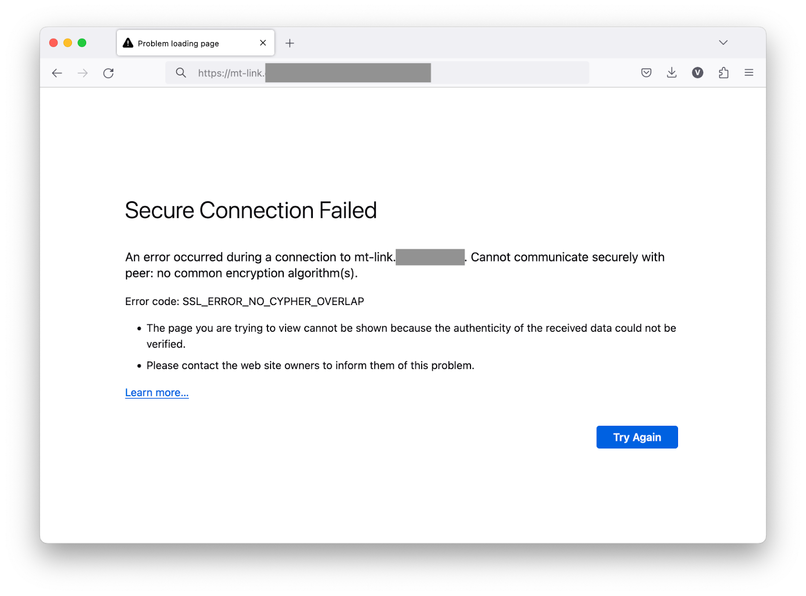

# SSL_ERROR_NO_CYPHER_OVERLAP or Error 1001

When using a custom domain for click tracking, you may encounter `SSL_ERROR_NO_CYPHER_OVERLAP` or `Error 1001` error.

<figure><figcaption>SSL error when accessing custom domain for click tracking</figcaption></figure>

## Understanding Custom Domain Click Tracking

Mailtrap allows you to use your own domain for click tracking. To achieve this:

1. You add an `mt-link` CNAME record during the domain setup process
2. Mailtrap issues a security certificate for the mt-link subdomain to ensure a secure connection
3. Certificates from **Let's Encrypt** and **Google Trust Services** are used

## The Cause of the Error

Some domains have a list of trusted Certificate Authorities (CAs) specified in **CAA records**.


If your CAA records don't include Google Trust Services and Let's Encrypt, Mailtrap won't be able to request certificates from them. This prevents click tracking from working because browsers can't establish a secure connection.


## Checking Your CAA Records

You can check the CAA records for your domain using this command:


```bash
dig CAA example.com
```


The output might look similar to this:


```
;; ANSWER SECTION:
example.com.   13990    IN    CAA    0 issue "globalsign.com"
example.com.   13990    IN    CAA    0 issuewild "globalsign.com"
```


In this example, the domain only allows GlobalSign to issue certificates, which is why Mailtrap cannot obtain a certificate.

## Solution: Update CAA Records

You have two options:

### Option 1: Add Required CAs (Recommended)

If you want to keep your existing CAA records, modify them to include Google Trust Services and Let's Encrypt:


```
# Google Trust Services
0 issue "pki.goog; cansignhttpexchanges=yes"

# Let's Encrypt
0 issue "letsencrypt.org"
```


### Option 2: Remove CAA Restrictions

If you don't need to restrict which CAs can issue certificates for your domain, you can remove the CAA records entirely.

## How to Add CAA Records

<figure><figcaption>CAA record configuration form</figcaption></figure>

### CAA Record Configuration

| Field  | Value                                                                                                  | Description                                                                                                |
| ------ | ------------------------------------------------------------------------------------------------------ | ---------------------------------------------------------------------------------------------------------- |
| Name   | blank or `@`, depending on your provider                                                               |                                                                                                            |
| TTL    | 1 hour or any other appropriate TTL                                                                    | Controls how long the record is valid.                                                                     |
| Flag   | 0                                                                                                      | `0` means that no flags have been set. Please read your DNS provider's documentation for specific behavior. |
| Tag    | issue                                                                                                  | Allows the CA to issue certificates for this domain and its subdomains (e.g., mt-link subdomain).          |
| Domain | `pki.goog; cansignhttpexchanges=yes` **OR** `letsencrypt.org`                                          | Google Trust Services needs the additional parameter `cansignhttpexchanges=yes`.                           |


You'll need to create **two separate CAA records**: one for Google Trust Services and one for Let's Encrypt.


## Verification

After updating your CAA records:



### Wait for DNS Propagation

It can take several hours for the changes to your CAA records to propagate. This varies by DNS provider and TTL settings.



### Verify CAA Records

Run the `dig CAA example.com` command again to confirm the new records are in place.



### Test Your mt-link Subdomain

Once propagated, you should be able to access your mt-link subdomain without SSL errors:

<figure><figcaption>Successful SSL connection after CAA records configuration</figcaption></figure>



## Additional Resources

For DNS setup guides specific to your provider, see:
* AWS Route 53 Setup Guide
* Cloudflare DNS Setup Guide
* GoDaddy DNS Setup Guide

## Need Help?

If you're still experiencing SSL errors after updating CAA records:

* Wait at least 24 hours for full DNS propagation
* Verify the records are correctly formatted (check for typos)
* Contact your DNS provider for CAA record support
* Reach out to Mailtrap support at [support@mailtrap.io](mailto:support@mailtrap.io)

## Related Articles

* [Sending Domain Setup](../sending-domain-setup.md)
* [Email API/SMTP FAQs](../faqs.md)
