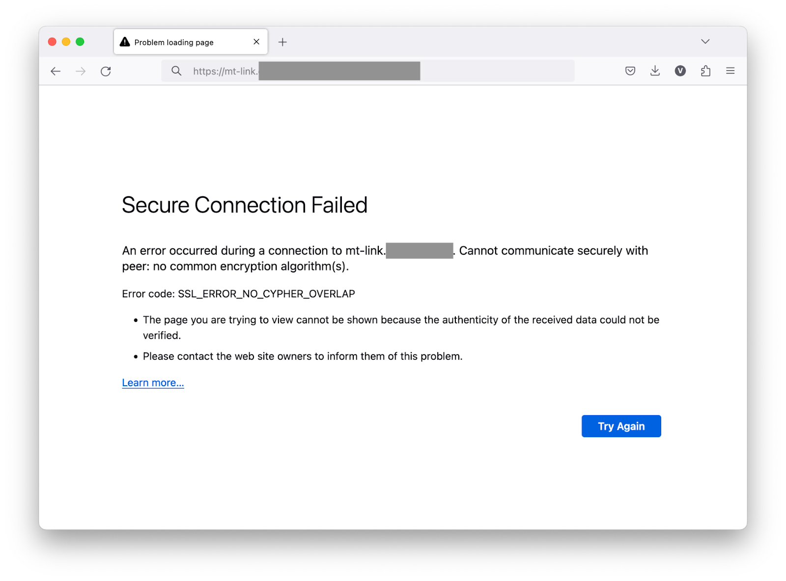

# Click Tracking Blocked – SSL Cipher Error

Click tracking or custom domain tracking issues include `SSL_ERROR_NO_CYPHER_OVERLAP` or `Error 1001` errors.

<figure><figcaption><p>Custom domain blocked: SSL error when accessing custom domain for click tracking</p></figcaption></figure>

### Understanding custom domain click tracking

Mailtrap allows you to use your own domain for click tracking. To achieve this:

1. You add an `mt-link` CNAME record during the domain setup process
2. Mailtrap issues a security certificate for the mt-link subdomain to ensure a secure connection
3. Certificates from **Let's Encrypt** and **Google Trust Services** are used

### Why your custom hostname was blocked

The primary cause for custom domain tracking issues is that some domains have a list of trusted Certificate Authorities (CAs) specified in **CAA records**.


If your CAA records don't include Google Trust Services and Let's Encrypt, Mailtrap won't be able to request certificates from them. This prevents click tracking from working because browsers can't establish a secure connection, hence the custom hostname issues.


### Checking your CAA records

You can check the CAA records for your domain using this command:


```bash
dig CAA example.com
```


The output might look similar to this:


```
;; ANSWER SECTION:
example.com.   13990    IN    CAA    0 issue "globalsign.com"
example.com.   13990    IN    CAA    0 issuewild "globalsign.com"
```


In this example, the domain only allows GlobalSign to issue certificates, which is why Mailtrap cannot obtain a certificate.

### Solution: Update CAA records

You have two options:

**Option 1: Add required CAs (recommended)**

If you want to keep your existing CAA records, modify them to include Google Trust Services and Let's Encrypt:


```
# Google Trust Services
0 issue "pki.goog; cansignhttpexchanges=yes"

# Let's Encrypt
0 issue "letsencrypt.org"
```


**Option 2: Remove CAA restrictions**

If you don't need to restrict which CAs can issue certificates for your domain, you can remove the CAA records entirely.

### How to add CAA records

**CAA Record Configuration**

<table><thead><tr><th width="148.625">Field</th><th width="318.66015625">Value</th><th>Description</th></tr></thead><tbody><tr><td>Name</td><td>blank or <code>@</code>, depending on your provider</td><td></td></tr><tr><td>TTL</td><td>1 hour or any other appropriate TTL</td><td>Controls how long the record is valid.</td></tr><tr><td>Flag</td><td>0</td><td><code>0</code> means that no flags have been set. Please read your DNS provider's documentation for specific behavior.</td></tr><tr><td>Tag</td><td>issue</td><td>Allows the CA to issue certificates for this domain and its subdomains (e.g., mt-link subdomain).</td></tr><tr><td>Domain</td><td><code>pki.goog; cansignhttpexchanges=yes</code> <strong>OR</strong> <code>letsencrypt.org</code></td><td>Google Trust Services needs the additional parameter <code>cansignhttpexchanges=yes</code>.</td></tr></tbody></table>


You'll need to create **two separate CAA records**: one for Google Trust Services and one for Let's Encrypt.


### Verification

After updating your CAA records:



**Wait for DNS propagation**

It can take several hours for the changes to your CAA records to propagate. This varies by DNS provider and TTL settings.



**Verify CAA records**

Run the `dig CAA example.com` command again to confirm the new records are in place.



**Test your mt-link subdomain**

Once propagated, you should be able to access your mt-link subdomain without SSL errors:

<div align="left" data-with-frame="true"><figure><figcaption></figcaption></figure></div>



### Additional resources

For DNS setup guides specific to your provider, see:

* AWS Route 53 Setup Guide
* Cloudflare DNS Setup Guide
* GoDaddy DNS Setup Guide

### Need help?

If you're still experiencing SSL errors after updating CAA records:

* Wait at least 24 hours for full DNS propagation
* Verify the records are correctly formatted (check for typos)
* Contact your DNS provider for CAA record support
* Reach out to Mailtrap support at [support@mailtrap.io](mailto:support@mailtrap.io)
