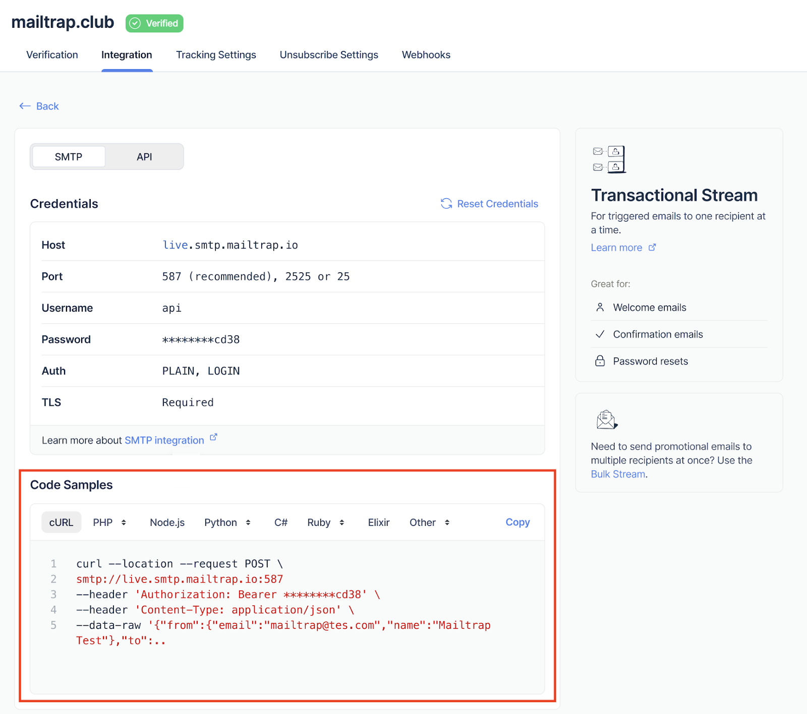

# 401 Unauthorized Error

If you're getting an "Unauthorised" error (401 code) when trying to send emails, there are several possible causes and solutions.

### Common Causes

**1. Sending from Unverified Domain**

Make sure you're sending from the domain that you've set up and verified in Mailtrap. Using any other domain will result in this error.


If you verified `example.com`, you can only send from `*@example.com` addresses. Attempting to send from `otherdomain.com` will fail with a 401 error.


**2. API Token Permissions**

If you've configured a custom API token for your domain, make sure it has proper permissions to send emails.

Check your [API tokens](https://mailtrap.io/api-tokens) and verify the token has:

* Email sending permissions
* Access to the correct domain
* Valid expiration date (if applicable)

**3. Incorrect Credentials**

Make sure you're using the correct SMTP/API credentials provided in the Integration tab of your domain.

<figure><figcaption>
SMTP and API credentials in Integration tab
</figcaption></figure>

### How to Fix



**Verify Your Domain**

1. Go to [Sending Domains](https://mailtrap.io/sending/domains)
2. Ensure your domain shows the **Verified** badge
3. If not verified, complete the DNS record setup



**Check API Token (if using custom tokens)**

1. Go to [API Tokens](https://mailtrap.io/api-tokens)
2. Verify the token has **Send Email** permissions
3. Ensure it's assigned to the correct domain
4. Check that the token hasn't expired



**Verify Credentials**

Navigate to: **Sending Domains > Integration > Integrate** (under Transactional or Bulk Stream)

Copy the exact credentials shown there:

* For SMTP: Username and Password
* For API: API Token

Replace your current credentials with these values.



**Test with cURL**

Use the cURL code example to test if the error persists:

1. Go to **Sending Domains > Integration > Integrate**
2. Select your stream (Transactional or Bulk)
3. Go to **Code Samples > cURL**
4. Copy and run the cURL command

<figure><figcaption>
Code Samples section with cURL example
</figcaption></figure>

If the cURL test succeeds but your application fails, the issue is with your application's configuration.



### Still Having Issues?

If you've verified all the above and still getting 401 errors:

* Double-check that your FROM address domain matches your verified domain
* Ensure there are no extra spaces or special characters in your credentials
* Contact support at [support@mailtrap.io](mailto:support@mailtrap.io) with:
  * Your domain name
  * The exact error message
  * A code sample showing how you're attempting to send

### Related Articles

* [Sending Domain Setup](../sending-domain-setup.md)
* [API Integration](../api-integration.md)
* [SMTP Integration](../smtp-integration.md)
* [Sending from Domain Not Allowed](sending-from-domain-not-allowed.md)
