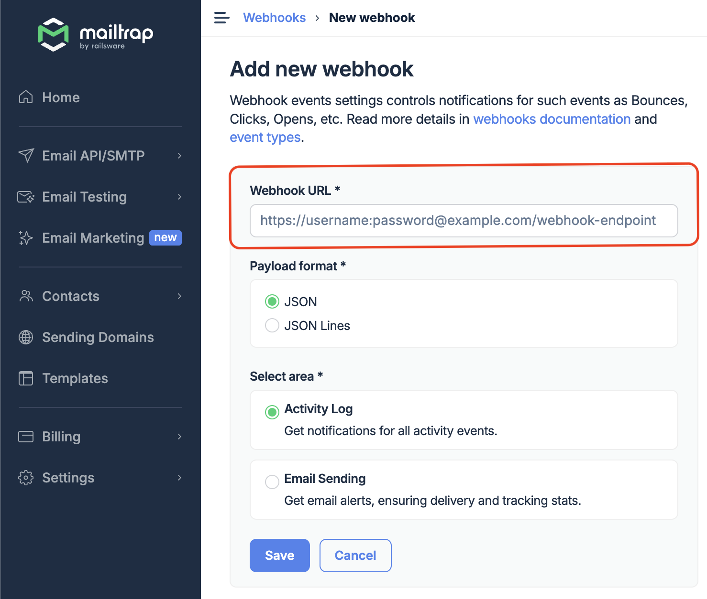
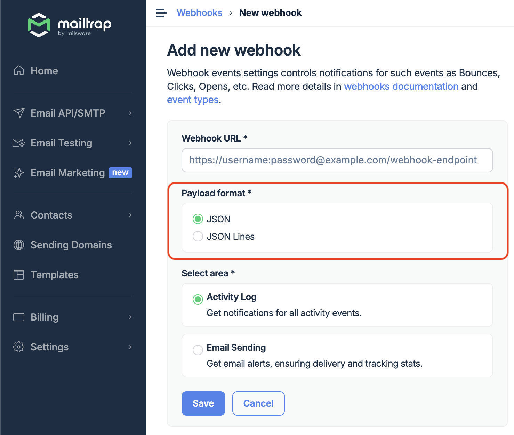
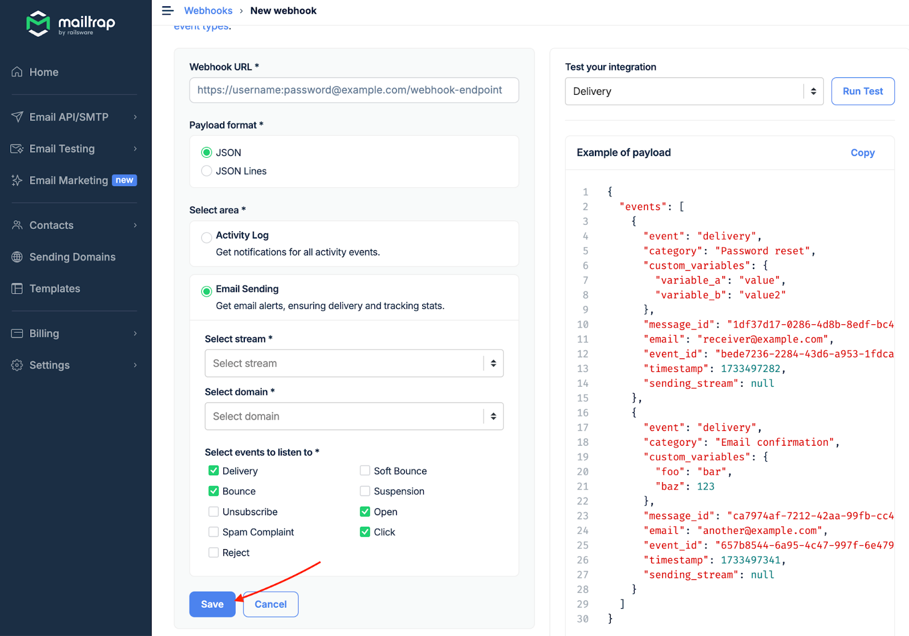

# Webhooks

Webhooks allow you to receive all information about your deliverability and activities within your account (Audit Log) almost in real-time.

### Event types

**Sending events:**

* **Delivery** - Email successfully delivered
* **Bounce** - Permanent delivery failure
* **Soft bounce** - Temporary failure (will retry)
* **Spam complaint** - Recipient reported spam
* **Unsubscribe** - Recipient unsubscribed
* **Open** - Email was opened
* **Click** - Link was clicked
* **Suspension** - Message suspended
* **Reject** - Message rejected

**Audit Log events (available for enterprise only):**

* User login events
* Profile updates
* Permission changes
* And more

### How to set up webhooks



Navigate to **Settings** → **Webhooks** and click the **Create New Webhook** button.

<div align="left" data-with-frame="true"></div>



Enter a valid **Webhook URL**. Use a password and username as an extra security layer with basic authorization to prevent others from sending information to that endpoint. You can also use a token as a query parameter or use [webhook signature](https://docs.mailtrap.io/email-api-smtp/advanced/webhooks#webhook-signature-verification).

<div align="left" data-with-frame="true"></div>



Choose the **Payload format** (JSON or JSON Lines).

<div align="left" data-with-frame="true"></div>

Examples of payload:



Events sent as a JSON object with an `events` array:

```json
{
  "events": [
    {"event": "delivery", "email": "user@example.com", ...}
  ]
}
```



Events sent as newline-delimited JSON:

```jsonl
{"event":"delivery","email":"user@example.com",...}
{"event":"open","email":"user@example.com",...}
```





Select the webhooks area (**Audit Log** or **Email Sending**).

<div align="left" data-with-frame="true"></div>



**If you choose Audit Log**, you will receive events related to all activities within your account that are supported by the Audit Log.

**If you choose Email Sending**, you'll also need to:



Choose the **Sending Stream** (Transactional or Bulk) for which you want to set up the webhooks.


**Transactional Stream** is used to send user-triggered emails to one recipient at a time, while **Bulk Stream** is used to send promotional emails to multiple recipients at once.




Choose the **domain** you want to receive events' data for and select one or more [event types](analytics/statuses-and-events.md) by ticking the corresponding checkbox.

<div align="center" data-with-frame="true"></div>



Click the **Run Test** button to test the webhook setup. The code represents a dummy payload of the webhook structure and how to read it correctly. If your endpoint responds with a 200 code, you'll see a confirmation in the app. All other response codes show an error during a test.

<div align="left" data-with-frame="true"></div>


One popular way to test webhooks outside your system is [Webhook.site](https://webhook.site/#!/view/d24cebd2-99cc-46f3-8685-c779017f39a0), but don't use it for production.




If the tests are successful, click the **Save** button. All information will be sent to your webhook endpoint.

<div align="left" data-with-frame="true"></div>


To edit, pause, or delete an active webhook, go back to the Webhooks tab and select the webhook you want to change.





Mailtrap webhooks are delivered only on ports 443 (for HTTPS) or 80 (for HTTP). Please be sure to use these ports only.


### Receive events (JSON format)

Receive webhook events as a JSON object containing an array of events.

Set **Payload format: JSON** in your webhook settings.

Mailtrap sends a `POST` request to your webhook URL with events as a JSON object.

**Your endpoint should:**

* Accept `Content-Type: application/json`
* Return HTTP 200 to acknowledge receipt
* Process events asynchronously

#### Payload

**events** <mark style="color:$info;">one of\[]</mark> <mark style="color:blue;">optional</mark>

<details>

<summary><mark style="color:$info;">object · SendingWebhookEvent</mark> <mark style="color:blue;">optional</mark><br><mark style="color:$info;">Email lifecycle webhook event</mark></summary>

**event** <mark style="color:$info;">string · enum</mark> <mark style="color:$warning;">required</mark>\
<mark style="color:$info;">Event type</mark>\ <mark style="color:$info;">Possible values</mark>: `delivery` `open` `click` `unsubscribe` `spam` `soft bounce` `bounce` `suspension` `reject`

**message\_id** <mark style="color:$info;">string</mark> <mark style="color:$warning;">required</mark>\
<mark style="color:$info;">Unique message ID</mark>&#x20;

**sending\_stream** <mark style="color:$info;">string · enum</mark> <mark style="color:$warning;">required</mark>\
<mark style="color:$info;">Sending stream used</mark>\
<mark style="color:$info;">Possible values:</mark> `transactional` `bulk`

**email** <mark style="color:$info;">string</mark> <mark style="color:$warning;">required</mark>\
<mark style="color:$info;">Recipient email address</mark>

**sending\_domain\_name** <mark style="color:$info;">string</mark> <mark style="color:$warning;">required</mark>\
<mark style="color:$info;">Sending domain name</mark>

**category** <mark style="color:$info;">string</mark> <mark style="color:$primary;">optional</mark>\
<mark style="color:$info;">Category assigned when sending</mark>

**custom\_variables** <mark style="color:$info;">object</mark> <mark style="color:$primary;">optional</mark>\
<mark style="color:$info;">Custom variables from the email</mark>

* **Other properties** <mark style="color:$info;">string | number | boolean</mark> <mark style="color:$primary;">optional</mark>

**timestamp** <mark style="color:$info;">integer</mark> <mark style="color:$warning;">required</mark>\
<mark style="color:$info;">Unix epoch timestamp</mark>

**event\_id** <mark style="color:$info;">string</mark> <mark style="color:$warning;">required</mark>\
<mark style="color:$info;">Unique event ID (use for idempotency)</mark>

**reason** <mark style="color:$info;">string</mark> <mark style="color:$primary;">optional</mark>\
<mark style="color:$info;">Reason (for</mark> `suspension` <mark style="color:$info;">and</mark> `reject` <mark style="color:$info;">events)</mark>

**response** <mark style="color:$info;">string</mark> <mark style="color:$primary;">optional</mark>\
<mark style="color:$info;">Server response (for</mark> `soft bounce` <mark style="color:$info;">and</mark> `bounce` <mark style="color:$info;">events)</mark>

**response\_code** <mark style="color:$info;">integer</mark> <mark style="color:$primary;">optional</mark>\
<mark style="color:$info;">SMTP response code (for</mark> `soft bounce` <mark style="color:$info;">and</mark> `bounce` <mark style="color:$info;">events)</mark>

**bounce\_category** <mark style="color:$info;">string</mark> <mark style="color:$primary;">optional</mark>\
<mark style="color:$info;">Bounce category (for</mark> `soft bounce` <mark style="color:$info;">and</mark> `bounce` <mark style="color:$info;">events)</mark>

**ip** <mark style="color:$info;">string</mark> <mark style="color:$primary;">optional</mark>\
<mark style="color:$info;">User IP address (for</mark> `open`<mark style="color:$info;">,</mark> `click`<mark style="color:$info;">,</mark> `unsubscribe` <mark style="color:$info;">events)</mark>

**user\_agent** <mark style="color:$info;">string</mark> <mark style="color:$primary;">optional</mark>\
<mark style="color:$info;">User agent (for</mark> `open`<mark style="color:$info;">,</mark> `click`<mark style="color:$info;">,</mark> `unsubscribe` <mark style="color:$info;">events)</mark>

**url** <mark style="color:$info;">string</mark> <mark style="color:$primary;">optional</mark> \
<mark style="color:$info;">Clicked URL</mark> <mark style="color:$info;">(for</mark> `click` <mark style="color:$info;">events)</mark>

</details>

<details>

<summary><mark style="color:$info;">object · ActivityLogWebhookEvent</mark> <mark style="color:$primary;">optional</mark><br><mark style="color:$info;">Account activity webhook event (Enterprise only)</mark></summary>

**event** <mark style="color:$info;">string</mark> <mark style="color:$warning;">required</mark>\
<mark style="color:$info;">Activity log event type</mark>\ <mark style="color:$info;">Example:</mark> `activity_log.user.updated`

**description** <mark style="color:$info;">string</mark> <mark style="color:$warning;">required</mark>\
<mark style="color:$info;">User-friendly event description</mark>\ <mark style="color:$info;">Example:</mark> `updated the user profile`

**actor** <mark style="color:$info;">object</mark> <mark style="color:$warning;">required</mark>\
<mark style="color:$info;">User or system that performed the action</mark>

* **id** <mark style="color:$info;">integer</mark> <mark style="color:$primary;">optional</mark>\
  <mark style="color:$info;">Actor ID</mark>\ <mark style="color:$info;">Example:</mark> `1`
* **type** <mark style="color:$info;">string · enum</mark> <mark style="color:$primary;">optional</mark>\
  <mark style="color:$info;">Actor type</mark>\ <mark style="color:$info;">Possible values:</mark> `user` `api_token`
* **name** <mark style="color:$info;">string</mark> <mark style="color:$primary;">optional</mark>\
  <mark style="color:$info;">Actor name</mark>\ <mark style="color:$info;">Example:</mark> `John Doe`

**resource** <mark style="color:$info;">object</mark> <mark style="color:$primary;">optional</mark>\
<mark style="color:$info;">Affected resource (optional)</mark>

* **id** <mark style="color:$info;">string</mark> <mark style="color:$primary;">optional</mark>\
  <mark style="color:$info;">Resource ID</mark>\ <mark style="color:$info;">Example:</mark> `1`
* **type** <mark style="color:$info;">string · enum</mark> <mark style="color:$primary;">optional</mark>\
  <mark style="color:$info;">Resource type</mark>\ <mark style="color:$info;">Possible values:</mark> `user` `api_token` `billing` `account` `sso_config` `sending_domain` `project` `inbox` `contact_list` <kbd>contact\_field</kbd> `contact_segment`
* **name** <mark style="color:$info;">string</mark> <mark style="color:$primary;">optional</mark>\
  <mark style="color:$info;">Resource name</mark>\ <mark style="color:$info;">Example:</mark> `John Doe`

**changes** <mark style="color:$info;">object</mark> <mark style="color:$primary;">optional</mark>\
<mark style="color:$info;">Changes made (optional)</mark>\ <mark style="color:$info;">Example:</mark> `{"name":{"from":"John","to":"John Doe"}}`

* **Other properties** <mark style="color:$info;">object</mark> <mark style="color:$primary;">optional</mark>

**timestamp** <mark style="color:$info;">integer</mark> <mark style="color:$warning;">required</mark>\
<mark style="color:$info;">Unix epoch timestamp</mark>\ <mark style="color:$info;">Example:</mark> `1735830138`

</details>

**Responses**

| <mark style="color:$success;">`200`</mark> | Return 200 to acknowledge successful receipt             |
| ------------------------------------------ | -------------------------------------------------------- |
| <mark style="color:$danger;">`500`</mark>  | Any other status triggers retry (40 retries every 5 min) |

**Payload**



```json
{
  "events": [
    {
      "event": "delivery",
      "timestamp": 1728669700,
      "sending_stream": "transactional",
      "category": "Password reset",
      "custom_variables": {
        "user_id": "123"
      },
      "message_id": "1df37d17-0286-4d8b-8edf-bc4ec5be86e6",
      "email": "receiver@example.com",
      "event_id": "bede7236-2284-43d6-a953-1fdcafd0fdbc",
      "sending_domain_name": "examplesender.com"
    }
  ]
}
```



```json
{
  "events": [
    {
      "event": "bounce",
      "timestamp": 1728669700,
      "sending_stream": "transactional",
      "message_id": "1df37d17-0286-4d8b-8edf-bc4ec5be86e6",
      "email": "receiver@example.com",
      "event_id": "bede7236-2284-43d6-a953-1fdcafd0fdbc",
      "response": "[CS01] Message rejected due to local policy",
      "response_code": 555,
      "bounce_category": "spam",
      "sending_domain_name": "examplesender.com"
    }
  ]
}
```



```json
{
  "events": [
    {
      "event": "soft bounce",
      "timestamp": 1728669700,
      "sending_stream": "transactional",
      "message_id": "1df37d17-0286-4d8b-8edf-bc4ec5be86e6",
      "email": "receiver@example.com",
      "event_id": "bede7236-2284-43d6-a953-1fdcafd0fdbc",
      "response": "4.7.1 Temporary error, please retry",
      "response_code": 451,
      "bounce_category": "greylisting",
      "sending_domain_name": "examplesender.com"
    }
  ]
}
```



```json
{
  "events": [
    {
      "event": "spam",
      "timestamp": 1728669700,
      "sending_stream": "transactional",
      "message_id": "1df37d17-0286-4d8b-8edf-bc4ec5be86e6",
      "email": "receiver@example.com",
      "event_id": "bede7236-2284-43d6-a953-1fdcafd0fdbc",
      "sending_domain_name": "examplesender.com"
    }
  ]
}
```



```json
{
  "events": [
    {
      "event": "suspension",
      "timestamp": 1728669700,
      "sending_stream": "transactional",
      "message_id": "1df37d17-0286-4d8b-8edf-bc4ec5be86e6",
      "email": "receiver@example.com",
      "event_id": "bede7236-2284-43d6-a953-1fdcafd0fdbc",
      "reason": "Your account has reached its daily sending limit.",
      "sending_domain_name": "examplesender.com"
    }
  ]
}
```



```json
{
  "events": [
    {
      "event": "reject",
      "timestamp": 1728669700,
      "sending_stream": "transactional",
      "message_id": "1df37d17-0286-4d8b-8edf-bc4ec5be86e6",
      "email": "receiver@example.com",
      "event_id": "bede7236-2284-43d6-a953-1fdcafd0fdbc",
      "reason": "Recipient in suppression list. Reason: unsubscription",
      "sending_domain_name": "examplesender.com"
    }
  ]
}
```



```json
{
  "events": [
    {
      "event": "open",
      "timestamp": 1728669700,
      "sending_stream": "transactional",
      "message_id": "1df37d17-0286-4d8b-8edf-bc4ec5be86e6",
      "email": "receiver@example.com",
      "event_id": "bede7236-2284-43d6-a953-1fdcafd0fdbc",
      "ip": "127.138.158.185",
      "user_agent": "Mozilla/5.0 (Macintosh; Intel Mac OS X 10_15_7)",
      "sending_domain_name": "examplesender.com"
    }
  ]
}
```



```json
{
  "events": [
    {
      "event": "click",
      "timestamp": 1728669700,
      "sending_stream": "transactional",
      "message_id": "1df37d17-0286-4d8b-8edf-bc4ec5be86e6",
      "email": "receiver@example.com",
      "event_id": "bede7236-2284-43d6-a953-1fdcafd0fdbc",
      "ip": "142.86.27.2",
      "user_agent": "Mozilla/5.0 (Windows NT x.y; Win64; x64)",
      "url": "https://mailtrap.io/email-api",
      "sending_domain_name": "examplesender.com"
    }
  ]
}
```



```json
{
  "events": [
    {
      "event": "unsubscribe",
      "timestamp": 1728669700,
      "sending_stream": "transactional",
      "message_id": "1df37d17-0286-4d8b-8edf-bc4ec5be86e6",
      "email": "receiver@example.com",
      "event_id": "bede7236-2284-43d6-a953-1fdcafd0fdbc",
      "sending_domain_name": "examplesender.com"
    }
  ]
}
```



```json
{
  "events": [
    {
      "event": "activity_log.user.login",
      "description": "logged in with SSO",
      "actor": {
        "id": 1,
        "type": "user",
        "name": "John Doe"
      },
      "timestamp": 1735830138
    }
  ]
}
```



```json
{
  "events": [
    {
      "event": "activity_log.user.updated",
      "description": "updated the user profile",
      "actor": {
        "id": 1,
        "type": "user",
        "name": "John Doe"
      },
      "resource": {
        "id": "1",
        "type": "user",
        "name": "John Doe"
      },
      "changes": {
        "name": {
          "from": "John",
          "to": "John Doe"
        }
      },
      "timestamp": 1735830138
    }
  ]
}
```



### Receive events (JSON Lines format)

Mailtrap sends a `POST` request to your webhook URL with events in [JSON Lines](https://jsonlines.org/) format.

Each line is a separate JSON object. Parse line by line.

**Your endpoint should:**

* Accept `Content-Type: application/jsonl`
* Return HTTP 200 to acknowledge receipt
* Process events asynchronously

**Payload**

<details>

<summary><mark style="color:$info;">object · SendingWebhookEvent</mark> <mark style="color:blue;">optional</mark><br><mark style="color:$info;">Email lifecycle webhook event</mark></summary>

**event** <mark style="color:$info;">string · enum</mark> <mark style="color:$warning;">required</mark>\
<mark style="color:$info;">Event type</mark>\ <mark style="color:$info;">Possible values</mark>: `delivery` `open` `click` `unsubscribe` `spam` `soft bounce` `bounce` `suspension` `reject`

**message\_id** <mark style="color:$info;">string</mark> <mark style="color:$warning;">required</mark>\
<mark style="color:$info;">Unique message ID</mark>&#x20;

**sending\_stream** <mark style="color:$info;">string · enum</mark> <mark style="color:$warning;">required</mark>\
<mark style="color:$info;">Sending stream used</mark>\
<mark style="color:$info;">Possible values:</mark> `transactional` `bulk`

**email** <mark style="color:$info;">string</mark> <mark style="color:$warning;">required</mark>\
<mark style="color:$info;">Recipient email address</mark>

**sending\_domain\_name** <mark style="color:$info;">string</mark> <mark style="color:$warning;">required</mark>\
<mark style="color:$info;">Sending domain name</mark>

**category** <mark style="color:$info;">string</mark> <mark style="color:$primary;">optional</mark>\
<mark style="color:$info;">Category assigned when sending</mark>

**custom\_variables** <mark style="color:$info;">object</mark> <mark style="color:$primary;">optional</mark>\
<mark style="color:$info;">Custom variables from the email</mark>

* **Other properties** <mark style="color:$info;">string | number | boolean</mark> <mark style="color:$primary;">optional</mark>

**timestamp** <mark style="color:$info;">integer</mark> <mark style="color:$warning;">required</mark>\
<mark style="color:$info;">Unix epoch timestamp</mark>

**event\_id** <mark style="color:$info;">string</mark> <mark style="color:$warning;">required</mark>\
<mark style="color:$info;">Unique event ID (use for idempotency)</mark>

**reason** <mark style="color:$info;">string</mark> <mark style="color:$primary;">optional</mark>\
<mark style="color:$info;">Reason (for</mark> `suspension` <mark style="color:$info;">and</mark> `reject` <mark style="color:$info;">events)</mark>

**response** <mark style="color:$info;">string</mark> <mark style="color:$primary;">optional</mark>\
<mark style="color:$info;">Server response (for</mark> `soft bounce` <mark style="color:$info;">and</mark> `bounce` <mark style="color:$info;">events)</mark>

**response\_code** <mark style="color:$info;">integer</mark> <mark style="color:$primary;">optional</mark>\
<mark style="color:$info;">SMTP response code (for</mark> `soft bounce` <mark style="color:$info;">and</mark> `bounce` <mark style="color:$info;">events)</mark>

**bounce\_category** <mark style="color:$info;">string</mark> <mark style="color:$primary;">optional</mark>\
<mark style="color:$info;">Bounce category (for</mark> `soft bounce` <mark style="color:$info;">and</mark> `bounce` <mark style="color:$info;">events)</mark>

**ip** <mark style="color:$info;">string</mark> <mark style="color:$primary;">optional</mark>\
<mark style="color:$info;">User IP address (for</mark> `open`<mark style="color:$info;">,</mark> `click`<mark style="color:$info;">,</mark> `unsubscribe` <mark style="color:$info;">events)</mark>

**user\_agent** <mark style="color:$info;">string</mark> <mark style="color:$primary;">optional</mark>\
<mark style="color:$info;">User agent (for</mark> `open`<mark style="color:$info;">,</mark> `click`<mark style="color:$info;">,</mark> `unsubscribe` <mark style="color:$info;">events)</mark>

**url** <mark style="color:$info;">string</mark> <mark style="color:$primary;">optional</mark> \
<mark style="color:$info;">Clicked URL</mark> <mark style="color:$info;">(for</mark> `click` <mark style="color:$info;">events)</mark>

</details>

<details>

<summary><mark style="color:$info;">object · ActivityLogWebhookEvent</mark> <mark style="color:$primary;">optional</mark><br><mark style="color:$info;">Account activity webhook event (Enterprise only)</mark></summary>

**event** <mark style="color:$info;">string</mark> <mark style="color:$warning;">required</mark>\
<mark style="color:$info;">Activity log event type</mark>\ <mark style="color:$info;">Example:</mark> `activity_log.user.updated`

**description** <mark style="color:$info;">string</mark> <mark style="color:$warning;">required</mark>\
<mark style="color:$info;">User-friendly event description</mark>\ <mark style="color:$info;">Example:</mark> `updated the user profile`

**actor** <mark style="color:$info;">object</mark> <mark style="color:$warning;">required</mark>\
<mark style="color:$info;">User or system that performed the action</mark>

* **id** <mark style="color:$info;">integer</mark> <mark style="color:$primary;">optional</mark>\
  <mark style="color:$info;">Actor ID</mark>\ <mark style="color:$info;">Example:</mark> `1`
* **type** <mark style="color:$info;">string · enum</mark> <mark style="color:$primary;">optional</mark>\
  <mark style="color:$info;">Actor type</mark>\ <mark style="color:$info;">Possible values:</mark> `user` `api_token`
* **name** <mark style="color:$info;">string</mark> <mark style="color:$primary;">optional</mark>\
  <mark style="color:$info;">Actor name</mark>\ <mark style="color:$info;">Example:</mark> `John Doe`

**resource** <mark style="color:$info;">object</mark> <mark style="color:$primary;">optional</mark>\
<mark style="color:$info;">Affected resource (optional)</mark>

* **id** <mark style="color:$info;">string</mark> <mark style="color:$primary;">optional</mark>\
  <mark style="color:$info;">Resource ID</mark>\ <mark style="color:$info;">Example:</mark> `1`
* **type** <mark style="color:$info;">string · enum</mark> <mark style="color:$primary;">optional</mark>\
  <mark style="color:$info;">Resource type</mark>\ <mark style="color:$info;">Possible values:</mark> `user` `api_token` `billing` `account` `sso_config` `sending_domain` `project` `inbox` `contact_list` <kbd>contact\_field</kbd> `contact_segment`
* **name** <mark style="color:$info;">string</mark> <mark style="color:$primary;">optional</mark>\
  <mark style="color:$info;">Resource name</mark>\ <mark style="color:$info;">Example:</mark> `John Doe`

**changes** <mark style="color:$info;">object</mark> <mark style="color:$primary;">optional</mark>\
<mark style="color:$info;">Changes made (optional)</mark>\ <mark style="color:$info;">Example:</mark> `{"name":{"from":"John","to":"John Doe"}}`

* **Other properties** <mark style="color:$info;">object</mark> <mark style="color:$primary;">optional</mark>

**timestamp** <mark style="color:$info;">integer</mark> <mark style="color:$warning;">required</mark>\
<mark style="color:$info;">Unix epoch timestamp</mark>\ <mark style="color:$info;">Example:</mark> `1735830138`

</details>

**Responses**

| <mark style="color:$success;">`200`</mark> | Return 200 to acknowledge successful receipt             |
| ------------------------------------------ | -------------------------------------------------------- |
| <mark style="color:$danger;">`500`</mark>  | Any other status triggers retry (40 retries every 5 min) |

**Payload**



```jsonl
{"event":"delivery","timestamp":1728669927,"sending_stream":"transactional","category":"Password reset","message_id":"1df37d17-0286-4d8b-8edf-bc4ec5be86e6","email":"receiver@example.com","event_id":"bede7236-2284-43d6-a953-1fdcafd0fdbc","sending_domain_name":"examplesender.com"}
{"event":"delivery","timestamp":1728669927,"sending_stream":"transactional","category":"Email confirmation","message_id":"ca7974af-7212-42aa-99fb-cc4742d0658b","email":"another@example.com","event_id":"657b8544-6a95-4c47-997f-6e47922a5052","sending_domain_name":"examplesender.com"}
```



```jsonl
{"event":"bounce","timestamp":1728669927,"sending_stream":"transactional","message_id":"1df37d17-0286-4d8b-8edf-bc4ec5be86e6","email":"receiver@example.com","event_id":"bede7236-2284-43d6-a953-1fdcafd0fdbc","response":"[CS01] Message rejected","response_code":555,"bounce_category":"spam","sending_domain_name":"examplesender.com"}
```



```jsonl
{"event":"delivery","timestamp":1728669927,"message_id":"abc-123","email":"user1@example.com","event_id":"evt-1","sending_stream":"transactional","sending_domain_name":"example.com"}
{"event":"open","timestamp":1728669930,"message_id":"abc-123","email":"user1@example.com","event_id":"evt-2","sending_stream":"transactional","ip":"192.168.1.1","sending_domain_name":"example.com"}
{"event":"click","timestamp":1728669935,"message_id":"abc-123","email":"user1@example.com","event_id":"evt-3","sending_stream":"transactional","url":"https://example.com","sending_domain_name":"example.com"}
```



### Audit Log event structure

Audit Log events include the following fields:

* **event** — The event type
  * Example: `activity_log.user.updated`
* **description** — The event description. Meant to be a user-friendly representation of the event type.
  * Example: `updated the user profile`
* **actor** — Object representing the actor who executed the action or if the action was performed by the system actor.
  * Example: `{"id":1,"type":"user","name":"Jack"}` or `{"name":"Mailtrap"}`
* **resource** — Optional object representing the resource affected by the action
  * Example: `{"id":17,"type":"sandbox","name":"Main"}`
* **changes** — Optional object representing the changes made to the resource
  * Example: `{"name":{"from":"John","to":"John Doe"}}`
* **timestamp** — The timestamp in Unix epoch format
  * Example: `1735830138`

All stats are built on the events, and you get most event information from the Mailtrap UI.

### Retry schedule and batches

#### Retry schedule

If your endpoint is down and doesn't respond with 200 OK, we'll retry multiple times. The scheduling logic is as follows:

* **Retry** - 40 retries every 5 minutes. The webhook will be considered failed if we don't receive 200 OK with all retries. If the webhook fails, we'll pause it and notify you by email. You'll need to check its settings and resume it manually.
* **Timeout** - 30 seconds. If your endpoint doesn't respond within that time, the webhook event batch will go to the retry schedule.

#### Batches

Webhooks are delivered in batches, so a single request can contain multiple events. This reduces the number of requests to your endpoint and lowers load on your infrastructure.

Mailtrap can include up to 500 events per delivery. Events are collected and sent every 30 seconds (if there are events to deliver).

The batch format depends on the webhook payload type you choose:

* **JSON**: events are sent as a JSON array in a single payload.
* **JSON Lines**: events are sent as one JSON object per line (not wrapped in an array).

### Webhook Signature Verification

Mailtrap signs all webhook requests to ensure they originate from Mailtrap and haven't been tampered with.

#### Overview

Mailtrap uses [HMAC-SHA256](https://tools.ietf.org/html/rfc2104) to sign webhook payloads. Each webhook has a unique signing secret that you can use to verify the authenticity of incoming requests.

### How it works

* Signature Header – Mailtrap includes a \`Mailtrap-Signature\` header in every webhook request.
* Signature Algorithm – The signature is computed using HMAC-SHA256.
* Signature Format – The signature is a hexadecimal-encoded string.
* Signing Secret – Each webhook has a unique signing secret (32 hex characters).

### Getting your signing secret

The signing secret is automatically generated when you create a webhook. You can view and manage your signing secret in the Mailtrap UI:



### Find the webhook you want to configure in to your webhooks settings

<figure><figcaption></figcaption></figure>



### The signing secret will be displayed in the webhook details

<figure><figcaption></figcaption></figure>

Then, you can:

* Copy the secret to use in your verification code.
* Reset it at any time from the UI if you wish to (i.e., for security reasons).

**Important**: When you reset the signing secret, the old secret becomes invalid immediately. Make sure to update your verification code with the new secret.



#### Verifying the signature&#x20;

To verify a webhook signature, you need to:

1. Extract the \`Mailtrap-Signature\` header from the incoming request
2. Get the raw request body (as bytes/string, not parsed JSON)
3. Compute HMAC-SHA256 using your signing secret and the raw body
4. Compare the computed signature with the header value using a constant-time comparison

**Important notes:**

* **Use the raw request body** – Do not parse the JSON first. Use the raw bytes/string exactly as received.
* **Constant-time comparison** – Always use a constant-time comparison function to prevent timing attacks.
* `Content-Type` – The signature is computed on the raw body regardless of Content-Type (JSON or JSONL)

#### Code examples



```ruby
ruby
require 'openssl'

def verify_webhook_signature(request_body, signature_header, signing_secret)
  return false if signature_header.blank? || request_body.blank?
  
  computed_signature = OpenSSL::HMAC.hexdigest(
    OpenSSL::Digest.new('sha256'),
    signing_secret,
    request_body
  )
  
  # Use secure_compare for constant-time comparison
  Rack::Utils.secure_compare(computed_signature, signature_header)
end
```



```ruby
def webhook_received
  signature = request.headers['Mailtrap-Signature']
  body = request.raw_post
  signing_secret = 'your_signing_secret_here'
  
  unless verify_webhook_signature(body, signature, signing_secret)
    head :bad_request
    return
  end
  
  # Process the webhook...
end
```



```python
import hmac
import hashlib

def verify_webhook_signature(request_body, signature_header, signing_secret):
    if not signature_header or not request_body:
        return False
    
    computed_signature = hmac.new(
        signing_secret.encode('utf-8'),
        request_body.encode('utf-8'),
        hashlib.sha256
    ).hexdigest()
    
    # Use hmac.compare_digest for constant-time comparison
    return hmac.compare_digest(computed_signature, signature_header)
```



```python
from flask import request

@app.route('/webhook', methods=['POST'])
def webhook_received():
    signature = request.headers.get('Mailtrap-Signature')
    body = request.get_data(as_text=True)
    signing_secret = 'your_signing_secret_here'
    
    if not verify_webhook_signature(body, signature, signing_secret):
        return '', 400
    
    # Process the webhook...
    return '', 200
```



```javascript
const crypto = require('crypto');

function verifyWebhookSignature(requestBody, signatureHeader, signingSecret) {
  if (!signatureHeader || !requestBody) {
    return false;
  }
  
  const computedSignature = crypto
    .createHmac('sha256', signingSecret)
    .update(requestBody, 'utf8')
    .digest('hex');
  
  // Use crypto.timingSafeEqual for constant-time comparison
  const signatureBuffer = Buffer.from(signatureHeader, 'hex');
  const computedBuffer = Buffer.from(computedSignature, 'hex');
  
  if (signatureBuffer.length !== computedBuffer.length) {
    return false;
  }
  
  return crypto.timingSafeEqual(signatureBuffer, computedBuffer);
}

// Usage in Express
app.post('/webhook', express.raw({ type: 'application/json' }), (req, res) => {
  const signature = req.headers['mailtrap-signature'];
  const body = req.body.toString('utf8');
  const signingSecret = 'your_signing_secret_here';
  
  if (!verifyWebhookSignature(body, signature, signingSecret)) {
    return res.status(400).send('Invalid signature');
  }
  
  // Process the webhook...
  res.status(200).send('OK');
});
```



```javascript
app.post('/webhook', express.raw({ type: 'application/json' }), (req, res) => {
  const signature = req.headers['mailtrap-signature'];
  const body = req.body.toString('utf8');
  const signingSecret = 'your_signing_secret_here';
  
  if (!verifyWebhookSignature(body, signature, signingSecret)) {
    return res.status(400).send('Invalid signature');
  }
  
  // Process the webhook...
  res.status(200).send('OK');
});
```



```php
<?php

function verifyWebhookSignature($requestBody, $signatureHeader, $signingSecret) {
    if (empty($signatureHeader) || empty($requestBody)) {
        return false;
    }
    
    $computedSignature = hash_hmac('sha256', $requestBody, $signingSecret);
    
    // Use hash_equals for constant-time comparison
    return hash_equals($computedSignature, $signatureHeader);
}

// Usage
$signature = $_SERVER['HTTP_MAILTRAP_SIGNATURE'] ?? '';
$body = file_get_contents('php://input');
$signingSecret = 'your_signing_secret_here';

if (!verifyWebhookSignature($body, $signature, $signingSecret)) {
    http_response_code(400);
    exit;
}

// Process the webhook...
```



```go
package main

import (
    "crypto/hmac"
    "crypto/sha256"
    "encoding/hex"
    "net/http"
    "strings"
)

func verifyWebhookSignature(requestBody []byte, signatureHeader, signingSecret string) bool {
    if signatureHeader == "" || len(requestBody) == 0 {
        return false
    }
    
    mac := hmac.New(sha256.New, []byte(signingSecret))
    mac.Write(requestBody)
    computedSignature := hex.EncodeToString(mac.Sum(nil))
    
    // Use hmac.Equal for constant-time comparison
    return hmac.Equal([]byte(computedSignature), []byte(signatureHeader))
}
```



```http
func webhookHandler(w http.ResponseWriter, r *http.Request) {
    signature := r.Header.Get("Mailtrap-Signature")
    body, _ := io.ReadAll(r.Body)
    signingSecret := "your_signing_secret_here"
    
    if !verifyWebhookSignature(body, signature, signingSecret) {
        w.WriteHeader(http.StatusBadRequest)
        return
    }
    
    // Process the webhook...
    w.WriteHeader(http.StatusOK)
}
```



#### Security best practices

* **Always verify signatures** – Never process webhooks without verifying the signature first.
* **Store secrets securely** – Keep your signing secrets in environment variables or secure secret management systems.
* **Use constant-time comparison** – Always use constant-time comparison functions to prevent timing attacks.
* **Handle missing headers gracefully** – If the signature header is missing, reject the request.
* **Rotate secrets when compromised** – If you suspect a secret has been compromised, reset it immediately in the Mailtrap UI.

#### Troubleshooting

**Signature verification fails:**

* **Check the raw body** – Make sure you're using the raw request body, not parsed JSON.
* **Verify encoding** – Ensure you're handling UTF-8 encoding correctly.
* **Check secret** – Confirm you're using the correct signing secret for the webhook.
* **Header name** – The header is case-insensitive, but ensure you're reading it correctly (\`Mailtrap-Signature\`).

**Signature header is missing:**

* This could indicate the request is not from Mailtrap
* Reject the request with a 400 Bad Request status

**Different payload formats:**

* The signature is computed on the raw body regardless of payload format (JSON or JSONL)
* Both formats use the same verification process
