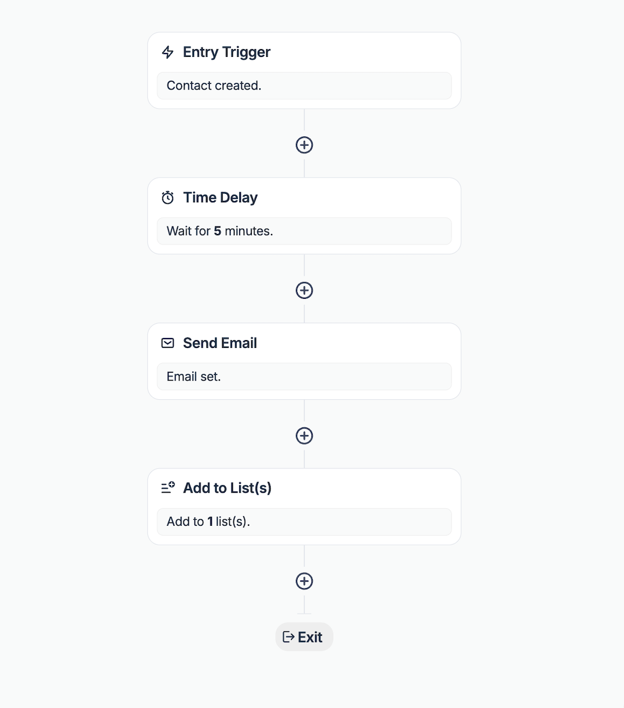

# Automations

The Automations feature allows you to create automated email sequences to engage your contacts.

Set up triggers, actions, and rules to automate your email sending.

## Use cases

Use integrations to add contacts into Mailtrap using API, SDKs, [Make.com](https://app.gitbook.com/s/gkNigAKiqQtQub1GOdjY/integrations/make), [Zapier](https://app.gitbook.com/s/gkNigAKiqQtQub1GOdjY/integrations/zapier), or [N8N](https://app.gitbook.com/s/gkNigAKiqQtQub1GOdjY/integrations/n8n).



**Use case**: Greet new contacts, set expectations, and share first-week tips. Perfect for onboarding new subscribers and making a great first impression.

**How to set it up**:

1. Trigger: Contact created
2. Add Send email steps with Time delays
3. Optionally: Conditional split by plan or locale

<figure><figcaption></figcaption></figure>



**Use case**: Nudge users when a field changes (e.g., trial started, role/plan updated). Ideal for guiding users through product adoption milestones.

**How to set it up**:

1. Trigger: Contact field updated
2. Send email with next steps
3. Add to list "Onboarding" for later messages

<figure><figcaption></figcaption></figure>



**Use case**: Deliver targeted content as people enter key lists. Great for webinar registrants, new customers, or list cleanup workflows.

**How to set it up**:

1. Trigger: Contact added to list (or removed from list)
2. Send email
3. Add/Remove from lists to manage follow-ups

<figure><figcaption></figcaption></figure>



**Use case**: React to product or billing events. Excellent for purchase confirmations, payment failures, or milestone celebrations.

**How to set it up**:

1. Trigger: API event received
2. Send email
3. Optionally: Update contact field and Conditional split based on event data

<figure><figcaption></figcaption></figure>



## Functionality

### Available components



Some of the Entry points available in the automation builder include:

* **Contact created** — Starts when a new contact is added.
* **Contact field updated** — Fires when specific field changes (e.g., email, last name, state, etc.).
* **Contact added to list** — Activates when a new user is added to your list.
* **Contact removed from list** — Triggers when a contact is removed from your list.
* **Contact custom event** — Starts when Mailtrap receives a custom API event.


Each contact can only enter the same automation once every 24 hours.




Here are the operations you can perform on your contacts in the automation builder:

* **Send email** — Deliver personalized messages to your contacts.
* **Update Contact Field** — Modify contact properties (e.g., email, last name, state, etc.).
* **Unsubscribe Contact** — Unsubscribe a contact from receiving your marketing emails.
* **Add to List(s)** — Assign a contact to one or more lists.
* **Remove from List(s)** — Remove a contact from one or more lists.



To control the flow and timing of your automations, you can use:

* **Time delay** — Wait a specified amount of time before moving on to the next step.
* **Conditional Split** — Branch the workflow automation based on criteria (fields and events).



## Triggering via API Event

"Contact custom event" trigger requires you to send an API event.


Event in the trigger settings should be equal to the event you pass via API.


Here is [description of the endpoint](https://api-docs.mailtrap.io/docs/mailtrap-api-docs/6b1b5749b0eec-create-contact-event).


```bash
curl -X POST https://api.mailtrap.io/contacts/{contact_id}/events \
  -H "Authorization: Bearer YOUR_API_KEY" \
  -H "Content-Type: application/json" \
  -d '{
    "event": "purchase_completed",
    "data": {
      "amount": 99.99,
      "product": "Premium Plan"
    }
  }'
```


## Limits

Each Mailtrap Email API/SMTP plan comes with different automation limits. To see the usage:

* Navigate to the [Billing Dashboard](https://mailtrap.io/billing/dashboard).
* Click on 'View all features' under Email API/SMTP.
* Look for 'Automations run count'.

<div align="left" data-with-frame="true"><figure><figcaption></figcaption></figure></div>


Each contact can go through the same automation once in 24 hours.


## Creating your first automation

To get started, navigate to the tab in your Mailtrap account or go to [https://mailtrap.io/automations](https://mailtrap.io/automations).



Define the name for your automation.

<div align="left" data-with-frame="true"><figure><figcaption></figcaption></figure></div>

Choose a descriptive name that indicates the automation's purpose.



Set up an entry trigger and select when the automation should start.

<div align="left" data-with-frame="true"><figure><figcaption></figcaption></figure></div>

For this example, we'll use the "Contact created" trigger. This means the automation will start whenever a new contact is added. After selecting the trigger type, click "Save".



## Building your automation sequence

Now that you've set up the trigger, you can start adding steps to your automation.



Click the "Add Step" button to add your first action.

<div align="left" data-with-frame="true"><figure><figcaption></figcaption></figure></div>



Select "Send Email" as your first action.

<div align="left" data-with-frame="true"><figure><figcaption></figcaption></figure></div>



Customize your email content and settings.

<div align="left" data-with-frame="true"><figure><figcaption></figcaption></figure></div>

Add your subject line, choose a template, and personalize with merge tags.



### Adding delays and additional steps

To create a more complex sequence, you can add time delays and further actions.



Insert waiting periods between actions.

<div align="left" data-with-frame="true"><figure><figcaption></figcaption></figure></div>

Configure the delay duration (minutes, hours, days, or weeks).



Continue building your sequence with additional messages or actions.

Repeat the process to add more emails, list assignments, or field updates.



## Automation activation

Once you've built your automation sequence, it's time to activate it.

<div align="left" data-with-frame="true"><figure><figcaption></figcaption></figure></div>


**Before activating**

* Test with a small group first
* Review all email content
* Verify trigger conditions
* Check time delays


### Pausing and disabling

You can pause or disable your automation at any time.

<div align="left" data-with-frame="true"><figure><figcaption></figcaption></figure></div>



**Temporary suspension**

* No new contacts can enter automation
* Contacts currently in automation continue the flow
* Use when making minor adjustments



**Complete shutdown**

* No new contacts can enter automation
* All contacts currently in automation will complete their current step
* Then removed from the flow
* Use for major changes or discontinuation



## Stats — Monitoring automation performance

You can track the performance of your automation by clicking on the Reports tab within the automation builder.

<div align="left" data-with-frame="true"><figure><figcaption></figcaption></figure></div>

**Available metrics**:

* Open rate per email
* Click rate per email
* Number of step completions
* Delivery rate

## Best practices

* **Start simple**: Begin with basic welcome series before complex flows.
* **Test thoroughly**: Use test contacts before going live.
* **Monitor performance**: Check reports weekly for optimization opportunities.
* **Segment wisely**: Use conditional splits for personalization.
* **Time delays**: Consider time zones and optimal send times.
* **Exit strategies**: Plan how contacts leave the automation.
