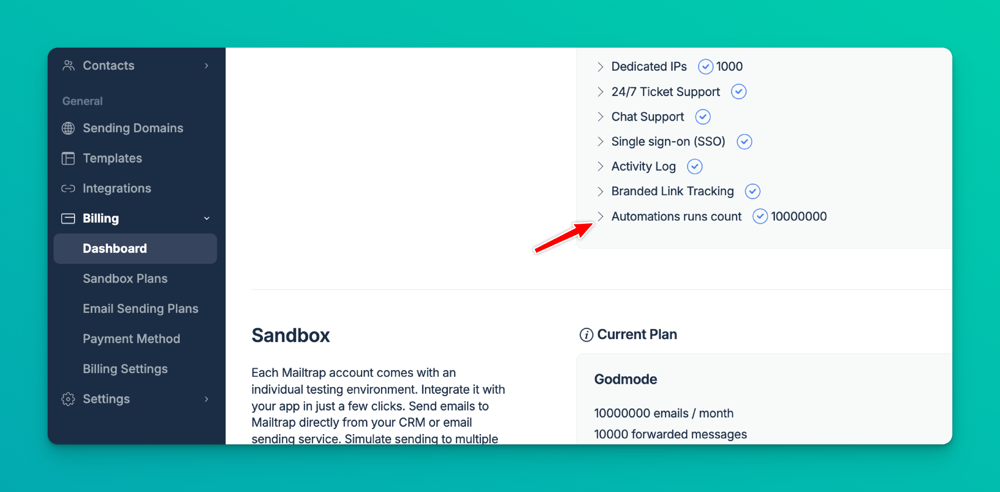
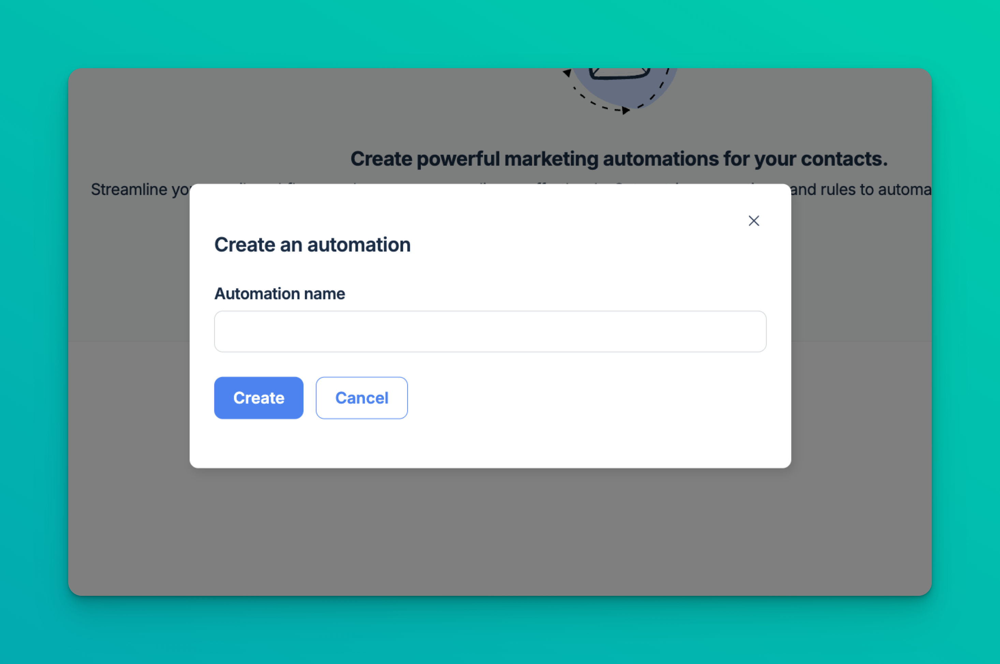
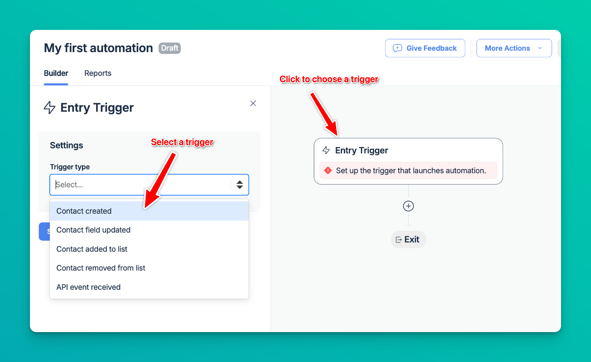
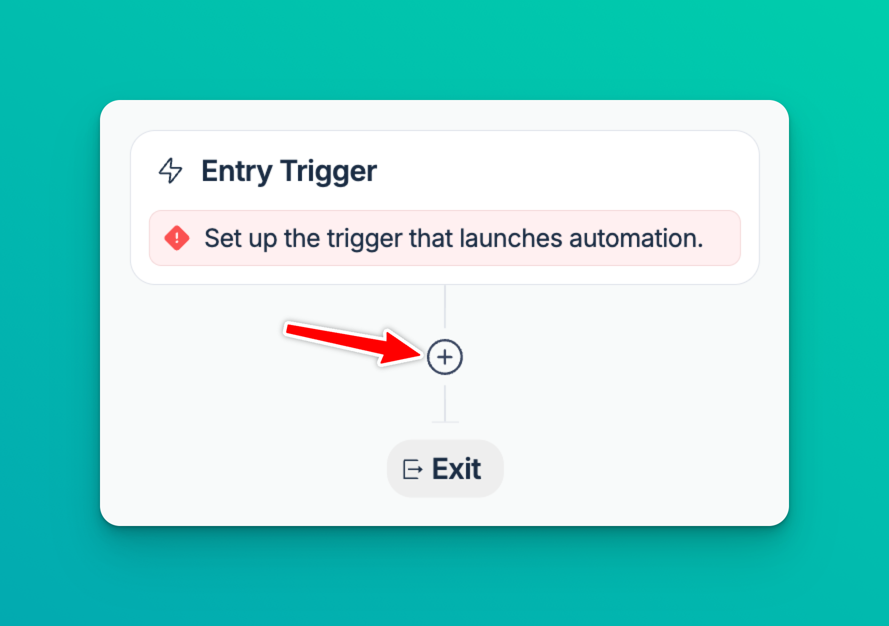
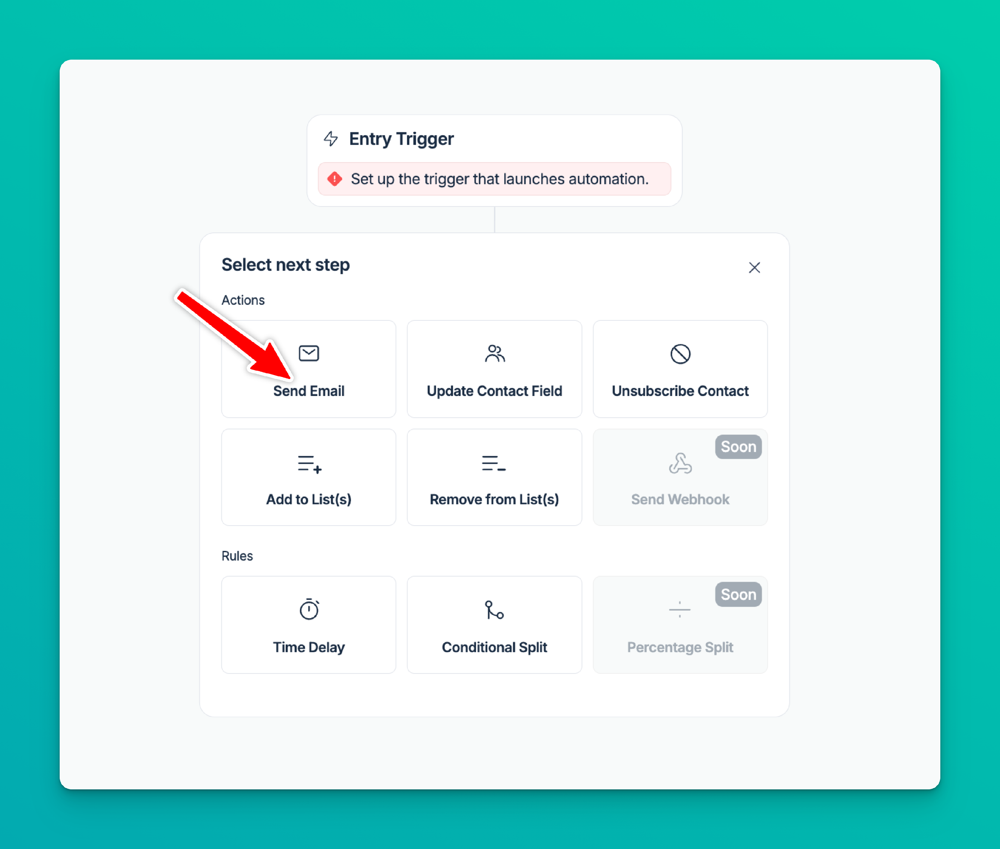
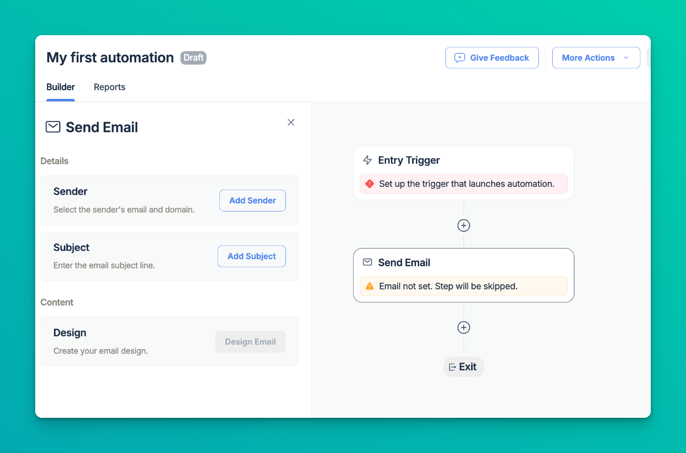
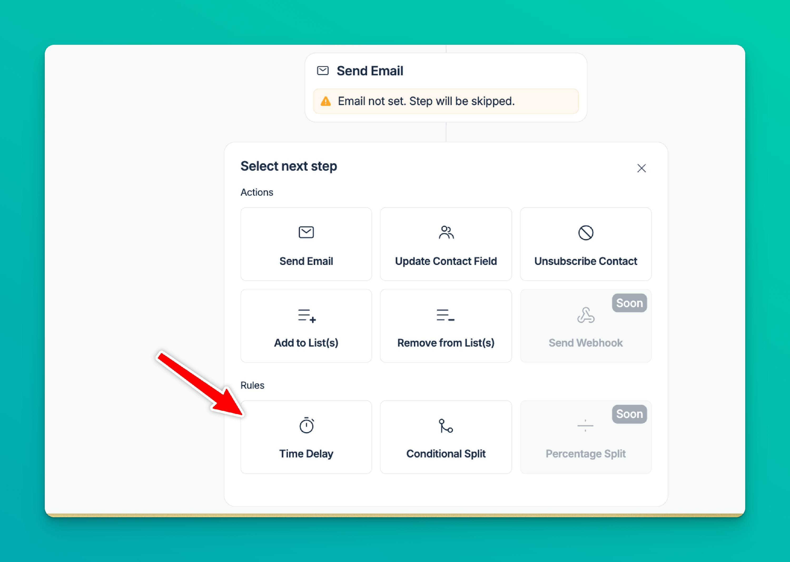
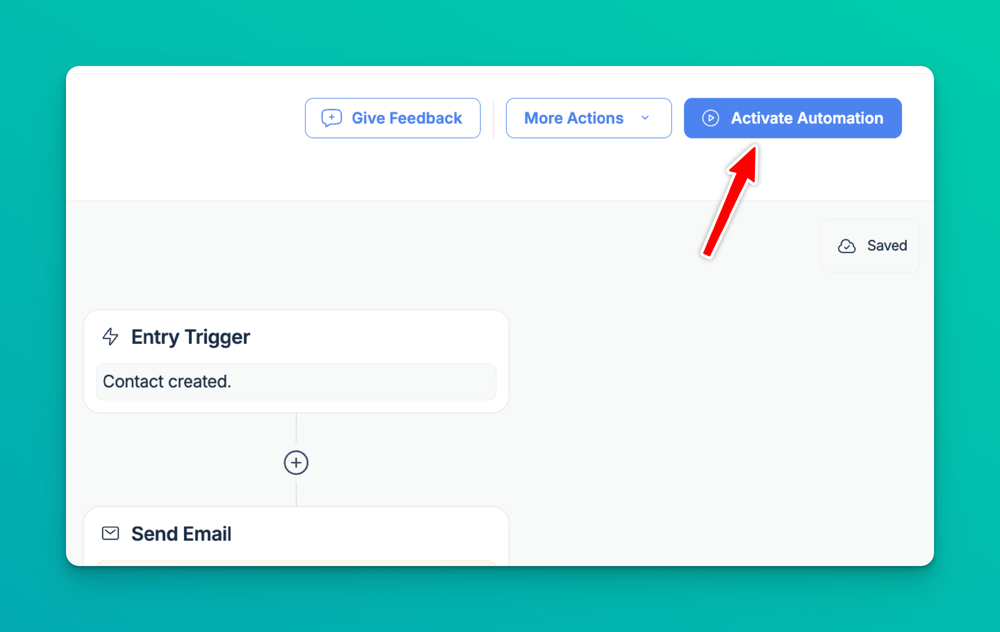
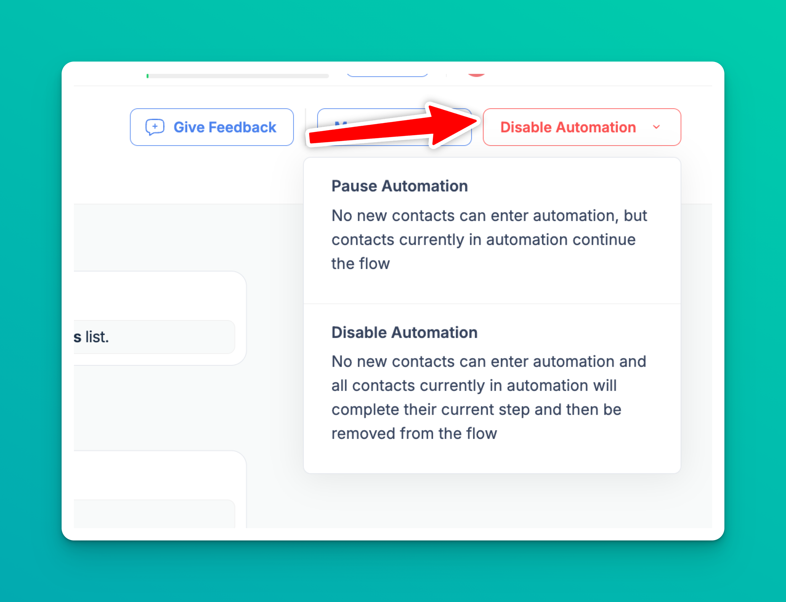
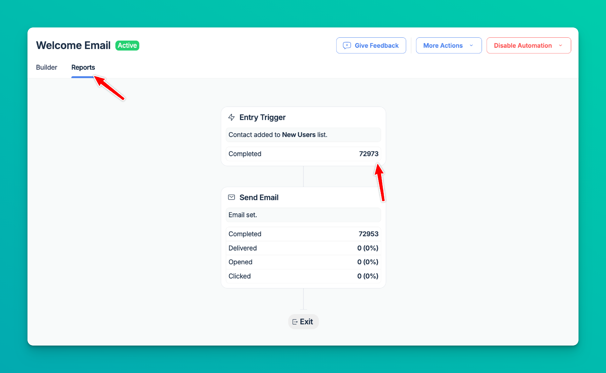

# ⚙️ Automations

Automations feature allows you to create, automated email sequences to engage your contacts.

Set up triggers, actions, and rules to automate your workflows.

#### Use cases

Use [Integrations](https://mailtrap.io/integrations) to add contacts into Mailtrap using API, SDKs, Make.com, Zapier or n8n integration.

Welcome series

* Greet new contacts, set expectations, and share first-week tips.
* How to set it up: Trigger Contact created → add Send email steps with Time delays → optionally Conditional split by plan or locale.

Onboarding prompts from profile changes

* Nudge users when a field changes (e.g., trial started, role/plan updated).
* How to set it up: Trigger Contact field updated → Send email with next steps → Add to list “Onboarding” for later messages.

Segment-based campaigns

* Deliver targeted content as people enter key lists (webinar registrants, paying customers) — or clean up when they leave.
* How to set it up: Trigger Contact added to list (or removed from list) → Send email → Add/Remove from lists to manage follow-ups.

Event-driven follow-ups

* React to product or billing events (purchase made, payment failed, milestone hit) with confirmations, guides, or recovery emails.
* How to set it up: Trigger API event received → Send email → optionally Update contact field and Conditional split based on event data.

#### Functionality

**Triggers**

* Contact created
* Contact field updated
* Contact added to list
* Contact removed from list
* Contact custom event (API event received)

**Actions**

* Send email
* Update Contact Field
* Unsubscribe Contact
* Add to List(s)
* Remove from List(s)

**Rules**

* Time delay
* Conditional Split

#### Triggering via API event

"Contact custom event" trigger requires you to send an API event.

Here is [description of the endpoint](https://api-docs.mailtrap.io/docs/mailtrap-api-docs/6b1b5749b0eec-create-contact-event).

Event in the trigger settings should be equal to the event you pass via API.

#### Limits

* You have a limited number of automation runs; higher plans have higher limits. You can check them in [Billing Dashboard](https://mailtrap.io/billing/dashboard), look for Automations run count.
* Each contact can go through the same automation once in 24 hours.
* The feature is currently free/include in your plans; it might change later.

#### Creating your first automation

To get started, navigate to the tab in your Mailtrap account or go to [https://mailtrap.io/automations](https://mailtrap.io/automations).

Create a new automation:

1. Define the name

2. Set up an Entry Trigger

For this example, we'll use the "Contact created" trigger. This means the automation will start whenever a new contact is added. After selecting the trigger type, click "Save".

#### Building your automation sequence

Now that you've set up the trigger, you can start adding steps to your automation.

1. **Add an Action:**

2. **Configure the Email**

**Adding delays and additional steps**

To create a more sophisticated sequence, you can add time delays and further actions.

1. **Add a Time Delay** and configure it.

2. **Add Another Email**

#### Automation activation

Once you've built your automation sequence, it's time to activate it.

**Activate Automation:**

**Pausing and Disabling:**

You can pause or disable your automation at any time.

* **Pause Automation:** No new contacts can enter automation, but contacts currently in automation continue the flow.
* **Disable Automation:** No new contacts can enter automation, and all contacts currently in automation will complete their current step and then be removed from the flow.

#### Stats - Monitoring automation's performance

You can track the performance of your automation by clicking on the Reports tab within the automation builder. Here you can see metrics for each step of your sequence, including how many contacts have completed each action and the open and click rates for your emails.

