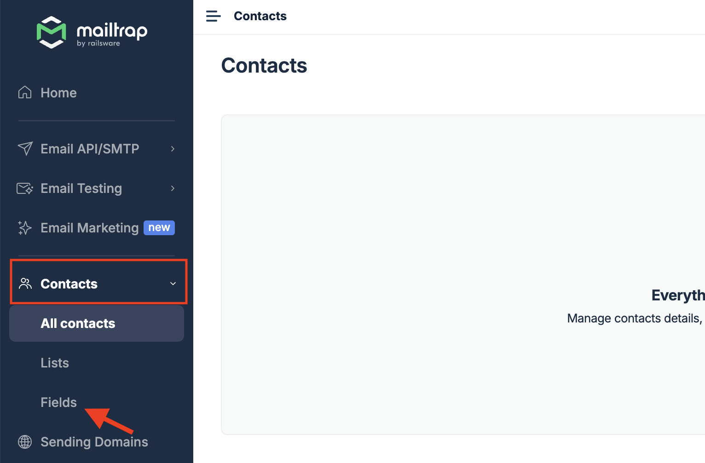
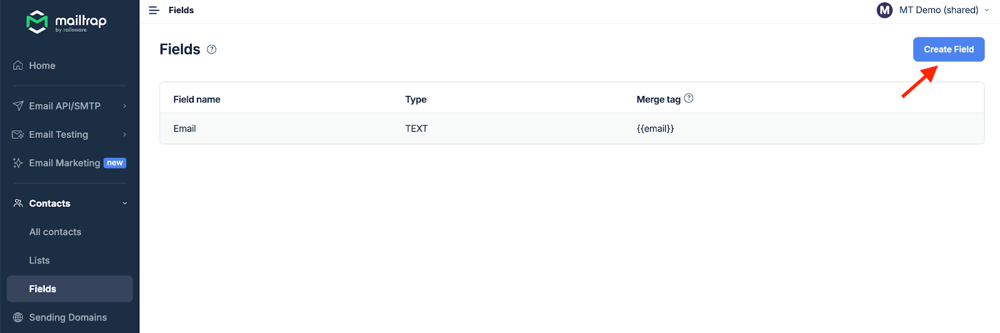
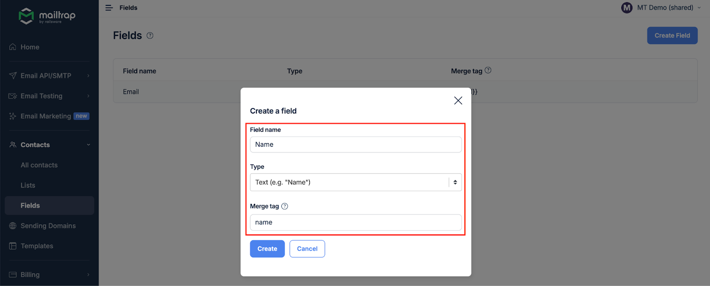
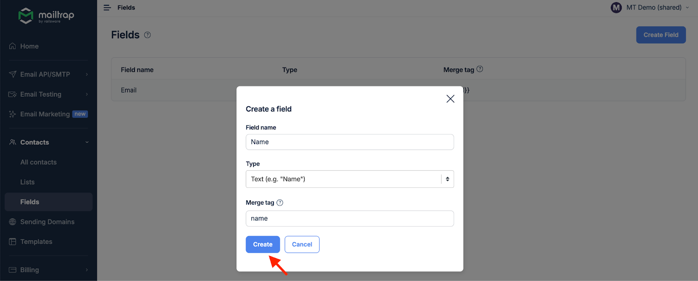

# Custom Fields

Custom fields allow you to store additional information about your contacts beyond their email address. Use these fields to personalize campaigns and create targeted segments.

## Understanding Custom Fields


**What are Custom Fields?** Custom fields are variables that store specific information about your contacts, such as:

* Personal details (first name, last name, birthday)
* Geographic information (city, country, timezone)
* Preferences (product interests, communication frequency)
* Custom data specific to your business


## Default Fields

Every contact in Mailtrap has these default fields:



**Primary identifier for contacts**

* Automatically created
* Cannot be deleted or modified
* Must be unique across your account
* Used for sending campaigns



**Tracks consent and engagement**

* Subscribed
* Unsubscribed
* Pending (awaiting confirmation)



## Creating Custom Fields



### Navigate to Fields

Go to **Contacts** → **Fields** in your Mailtrap dashboard.

<div align="left"></div>



### Click Create Field

Select the **Create Field** button to open the field creation form.

<div align="left"></div>



### Configure Field Properties

Fill in the field details:

* **Field Name**: Display name (e.g., "First Name")
* **Type**: Select the appropriate data type
* **Merge Tag**: Variable for personalization (e.g., `first_name`)

<div align="left"></div>


**Merge Tag Format** Use underscores for multi-word merge tags (e.g., `last_name`, `date_of_birth`)




### Save Your Field

Click **Create** to add the field to your account.

<div align="left"></div>



## Field Types

Choose the appropriate field type based on your data:



**For short text values**

* Names, titles, company names
* Short descriptions
* Single-line inputs
* Maximum 255 characters

Example: `first_name`, `company`, `job_title`



**For numeric values**

* Age, scores, counts
* Integers and decimals
* Mathematical operations in segments

Example: `age`, `purchase_count`, `loyalty_points`



**For date and time values**

* Birthdays, anniversaries
* Registration dates
* Last activity timestamps
* Format: YYYY-MM-DD

Example: `birthday`, `registration_date`, `last_purchase`



**For yes/no values**

* Preferences and flags
* Subscription statuses
* Feature toggles
* Values: true/false

Example: `is_vip`, `newsletter_subscriber`, `has_purchased`



**For predefined options**

* Categories, segments
* Multiple choice values
* Dropdown selections

Example: `product_interest`, `customer_tier`, `preferred_language`



## Using Fields in Campaigns

### Personalization with Merge Tags

Use merge tags to personalize your email content:


````

</div>

### Dynamic Content

Create conditional content based on field values:

<div data-gb-custom-block data-tag="code" data-title='Conditional Content Example'>
```liquid

  Hola {{first_name}},

  Bonjour {{first_name}},

  Hello {{first_name}},

````


## Best Practices


**Field Management Tips**

1. **Plan before creating**: Map out all fields you need before importing contacts
2. **Use descriptive names**: Make field names clear and intuitive
3. **Consistent naming**: Use a naming convention for merge tags
4. **Data validation**: Choose appropriate field types to ensure data quality
5. **Document usage**: Keep notes on what each field represents


## Common Use Cases

## Field Limits and Considerations


**Technical Specifications**

* Maximum fields per account: Depends on your plan
* Field name length: Up to 50 characters
* Merge tag length: Up to 50 characters
* Text field value: Up to 255 characters
* Cannot delete fields with existing data

