# Managing Contacts

Efficiently manage your contact database with powerful search, filtering, and bulk operation capabilities. Keep your lists clean and up-to-date with comprehensive management tools.

## Viewing Contacts

Navigate to **Contacts** → **All contacts** to access your complete contact database.

<div align="left" data-with-frame="true">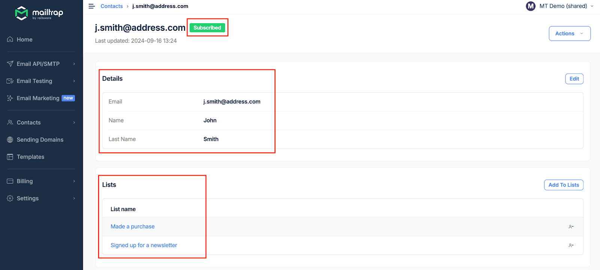</div>

## Searching and Filtering

### Quick Search

Use the search bar to quickly find contacts by:

* Email address
* Name (if custom field exists)
* Any custom field value

### Advanced Filtering

Build complex filters using multiple criteria:



**Select Filter Type**

Choose from:

* Subscription Status
* Email
* Lists
* Custom Fields



**Set Conditions**

Define your filter logic:

* **Is** / **Is not**
* **Contains** / **Does not contain**
* **Greater than** / **Less than** (for numbers)
* **Before** / **After** (for dates)



**Apply Filter**

Click **Search** to view filtered results.

<div align="left" data-with-frame="true"></div>



### Common Filter Examples



```
Subscription Status → Is → Subscribed
```

Find all contacts who can receive campaigns.



```
Signup Date → After → [Last 30 days]
AND Subscription Status → Is → Subscribed
```

Identify new subscribers for welcome campaigns.



```
Customer Tier → Is → VIP
OR Total Purchases → Greater than → 1000
```

Target high-value customers.



```
Last Activity → Before → [90 days ago]
AND Subscription Status → Is → Subscribed
```

Re-engage dormant subscribers.



## Individual Contact Actions

Click on any contact to view their details and perform individual actions:

<div align="left" data-with-frame="true">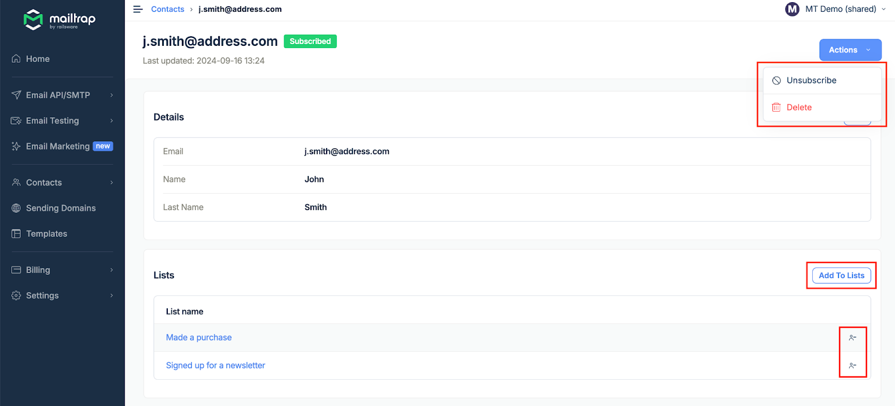</div>

### Available Actions



**Update contact information**

* Modify custom field values
* Update email address
* Change list assignments
* Add notes or tags


Changes are saved automatically and reflected immediately in campaigns.




**Add or remove from lists**

* Add to multiple lists
* Remove from specific lists
* View all assigned lists
* Check list membership history



**Remove from all marketing**

* Marks contact as unsubscribed
* Removes from all active campaigns
* Preserves contact data
* Cannot be reversed manually


Unsubscribed contacts must re-subscribe themselves to receive emails again.




**Permanently remove contact**

* Deletes all contact data
* Removes from all lists
* Cannot be undone
* Frees up contact quota


Deletion is permanent. Export contact data before deleting if needed.




## Bulk Operations

Perform actions on multiple contacts simultaneously for efficient management.

### Selecting Contacts


**Selection Methods**

* Click checkboxes for individual contacts
* Use "Select All" for current page
* Apply filters first to target specific groups


### Bulk Actions Available

#### Add to Lists



**Select Contacts**

Check the contacts you want to add to lists.

<div align="left" data-with-frame="true">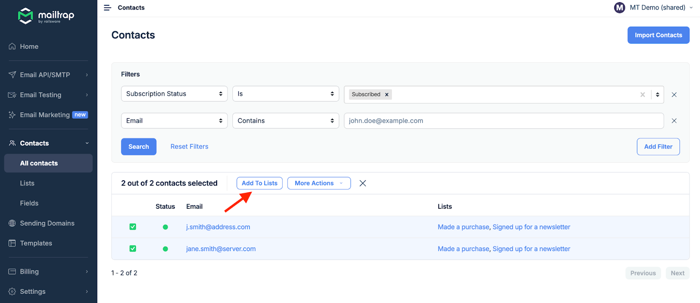</div>



**Choose Lists**

Select one or more destination lists.

<div align="left" data-with-frame="true">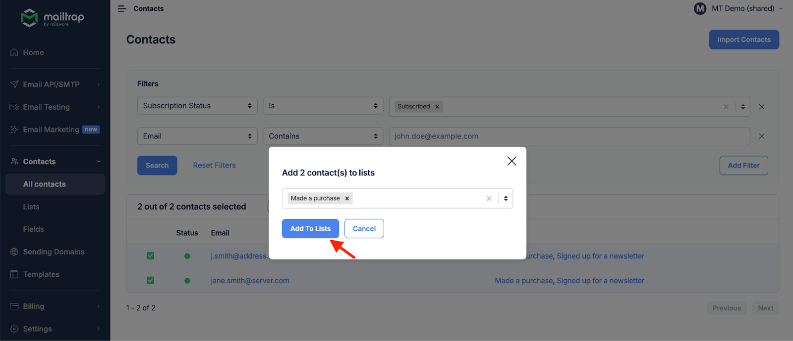</div>



**Confirm Action**

Click **Add To Lists** to complete the operation.



#### Remove from Lists



**Select Contacts**

Mark contacts to remove from lists.

Click **More Actions** → **Remove from lists**.

<div align="left" data-with-frame="true">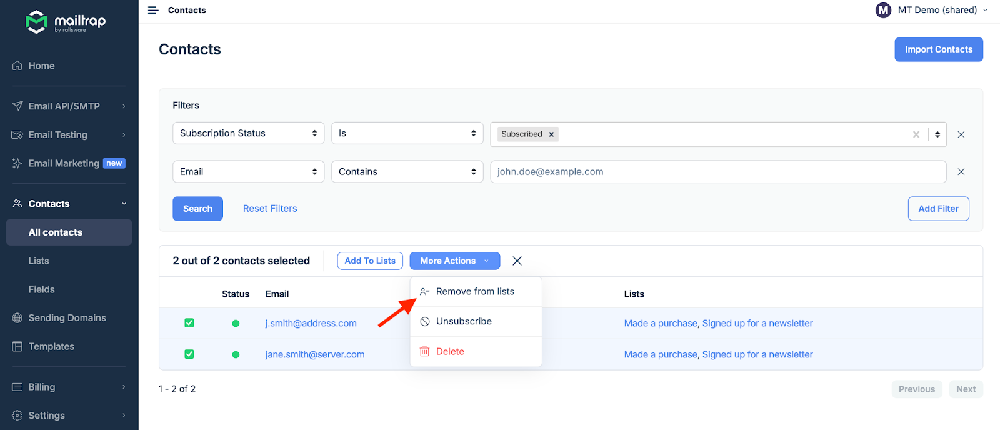</div>



**Choose Lists**

Select which lists to remove contacts from.

<div align="left" data-with-frame="true">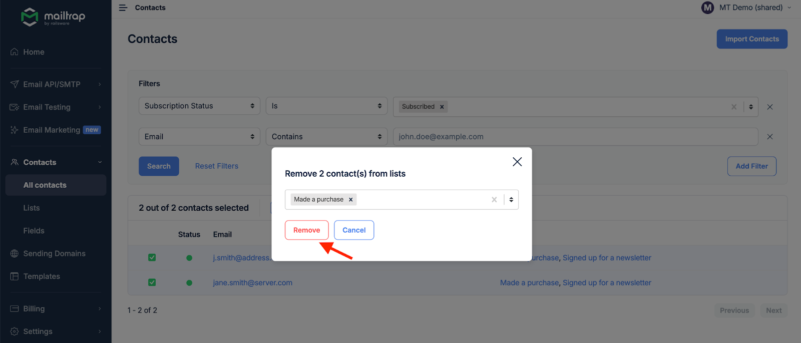</div>



**Confirm Removal**

Click **Remove** to process the action.



#### Bulk Unsubscribe



**Select Contacts**

Choose contacts to unsubscribe.

Click **More Actions** → **Unsubscribe**.

<div align="left" data-with-frame="true">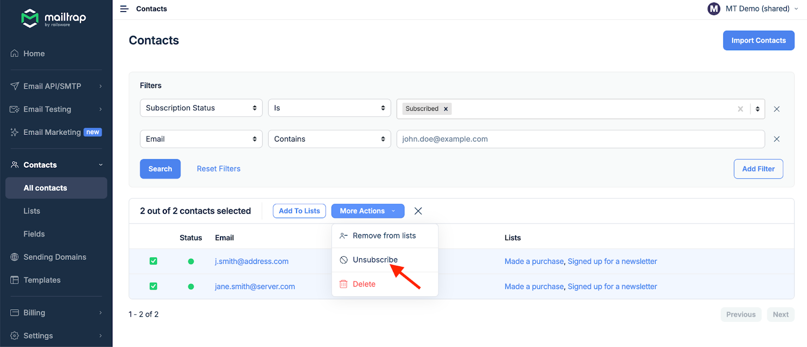</div>



**Confirm Action**

Type 'unsubscribe' to confirm.

<div align="left" data-with-frame="true">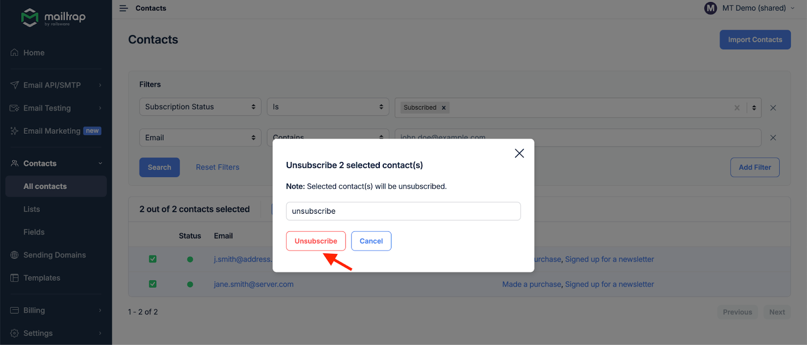</div>



**Process Unsubscribe**

Click **Unsubscribe** to complete.


This action cannot be undone. Contacts must re-subscribe themselves.




#### Export Contacts



**Select for Export**

Choose contacts to export.

Click **More Actions** → **Export**.

<div align="left" data-with-frame="true">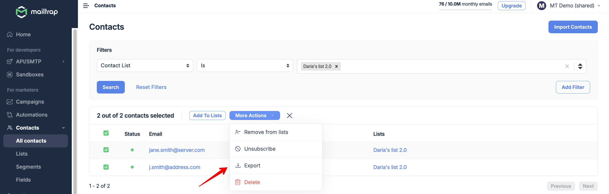</div>



**Confirm Export**

Click **Confirm Export**.

<div align="left" data-with-frame="true">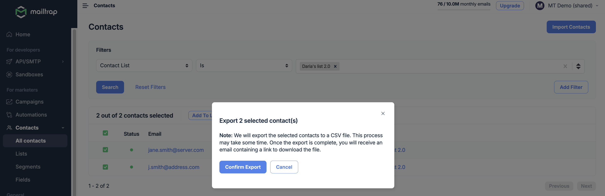</div>



**Download File**

Check your email for the download link.

<div align="left" data-with-frame="true">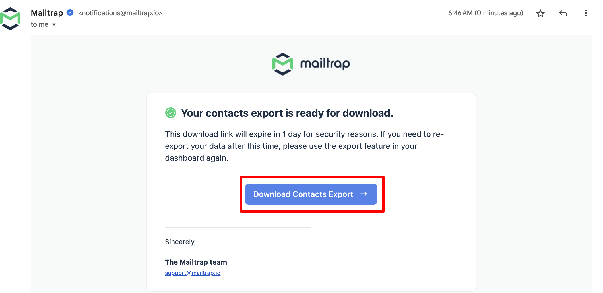</div>


Export includes all contact fields and list memberships.




#### Bulk Delete



**Select for Deletion**

Choose contacts to delete.

Click **More Actions** → **Delete**.

<div align="left" data-with-frame="true">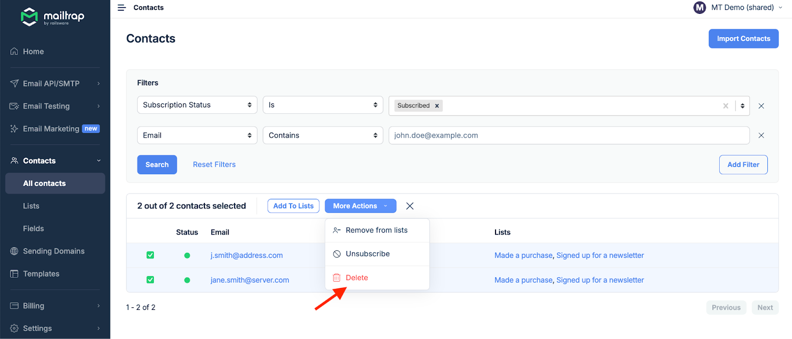</div>



**Confirm Deletion**

Type 'delete' to confirm.

<div align="left" data-with-frame="true">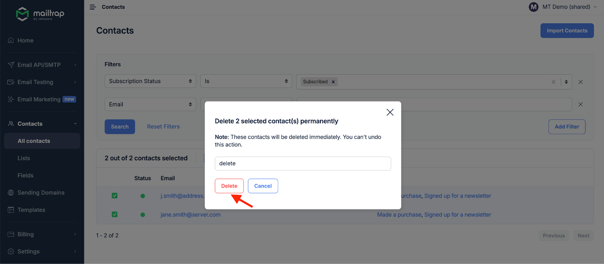</div>



**Process Deletion**

Click **Delete** to permanently remove contacts.


This action cannot be undone. All contact data will be permanently deleted.




## Contact Status Management

### Understanding Subscription Status



**Active and engaged**

* Can receive marketing emails
* Counted in campaign recipients
* Full access to all features
* Default status for new imports



**Opted out**

* Cannot receive marketing emails
* Excluded from all campaigns
* Status preserved for compliance
* Can only be changed by contact



**Awaiting confirmation**

* Double opt-in required
* Confirmation email sent
* Cannot receive campaigns yet
* Expires after set period



**Invalid or unreachable**

* Email address is invalid
* Automatically marked by system
* Excluded from future sends
* Requires manual review



## Best Practices


**Contact Management Tips**

1. **Regular Cleaning**: Remove bounced and inactive contacts monthly
2. **List Hygiene**: Audit lists quarterly for relevance
3. **Segmentation**: Use filters to create targeted segments
4. **Export Backups**: Regular exports for data safety
5. **Consent Tracking**: Document how consent was obtained

