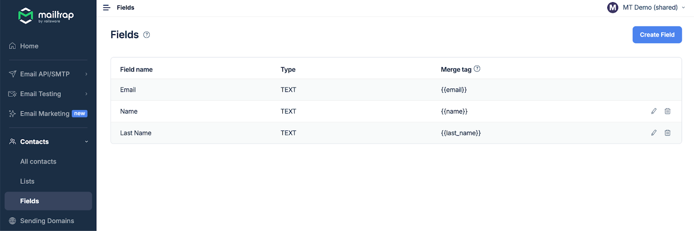
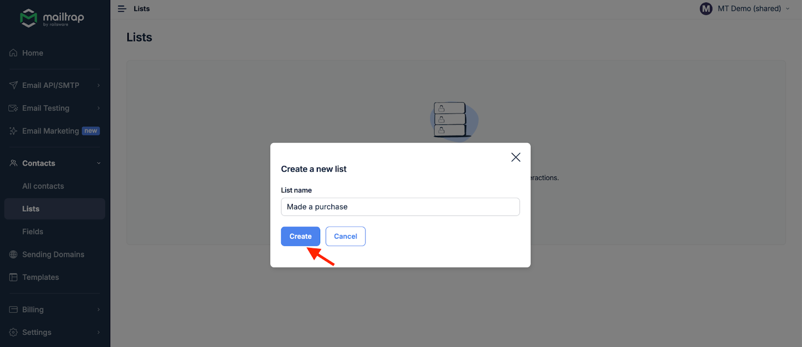
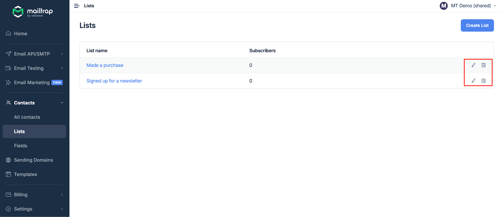

Mailtrap Contacts allows you to upload and store your contacts on Mailtrap platform and organize them in different email lists to send targeted campaigns.

### Before uploading your contacts

* Review your email list and identify the variables, such as first and last name, date of birth, address, etc. You’ll need these to create custom fields.
* Go to Mailtrap and navigate to Fields under Contacts.

* Click Create Field.

* In the popup window, enter the Field name (e.g., Name), select the Type (e.g., Text), and enter the Merge tag (e.g., name). If your merge tag contains two or more words, separate them with an underscore (e.g., last\_name). _The email field is created automatically by default_.

* Click Create. Repeat the process for each custom field you want to use with your contacts.

* Once you create all your custom fields, you can start uploading your contacts.

### How to upload Contacts

1. Go to Contacts and click Import Contacts.

2. Download the CSV template if needed by clicking Download CSV Template and add your contacts there.

3. Upload the CSV by clicking Browse files or dragging and dropping the file.

4. Click Import File.

5. Define the contact details by assigning fields created earlier. For example, choose Name next to First Name if you want to use it as a variable. Then, click Confirm Mapping.

6. Add the newly uploaded contacts to a list. If you already have lists, choose the desired one(s) from the dropdown menu and click Continue.

* To create a new list, click Create New List, type the desired list name, and click Create. Then, repeat step 6.

* You can add contacts to one or several lists.

7. As the last step, mark the checkbox to verify that you've obtained recipients' consent to be included in marketing campaigns. Note that you won't be able to continue without this step. Once that's done, click Confirm Import.

8. You'll see a confirmation notification, and the contacts will be under Contacts and Lists once the upload is completed.

### How to manage Contacts

You can filter Contacts by subscription status, email, or Lists. For example, if you want to search for subscribed contacts only, you need to choose _Subscription Status_ in the first field, _Is_ in the second, and _Subscribed_ in the third. Then, click Search, and you'll see all your subscribed contacts.

From the All Contacts page, click the contact to open its details, such as its subscription status, email, associated fields, and the lists it belongs to.

You can also delete or unsubscribe a contact, add them to a list, remove them from a list, or edit their details.

Remember that you won’t be able to activate a subscription for a contact manually after unsubscribing them unless they sign up for your list again.

#### Bulk actions

**Add to lists**

1. Mark the contacts you want to add to the lists and click Add To Lists.

2. Select the desired list(s) and click Add To Lists.

**Remove from lists**

1. Mark the contacts you want to remove from lists, click More Actions, and then Remove from lists.

2. Choose the list(s) from which you want to remove the contacts and click Remove.

**Unsubscribe**

1. Mark the contacts you want to unsubscribe, click More Actions, and then Unsubscribe.

2. Confirm the action by typing 'unsubscribe' and clicking the Unsubscribe button.

**Export**

1. Mark the contacts you want to export, click More Actions, and then Export.

2. Confirm the action by clicking the Confirm Export button.

3. The download link will be sent to you via email:

**Delete**

1. Mark the contacts you want to delete, click More Actions, and then Delete.

2. Confirm the action by typing 'delete' and clicking the Delete button. Remember that you can't undo this action.

### How to create and manage Lists

1. Go to Lists under Contacts and click Create List.

2. Enter the name of the List and click Create. Make sure you don't already have a list with the same name; otherwise, you won't be able to create it.

3. All your lists will be under the List tab. From there, you can rename or delete them.

