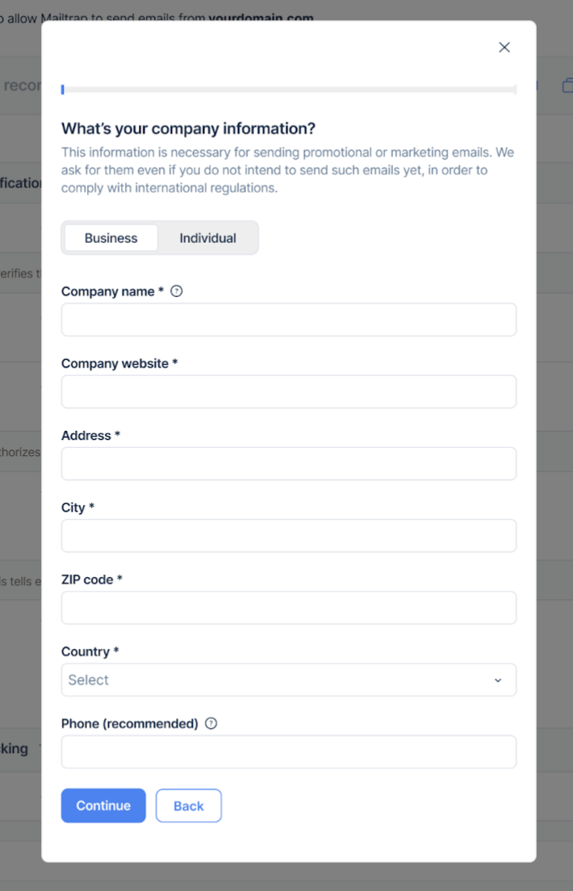
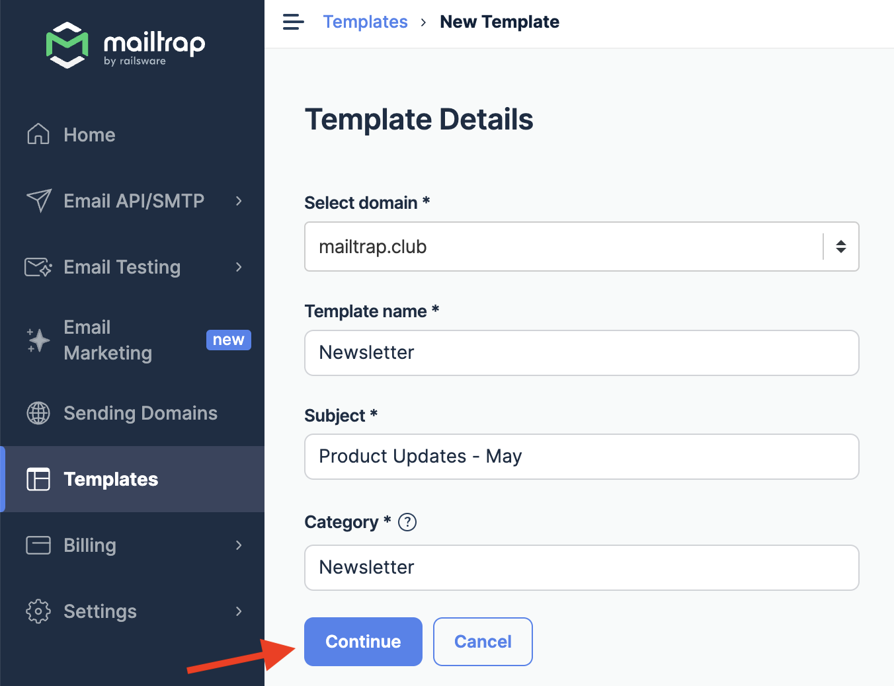
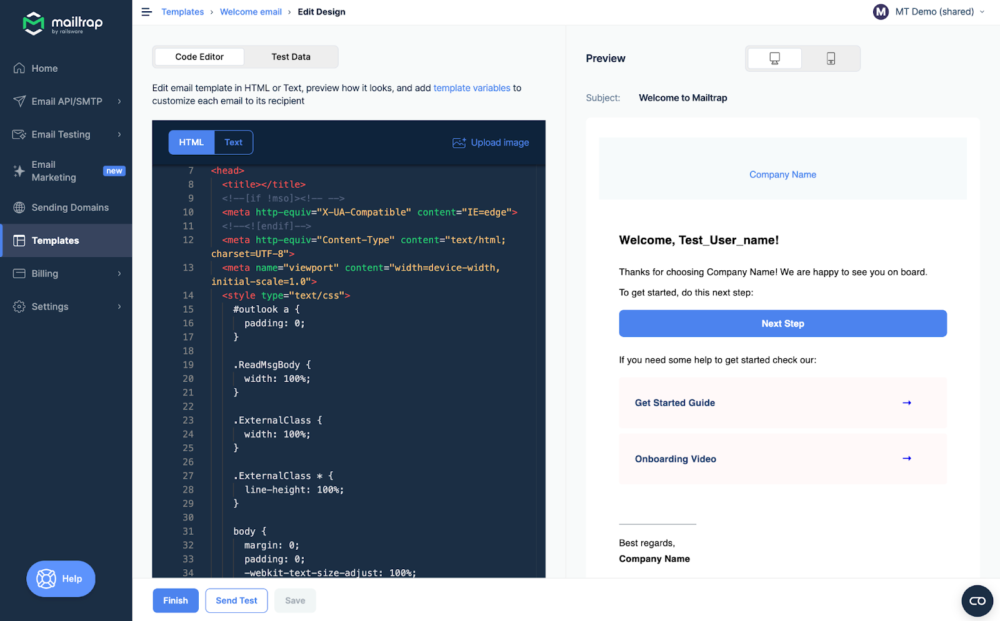
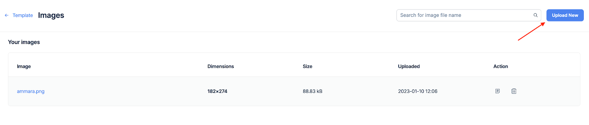
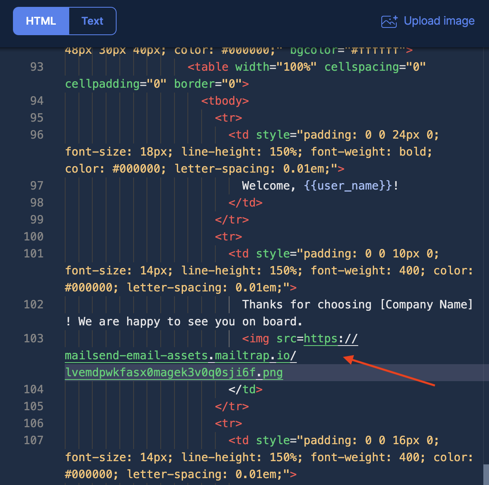

# Email Templates

Email Templates allow you to design, edit, and host HTML email templates.

<figure><figcaption></figcaption></figure>

By storing the template on Mailtrap and calling it via API, you can easily change the template code without committing to your codebase.&#x20;

Email Templates support Variables, and Mailtrap uses Handlebars as a template engine. You variable should match the \{{merge\_tag\}} in your contact Fields.

You can put `{{name}}` into your template and as your contact has a field named "name" with the value "John", the template will display "John". In our visual builder you'll a list of your contact fields.

## Creating a Template



Navigate to the **Templates** menu




Click the **Create New Template** button




**Configure template details**

Click the drop-down menu to select one of your domains, enter the Template name, Subject, and Category, and click **Continue**.




**Choose your editor**

Choose the **Drag & Drop Editor** to build the template without coding, or select **HTML Editor** if you prefer to write/modify the code.




**Create your design**

Create/modify the design and click **Finish**.





The main Templates menu features all your saved templates. To quickly access a saved template, just click on it within the main menu.


## Editing and Customizing Templates

### Template Details

Each template must have a name, subject, category, and assigned domain. The subject also supports variables.

### Available Editors



The drag-and-drop editor allows you to design templates without any coding.




Code Editor allows you to edit the HTML or Text content, depending on the emails you want to send.

The editor supports Find and Replace options, and you can use **Cmd+F** or **Win+F** as a hotkey to reveal a quick search bar.


**Template Validation**

If your template has an error, Handlebars cannot render it. You'll see an error message in the Preview tab, and the RAW code with an error will be highlighted in the Editor.

You can't save a template with errors. Note that we don't validate HTML—only Handlebars syntax is validated.


<figure><figcaption></figcaption></figure>




### Uploading Images



**Open the image upload menu**

Click **Upload image** in the upper right corner of the Code Editor.




**Upload a new image**

Hit the **Upload New** button in the following menu and choose an image from your local drive.


**Image Requirements**

* Supported formats: JPG, PNG, and GIF
* Maximum file size: 2 MB





**Confirm the upload**

Once the image is uploaded, you will receive a confirmation notification. If the file format is unsupported or the image is too big, you will receive the corresponding error message.




**Copy the image URL**

Click the **Copy URL** button to copy the image URL to your clipboard, then click **Template** to return to the editing menu.




**Add image to template**

Proceed to add the image to the template body under the `` tag. You can preview it in the template as soon as the asset is added.




### Test Data

Code Editor automatically parses your template and shows all the variables found. The Test Data tab helps you preview the object variables.


By default, as a value, we put a variable name and add the "Test\_" prefix.


### Sending Test Emails

If you're using email templates in production, you can send a test email to the account owner's email address to run basic tests. Simply press the **Send Test** button.


**Test Email Requirements**

* Your domain must be verified to send a test
* Each test email is billed over your quota

