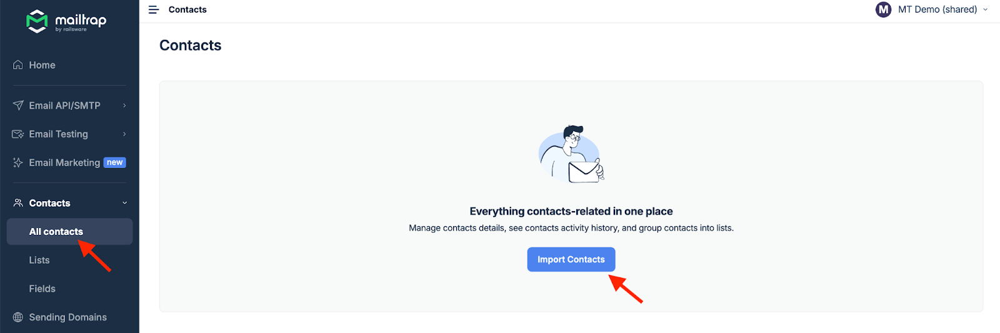
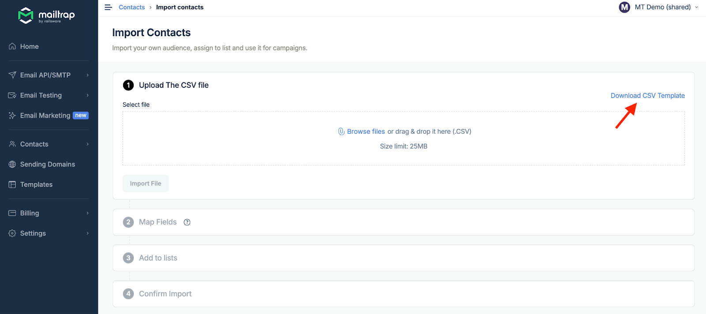
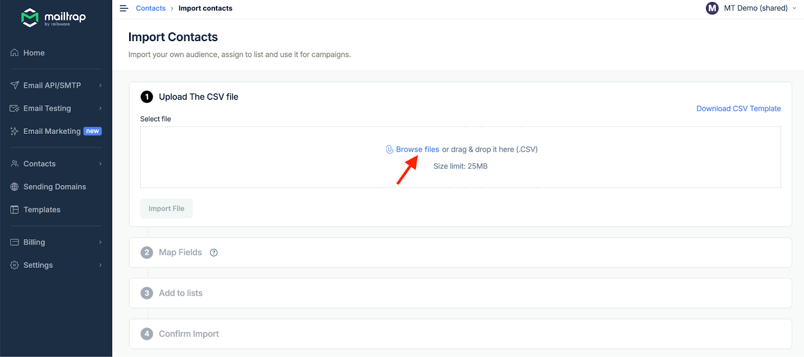
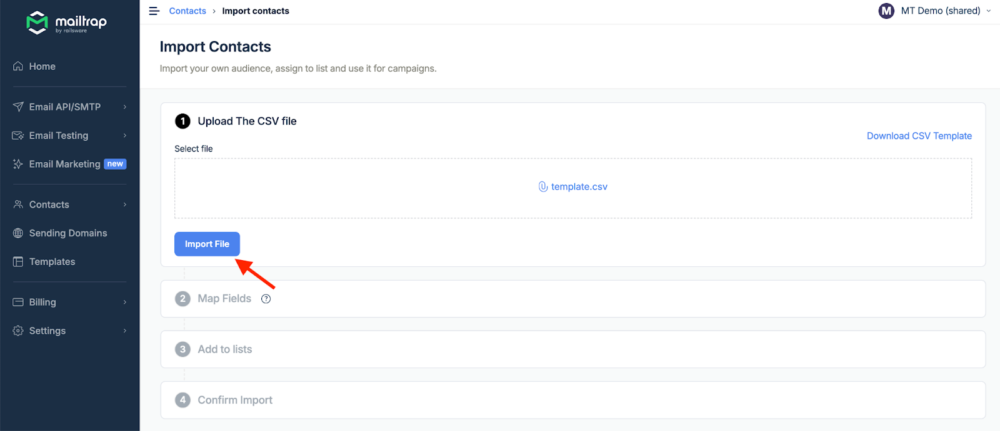
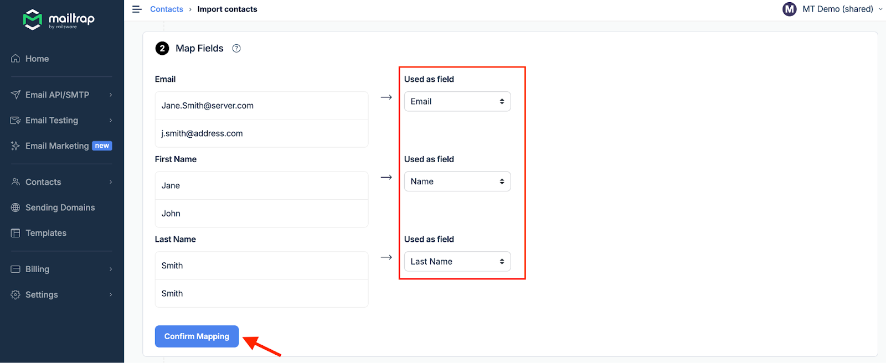
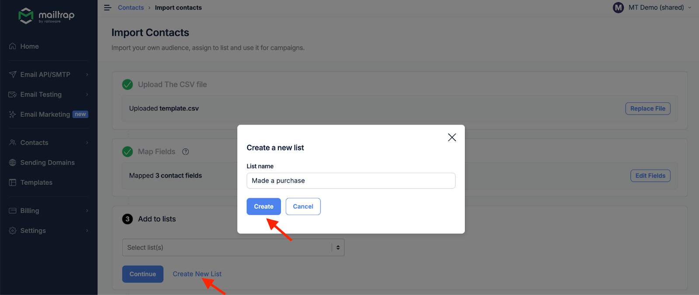
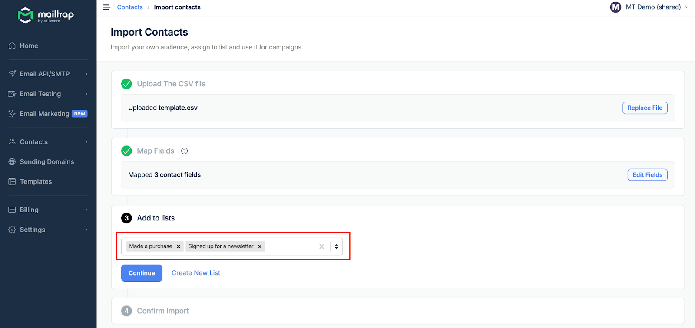
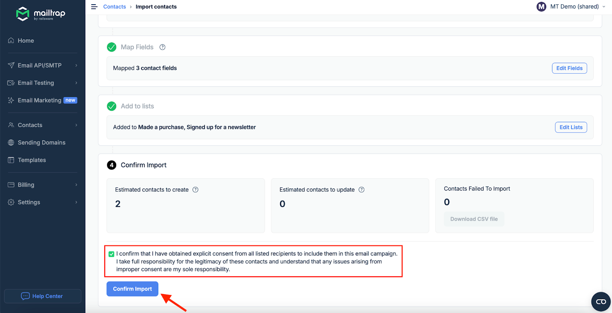
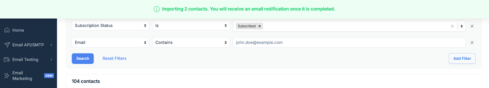

# Uploading Contacts

Import your contacts into Mailtrap using CSV files, API integration, or third-party tools. This guide walks you through each method step by step.

## Before You Begin


**Preparation Checklist** Before uploading contacts, ensure you have:

1. Created all necessary custom fields
2. Cleaned your contact list (removed duplicates, invalid emails)
3. Obtained explicit consent from all recipients
4. Prepared your data in the correct format


## Import Methods Overview



**Best for:**

* One-time migrations
* Periodic bulk updates
* Offline contact management

**Pros:**

* Simple and straightforward
* No technical knowledge required
* Visual field mapping

**File requirements:**

* UTF-8 encoding
* Comma-separated values
* Header row with field names



**Best for:**

* Real-time synchronization
* Automated workflows
* Dynamic contact updates

**Pros:**

* Automatic updates
* No manual intervention
* Programmatic control

**Requirements:**

* API key
* Development resources
* Integration setup



**Best for:**

* Connecting existing tools
* No-code automation
* Multi-platform workflows

**Available integrations:**

* Zapier
* Make.com
* n8n

**Setup:**

* Connect accounts
* Configure triggers
* Map fields



## CSV Upload Process



**Prepare Your CSV File**

**Download the Template**

Navigate to **Contacts** and click **Import Contacts**.

<div align="left" data-with-frame="true"></div>

Download our CSV template by clicking **Download CSV Template**.

<div align="left" data-with-frame="true"></div>

**Format Your Data**

Structure your CSV with:

* **Email column** (required)
* **Custom field columns** matching your created fields
* **One contact per row**


```csv
email,first_name,last_name,company,signup_date
john@example.com,John,Doe,Acme Corp,2024-01-15
jane@example.com,Jane,Smith,Tech Inc,2024-01-20
```




**Upload Your File**

Click **Browse files** or drag and drop your CSV file into the upload area.

<div align="left" data-with-frame="true"></div>

Click **Import File** to proceed.

<div align="left" data-with-frame="true"></div>



**Map Your Fields**

Assign CSV columns to your Mailtrap fields:

* Match column headers to custom fields
* Preview data mapping
* Verify field assignments

<div align="left" data-with-frame="true"></div>

Click **Confirm Mapping** when ready.


**Mapping Tips**

* Field names are case-insensitive
* Unmapped columns will be ignored
* Email field is automatically mapped if column is named "email"




**Assign to Lists**

Choose which lists should include these contacts:

**Add to Existing Lists**

Select one or more lists from the dropdown and click **Continue**.

<div align="left" data-with-frame="true"></div>

**Create New List**

Click **Create New List**, enter a name, and click **Create**.

<div align="left" data-with-frame="true"></div>


**Multiple Lists** You can add contacts to multiple lists simultaneously for better segmentation.


<div align="left" data-with-frame="true"></div>



**Confirm Consent**

Check the consent verification box to confirm you have permission to email these contacts.

<div align="left" data-with-frame="true"></div>


**Legal Requirement** You cannot proceed without confirming consent. Ensure you have explicit permission from all contacts before importing.


Click **Confirm Import** to complete the process.



**Import Confirmation**

You'll receive a success notification once the import is complete.

<div align="left" data-with-frame="true"></div>

Your contacts are now available under **Contacts** and in their assigned **Lists**.



## API Import

### Quick Start




```bash
curl -X POST https://api.mailtrap.io/contacts \
  -H "Authorization: Bearer YOUR_API_KEY" \
  -H "Content-Type: application/json" \
  -d '{
    "email": "user@example.com",
    "first_name": "John",
    "last_name": "Doe",
    "lists": ["list_id_1", "list_id_2"]
  }'
```





```javascript
const contacts = [
  {
    email: "user1@example.com",
    first_name: "John",
    custom_fields: { company: "Acme Corp" }
  },
  {
    email: "user2@example.com",
    first_name: "Jane",
    custom_fields: { company: "Tech Inc" }
  }
];

await fetch('https://api.mailtrap.io/contacts/batch', {
  method: 'POST',
  headers: {
    'Authorization': 'Bearer YOUR_API_KEY',
    'Content-Type': 'application/json'
  },
  body: JSON.stringify({ contacts, lists: ["list_id"] })
});
```





```python
import requests

contact_data = {
    "email": "user@example.com",
    "first_name": "John",
    "last_name": "Updated",
    "custom_fields": {
        "last_activity": "2024-01-20"
    }
}

response = requests.put(
    "https://api.mailtrap.io/contacts/user@example.com",
    headers={"Authorization": "Bearer YOUR_API_KEY"},
    json=contact_data
)
```




For complete API documentation, see [Contacts API Reference](../../../api-docs/contacts-api.md).

## Third-party Integrations

### Zapier Integration



**Connect Mailtrap**

Add Mailtrap as an action in your Zap.



**Configure Trigger**

Set up your trigger app (CRM, form, spreadsheet).



**Map Fields**

Match trigger data to Mailtrap contact fields.



**Test & Activate**

Run a test and activate your Zap.



### Make.com Scenario

Create automated workflows that sync contacts from multiple sources:


```json
{
  "trigger": "New form submission",
  "actions": [
    {
      "app": "Mailtrap",
      "action": "Create/Update Contact",
      "fields": {
        "email": "{{form.email}}",
        "first_name": "{{form.name}}",
        "source": "Website Form"
      }
    }
  ]
}
```


## Import Best Practices


**Data Quality Guidelines**

1. **Validate emails**: Remove invalid or malformed addresses
2. **Remove duplicates**: Clean your list before importing
3. **Standardize formats**: Use consistent date and text formats
4. **Test small batches**: Import a test batch first
5. **Monitor bounces**: Track delivery after first campaign


## Handling Import Errors

## Import Limits


**Upload Specifications**

* **File size**: Up to 10MB per CSV
* **Contacts per import**: Up to 50,000
* **Import frequency**: No limit
* **Processing time**: 1-5 minutes for large files

