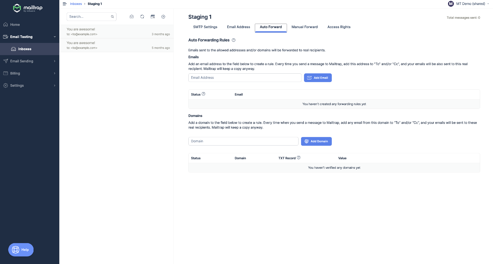
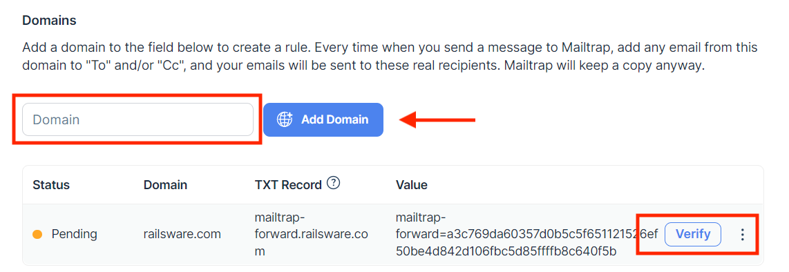

# ↪️ Automatic Forwarding

You can forward emails from the sandbox to any inbox.

* View emails in different email clients, or even other apps
* Notify your colleagues or clients about the testing progress
* Use it as a proxy between your application and your email client - never miss a thing from your QA environment

Email forwarding is available starting from the [Basic plan](https://mailtrap.io/pricing/). You can set automatic forwarding to confirmed email addresses or domains.

### How to set automatic forwarding to an email address

To set auto-forwarding to email addresses, go to the **Auto Forward** tab in your sandbox and enter the forwarding email address(es).

The email confirmation will be sent to this email address(es) for verification. Once the address is confirmed by its owner, you can **add this address to the "To" or "Cc" headers** of your email messages, and they will be automatically forwarded.

In the **Auto Forward** tab, you will also find the list of email addresses for forwarding and their statuses:

* _Active_ means that its owner has confirmed that they agree to receive emails.
* _Pending_ means that the owner hasn't confirmed that they agree to receive emails.

To resend the confirmation or remove a forwarding rule, use the action buttons in the three-dots menu next to the selected email address.

### How to set automatic forwarding to a domain

To set auto-forwarding to a domain, you need to add a TXT record to verify your site. Here are the steps:

1. Enter your domain in the Domain field and click the **Add domain** button.
2. In the displayed table you will find the record and its value.
3. Go to your domain settings page, select Manage DNS, and choose TXT from the list of options (for details, consult your domain provider documentation).
4. Copy the authentication key from the _Value_ column and paste it to your TXT record.
5. Once completed, get back and click the **Verify** button for this domain. The status should change to _Active_. The system will forward messages to any email address which matches "\*@domain" in the "To" or "Cc" email headers.To remove a forward rule, use the action buttons in the three-dots menu next to the domain.

### "From" header in forwarded emails

All forwarded email messages use forward.mailtrap.info in the "from" header, e.g., when you forward an email from sandbox you'll see something like this in your sandbox:

> From: Mailtrap Forward \<b751965-a5480376@forward.mailtrap.info>

It helps to use forwarding for users with a strict DMARC policy on their domains. Since DMARC doesn't allow sending emails from your domain without permissions, sandbox rewrites the "from" header.But because the original sender is valuable information, especially in automated testing, we still preserve it in _x-mailtrap-original-from_ header of the forwarded emails.
