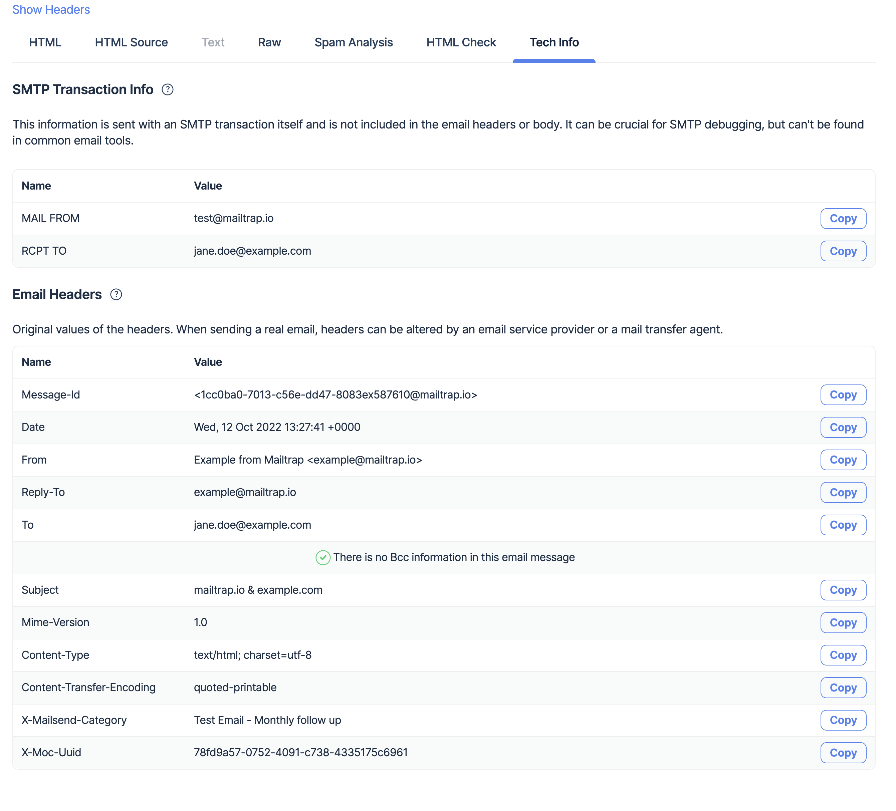

# Email Headers and Bcc

* **Subject line.** View how it looks for the recipient. Especially if you used emojis, make sure that they are rendered as expected.
* **FROM** (sender). Make sure of the correct sender's name and email address.
* **TO** (recipients) - To and Cc. When you send multiple emails and/or use "merge" functions, you should carefully check whether recipients are generated correctly.
* **Bcc** - Blind copy, which is not a header, making it especially difficult to test. With Sandbox, you can check whether proper addresses are added (available starting from the [Team plan](https://mailtrap.io/pricing/)).

You can perform all these checks in your Mailtrap sandbox. Open the message, and check the Subject, From, and To headers first. Then click **Show Headers** or go to the **Tech Info** tab directly. There you will find the following information:

* Message-Id
* Message date and time
* Reply-To
* Bcc'ed email address(-es) (if there is no Bcc, then you will see the "There is no Bcc information in this email message" message)

**SMTP Info** section demonstrates the message details according to the SMTP protocol. Mailtrap analyzes SMTP commands of the message, compares message headers and recipients, and then prints out the difference to the Bcc field. To learn more about Bcc and how it works, read:



Please note that the sandbox shows Bcc "as is'. It displays an email message for each DATA SMTP command. If an SMTP client fetches Bcc from the RCPT TO command, it will be displayed as one email message in the Mailtrap sandbox. However, some clients send email messages to Bcc'ed addresses as separate RCPT TO **and** DATA commands that result in a separate/second email message in the sandbox.

If you need detailed information about the message metadata, view the **Raw** tab.
