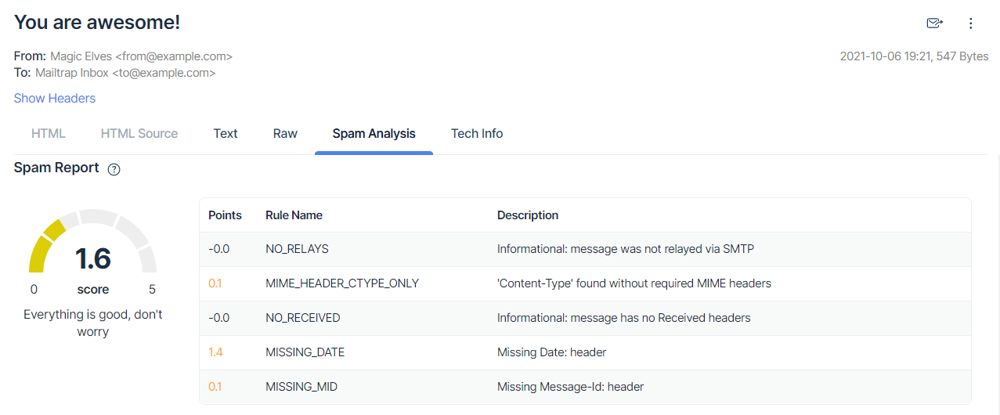
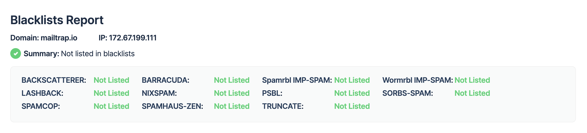

# Deliverability Tests

### Spam Report

Go to the **Spam Analysis** tab to view the Spam Report. It contains the general score and a detailed table with spam test points and their descriptions.

[Apache SpamAssassin](https://mailtrap.io/blog/spamassassin-score/), the most popular email filter, runs numerous tests on email headers and body text and assigns a score to each of them.

A score below 5 points is considered good. If your email gets more than 5 points, it will most likely be treated as spam by various email clients. In this case, check the rules that gained the highest score and fix your email template accordingly.

### Blacklists Report

You will find the Blacklists Report in the **Spam** **Analysis** tab as well.

It checks whether your IP or domain has been listed on any of the commonly used blacklists. It shows resources that have been queried and your current status. If your domain or IP is blacklisted, click the resource name; it's hyperlinked to the blacklist website -- check their rules for delisting and follow their instructions.

