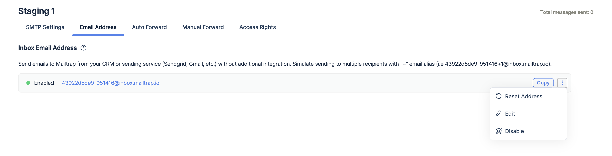

# 📧 Email Address per Sandbox

This feature offers an email address for testing, which you can customize. It supports dynamic aliases and provides you with an unlimited number of virtual email addresses. As soon as it is linked to your [sandbox](https://mailtrap.io/inboxes/), you can manage, view, and share your test results via the Mailtrap UI.

Starting from the [Basic](https://mailtrap.io/pricing/) billing plan, each of your sandboxes includes a dedicated email address you can use to send messages. You will find it in the **Email Address** tab. You can use your current email setup without needing to integrate Mailtrap as a fake server and, in this way, and run safe experiments.

The email address is enabled for you by default. To, disable, edit and reset the email address for this sandbox, go to the three-dots(more)menu.

As you can see from the screenshot, the sandbox address consists of two parts:

* A **customizable alias**, which you can edit manually. You can use any combination of numbers and Latin symbols - for example, your company name or the name of the current sandbox with an identifying number.
* Mailtrap's **technical hash**, which can't be changed. It consists of 6 symbols and acts as our internal sandbox identifier.

This way, you get an infinite number of combinations and can imitate sending emails to a large number of users (with unique email addresses).

The sandbox name changes are applied instantly.

_Also, note that Mailtrap verifies sandbox aliases so that if you try to send a message to a custom sandbox address that doesn't exist, you will receive a `554 5.5.1 Error: no sandbox for this email.`message._

In addition, Mailtrap sandboxes support dynamic aliased addresses. For example, [mailtrap-load-test-12ab34+1@inbox.mailtrap.io](mailto:mailtrap-load-test+1-12qb34@mailtrap.io) and [mailtrap-load-test-12ab34](mailto:mailtrap-load-test+2-12qb34@mailtrap.io)[+2](mailto:mailtrap-load-test+2-12qb34@mailtrap.io)[@inbox.mailtrap.io](mailto:mailtrap-load-test+2-12qb34@mailtrap.io) will be equally accepted and delivered to the same sandbox.

As a result of testing, all your experiments will be perfectly sorted and delivered to the corresponding Mailtrap virtual sandboxes. You will be able to review all of the messages and verify their content. This is crucial when you use personalization (especially in a subject line) and dynamic elements or localization.

Another important point is that sending to sandboxes from your production server doesn't affect your domain's reputation for the main email providers like Gmail, Hotmail, Yahoo, etc.
