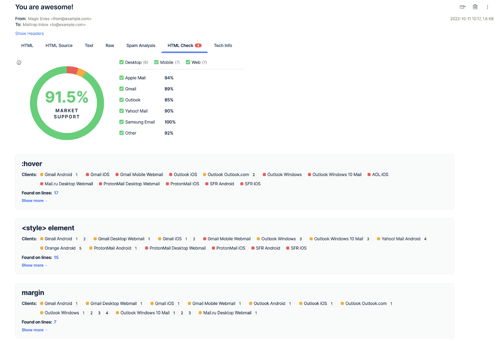
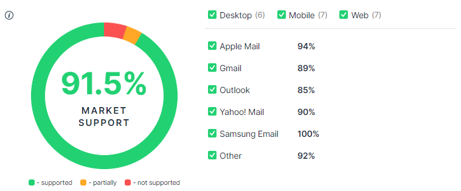
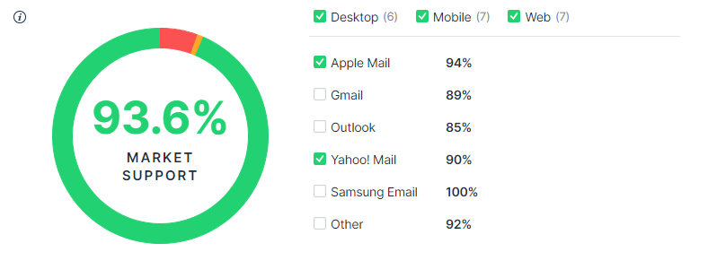
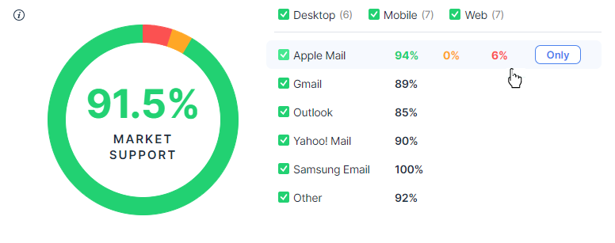
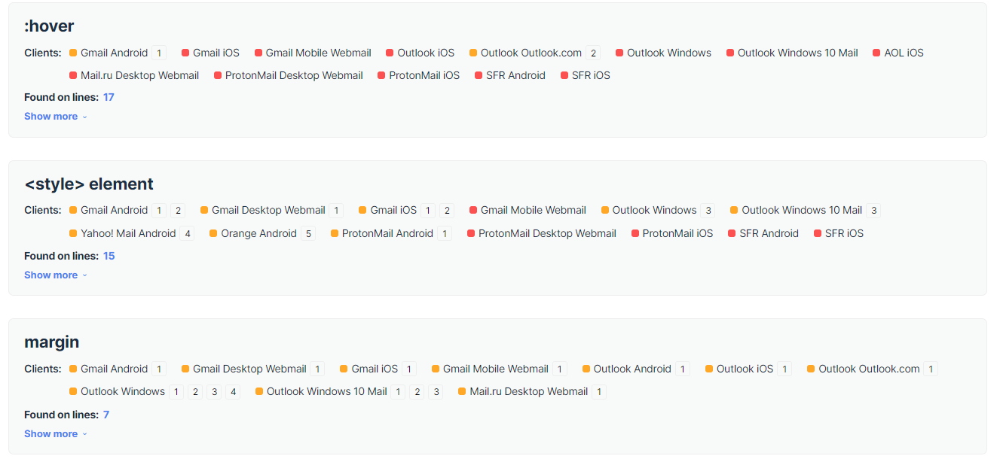
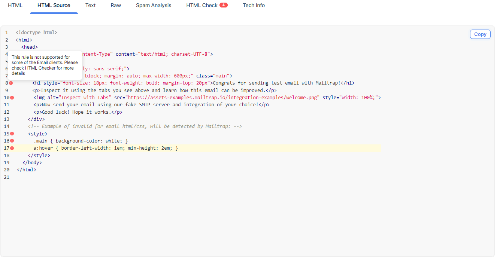

# HTML Check

**HTML Check** scans through your email in search of problematic elements. For each it finds, it displays the list of email clients that lack support for it or support it only partially. It also estimates the support for your emails' code across popular email clients, and provides you with the percentage of the market share accordingly.

The report is available in the **HTML Check** tab:

The higher your market support score, the better for your email!

### Understanding the Market Support score

Each HTML email template consists of dozens, if not hundreds, of HTML/CSS rules. The support for them varies across email clients and even across versions of particular clients. It's not uncommon that, for example, Apple Mail supports a rule for iOS 11.0+ (but doesn't for an older version) and only has partial support for the macOS app.

**HTML Check** collects the list of rules used in your email and compiles it with the support data we have for the most popular email clients. The final result is the **Market Support** - the overall level of HTML/CSS support for your email.

The support for a rule in a particular client can fall into either of three categories:

* Full support - the rule is fully supported across all versions of a client.
* Partial support - the rule is not fully supported in a given client, OR at least one of the versions of this client doesn't support it.
* No support - the email client offers no support for this rule.

When calculating the score, we take into consideration the market share of each email client. Some clients (e.g., Gmail or iPhone's default Mail app) are far more popular than others (for example, Yahoo! Mail). For that reason, the less popular clients may lack support for specific elements thus having a far more significant impact on the Market Support score.

### Filtering options

By default, the market support is calculated for all email clients listed to the right and all their versions in common use. You can freely check and uncheck particular filters, and the market score will adjust immediately.

The vertical list shows five common families of email clients, 'Other' representing less popular clients (e.g., Thunderbird, AOL, etc.). The horizontal list lets you narrow down the results for the particular type of client - mobile, web, or desktop.

For example, if you were to select only Apple Mail and Yahoo! Mail but unchecked 'Mobile', both clients' iOS and Android apps would be ignored. If there's no client for a particular category (e.g., Apple Mail doesn't have a web client), unchecking a category won't alter the results.

As usual, the weight on the Market Support result is proportional to the popularity of each client.

Filtering is particularly beneficial if you know that the vast majority of your users are, for example, on mobile or use only Outlook to view your emails. You can get a more focused market support result this way.

Note that at least one category (Web/Mobile/Desktop) and at least one email client need to be checked to generate any result.

### The algorithm behind HTML Check

You may also view the support for the entire family of popular email clients, such as Gmail (iOS, Android apps, desktop, mobile webmail, etc.). Simply hover over the respective name, and the green (fully supported), orange (partially supported), and red (not supported) numbers will appear.

To understand how these are calculated, let's look at an example. We want to view the results for Gmail only, which across all three categories has ten different versions of its email client (as an example). Our email has three HTML/CSS rules:

* 'height attribute' - not supported in clients \[2], \[4], and \[6], only partially supported in \[5]
* 'max-width' - not supported in clients \[2], \[3], and \[4], partially supported in \[5], and \[6]
* 'style tag' - not supported in \[2]

**HTML Check** algorithm calculates which clients:

* Don't support at least one of the styles used in a template -> \[2], \[3], \[4], \[6] -> 4/10 -> 40% -> these are marked as red (no support)
* Only partially support at least one of the styles (and have not been marked as 'no support') -> \[5] -> 1/10 -> 10% -> these are marked as orange (partial support)
* All other clients - \[1], \[7], \[8], \[9], \[10] - 5/10 -> 50% - are marked as green (full support)

Note that client \[5] partially supports one rule but doesn't support another. Because we look at the "worst" support level across all rules, this client was tagged as 'no support'.

The support for Gmail in our example is:

* Full support - 50%
* Partial support - 10%
* No support - 40%

We collect the data on support for particular rules from [Caniemail.com](https://www.caniemail.com/).

### Analyzing the HTML elements

Almost always, at least a few errors will appear. These will look as follows:

Each will display:

* Its name (e.g. 'margin-left')
* Clients that don't support this element (red) or offer only partial support (orange)
* Hyperlinks to individual lines where the element was found (more on these below)
* "show more" label shedding more light on the problematic element.

To the right of each element, you can see the numbers (\[1], \[2], etc.). Click on any of them, and the "show more" section will expand, explaining what the issue is and which client/version it applies to.

Clicking on the line number will take you to the **HTML Source** tab where you can view your email's entire HTML.

This also demonstrates the alternative way of using HTML Check. You can use the **HTML Source** tab from the start and inspect the code, line by line. Each problematic line will be highlighted with an orange or a red circle, with an exclamation mark inside of it.

For more details on the issue, head to the **Check HTML** tab and look for this item down the list.
