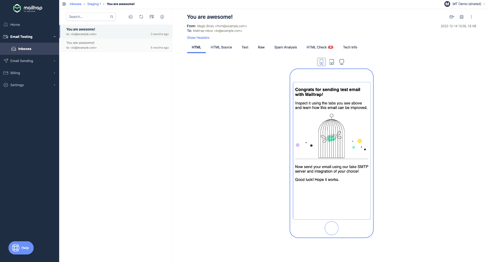
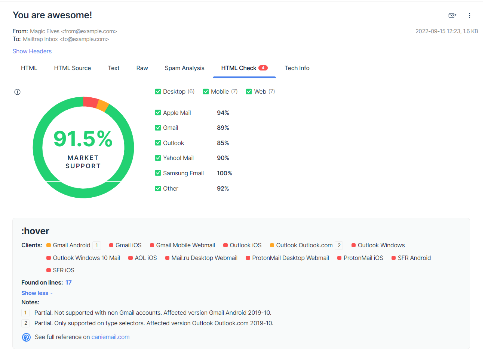
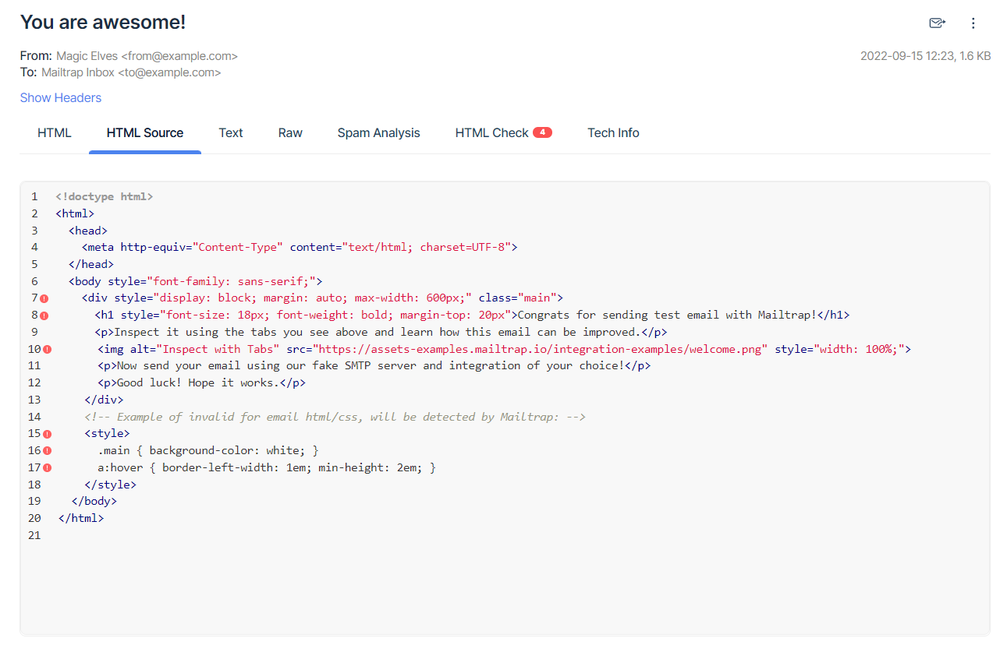
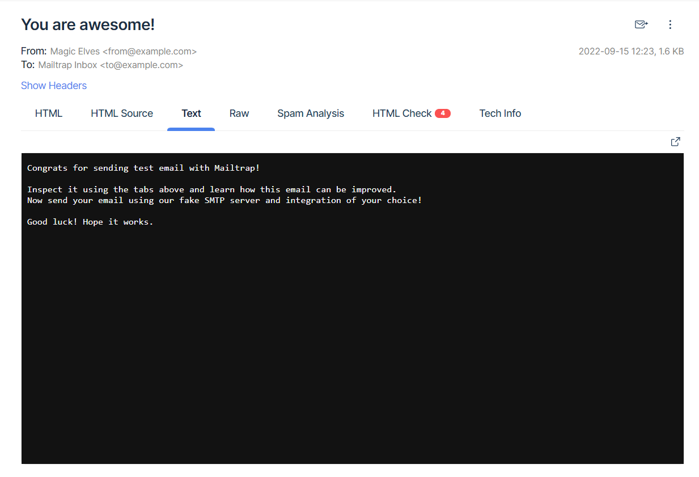

## 1. View the email in the sandbox and check its content

Go to the **HTML tab**. It opens by default when you open a message. This tab demonstrates how the email is rendered in a web browser.

* Check whether the template looks as expected: Markup is correct, images are displayed, and fonts are supported.
* Review the message content, click the links and buttons.
* Test the message for responsiveness: click the device icons in the tab to see how it looks on mobile, tablet, and desktop.

## 2. Check the HTML template code for validity

Email clients use different rendering standards. This is why your email can be displayed not as you designed it. You need to check that your message code won't cause rendering issues.

**HTML Check** scans through your email in search of problematic elements. For each it finds, it displays the list of email clients that lack support for it or support it only partially. It also estimates the support for your emails' code across popular email clients, making adjustments for their popularity.

Go to the **HTML Check** tab to see the report:

**HTML Check** collects the list of rules used in your email and compiles it with the supporting data we have for the most popular email clients. The final result is the Market Support - the overall level of HTML/CSS support for your email.

Below you will see a list of rules that cause errors in the specified email clients. To the right of each element, you can see the numbers (\[1], \[2], etc.). Click on any of them, and the "show more" section will expand, explaining what the issue is and which client/version it applies to.

Clicking on the line number will take you to the **HTML Source** tab where you can view your email's entire HTML.

To learn more about the HTML Check feature, refer to the [HTML Check article](html-check.md).

## 3. Make sure that the HTML and TEXT versions of your message match

It is important to include both the HTML and text versions in your message. This not only affects the spam score but also helps your recipients to understand your message if the HTML part hasn't rendered for some reason. Go to the **Text** tab to inspect the text version.

