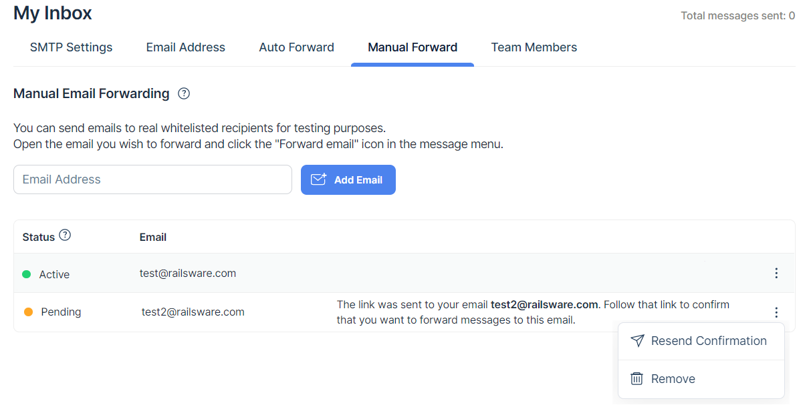

You can forward emails from sandbox to any inbox.

* View emails in different email clients, or even other apps.
* Notify your colleagues or clients about the testing progress.
* Use it as a proxy between your application and your email client and never miss a thing from your QA environment.

Email forwarding is available starting from the [Basic plan](https://mailtrap.io/pricing/).

## Manual forwarding setup

To forward emails manually,  go to the **Manual Forward** tab in your sandbox and add the email address for forwarding.

The email confirmation will be sent to this email address for verification. Once the address is confirmed by its owner, you can forward emails to it.

Return to the sandbox, open the message you want to forward and click the forwarding icon in the top-right of the screen.

In the **Manual Forward** tab, you will also find the list of email addresses for forwarding and their statuses:

* _active_ means that its owner has confirmed that they agree to receive emails.
* _pending_ means that the owner hasn't confirmed that they agree to receive emails.

Click the three-dot menu icon next to the email address to resend confirmation, or to remove this email address.

## "From" header in forwarded emails

All forwarded email messages use forward.mailtrap.info in the "from" header, e.g., when you forward an email you'll see something like this in your sandbox:

> From: Mailtrap Forward \<b751965-a5480376@forward.mailtrap.info

It helps to use forwarding for users with a strict DMARC policy on their domains. Since DMARC doesn't allow sending emails from your domain without permissions, sandbox rewrites the "from" header.

But because the original sender is valuable information, especially in automated testing, we still preserve it in  _x-mailtrap-original-from_ header of the forwarded emails.
