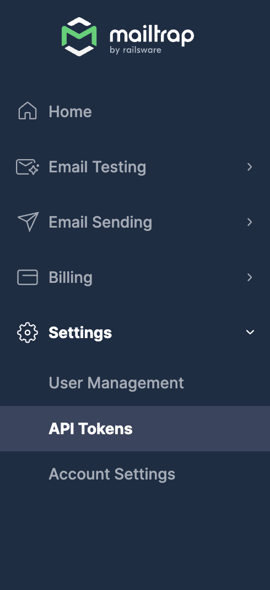

# 🔗 Sandbox API

### How the API works

The testing API uses REST protocol and can return calls as JSON objects. And it's compatible with the majority of programming languages.

Mailtrap supports the following HTTPs requests:

* **POST** to create a resource
* **PATCH** to update a resource
* **GET** to get a resource or list of resources
* **DELETE** to delete a resource

### What you can do with the Sandbox API

Via the API, you can run the following commands:

* **Sandbox**: create a new sandbox, reset the sandbox credentials and its email address; receive messages, clean one or all messages in the sandbox, mark all messages as read; manage users.
* **Project**: Create a new project, update, and delete it; manage its users.
* **Email forwarding**: manage forwarding messages to real email addresses (available starting from the Individual plan).
* **Email content**: inspect the email body by getting raw HTML (you can also download it), text, and detailed info about the HTML part, including a list of possible errors; receive message attachments.
* **Bcc and message headers**: receive message headers (Bcc is also included in this section, notwithstanding that it is not a regular message header). Bcc is available starting from the Team plan.
* **Deliverability**: get a SPAM report and domain blacklisting details.

This way, you can test and verify the following scenarios:

* Email sending script works.
* Email recipients are correct + Bcc testing (on the advanced plans).
* HTML template doesn't cause errors.
* Mail merge/dynamic content is replaced properly.
* Appropriate files are attached.
* Important links, such as reset password and account confirmation, work.
* Your message doesn't trigger a spam filter and your domain is not blacklisted, etc.

### How to get started with Sandbox API

First, you need to get a token. You can find it under Settings, API Tokens.

To learn more about managing your tokens, please [check this guide](../account-and-organization/api-tokens.md). Then, there are a couple ways to send authenticated HTTP requests:

* Send a HTTP header `Api-Token: {api_token}` , where `{api_token}` is your API token
* Send a HTTP header `Authorization: Bearer #{token}` , where `{api_token}` is your API token (more info: Token Access Authentication)

Go to the [API documentation](https://api-docs.mailtrap.io/docs/mailtrap-api-docs/a2041e813d169-email-testing-api), check samples, and experiment in the console.
