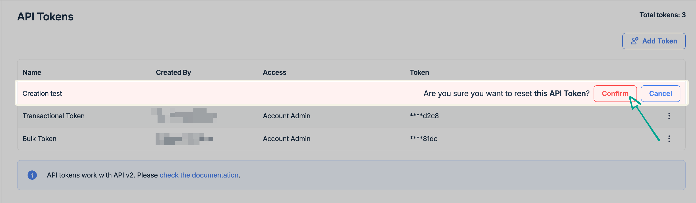
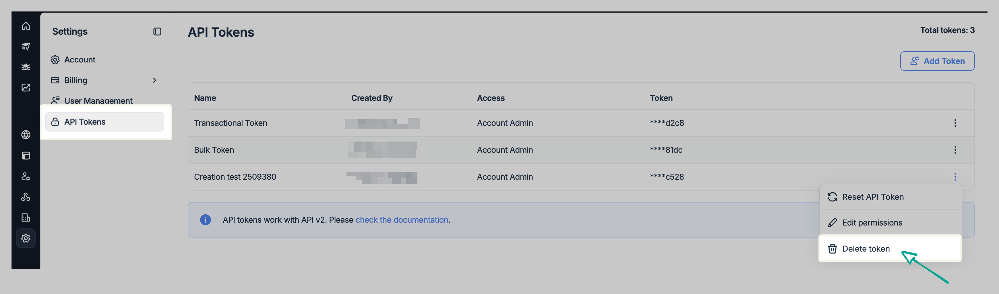
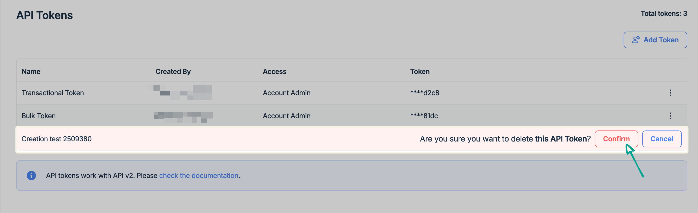

# API Tokens

You need an API Token to integrate Email Sandbox via the [API](https://docs.mailtrap.io/developers/email-sandbox/send-test-emails). If you're working with the SMTP, you don't need an API Token.

#### How to add and manage tokens manually





Navigate to **Settings** in the menu on the left and select **API Tokens**.



To add a new token, click the **Add Token** button in the upper-right corner.



**Type the token name** into the designated field.

It’s perfectly fine to have a custom name for the API token, as it’s only for your reference, regardless of the use case.



**Assign permissions** by checking the boxes in the corresponding access level columns. You can also give Account Admin access to the token and get access to all Projects, Sandboxes, and users on that account.


If you want to test how it works, you need to get authenticated using your API token. Mailtrap uses Bearer Authentication, so you must pass the token under the Authorization header of your email.




Click the **Save** button and preview the new token under the **API Tokens** main menu.



### How to reset API Tokens from the API Tokens menu

Go to API Tokens, click the three-dot menu icon next to the token you want to reset, and click Reset API Token.

<figure><figcaption></figcaption></figure>

Confirm your choice by clicking on the corresponding button.

<figure><figcaption></figcaption></figure>


**Important notes:**

* After clicking the Reset credentials or Reset API Token buttons, the existing token becomes invalid after 12 hours. So, you have a 12-hour window to update all apps that use the old API token. Once the old token expires, some parts of your application will not work properly unless you've updated the token. All expired tokens get deleted from your account within 24 hours after expiration.
* After the API token is reset and expired, a new token is created. The token ID is added to the token name the same way it's done for automatically generated tokens, e.g., mailtrap.example token 4231.


### How to delete a token

To delete a token, click the three-dot menu icon and choose the **Delete token** option.

<figure><figcaption></figcaption></figure>

Confirm the action by clicking the **Confirm** button.

<figure><figcaption></figcaption></figure>


**Important:**&#x20;

* When you reset a token, the token is kept valid for 12 hours. When you delete the token, the token is deleted immediately.&#x20;
* Use the delete feature in case your token gets compromised (i.e., leak). This way, all of the integrations using the token (be it yours or bad actor's) will stop working immediately.

